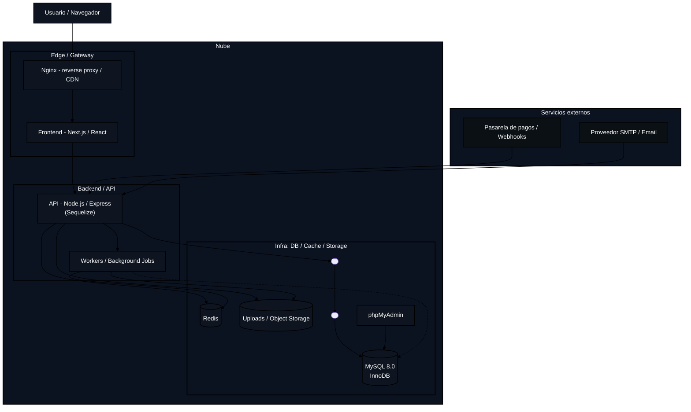

```mermaid
flowchart TB
  U[Usuario / Navegador]

  subgraph EXTERNAL["Servicios externos"]
    direction TB
    PAYMENT[Pasarela de pagos / Webhooks]
    SMTP[Proveedor SMTP / Email]
  end

  subgraph CLOUD["Nube"]
    direction TB

    subgraph EDGE["Edge / Gateway"]
      direction LR
      NGINX[Nginx - reverse proxy / CDN]
      FE[Frontend - Next.js / React]
    end

    subgraph BACKEND["Backend / API"]
      direction LR
      API["API - Node.js / Express<br/> (Sequelize)"]
      WORKERS[Workers / Background Jobs]
    end

    subgraph INFRA["Infra: DB / Cache / Storage"]
      direction LR
      REDIS[(Redis)]
      STORAGE[(Uploads / Object Storage)]
      A1([ ])
      A2([ ])
      MYSQL[(MySQL 8.0<br/>InnoDB)]
      PHPMY[phpMyAdmin]
    end
  end

  U --> NGINX
  NGINX --> FE
  FE --> API

  PAYMENT --> API
  SMTP --> API

  API --> WORKERS
  API --> REDIS
  WORKERS --> REDIS

  API --> STORAGE
  WORKERS --> STORAGE

  API --> A1 --> A2 --> MYSQL
  PHPMY --> MYSQL
  WORKERS -.-> MYSQL

  %% Estilos: cuadros oscuros (no todo negro), bordes y líneas negras, texto blanco para legibilidad
  classDef container fill:#0b1220,stroke:#000000,stroke-width:2px,color:#ffffff;
  classDef innerNode fill:#0e1520,stroke:#000000,stroke-width:1.4px,color:#ffffff;
  classDef cyl fill:#0e1520,stroke:#000000,stroke-width:1.6px,color:#ffffff;
  classDef external fill:#0b1014,stroke:#000000,stroke-width:1.2px,color:#ffffff;
  class CLOUD,EDGE,BACKEND,INFRA,EXTERNAL container;
  class U,NGINX,FE,API,WORKERS,PHPMY innerNode;
  class REDIS,STORAGE,MYSQL cyl;
  class PAYMENT,SMTP external;
  class A1,A2 fill:none,stroke:none,color:none;

  linkStyle default stroke:#000000,stroke-width:1.2px;
```