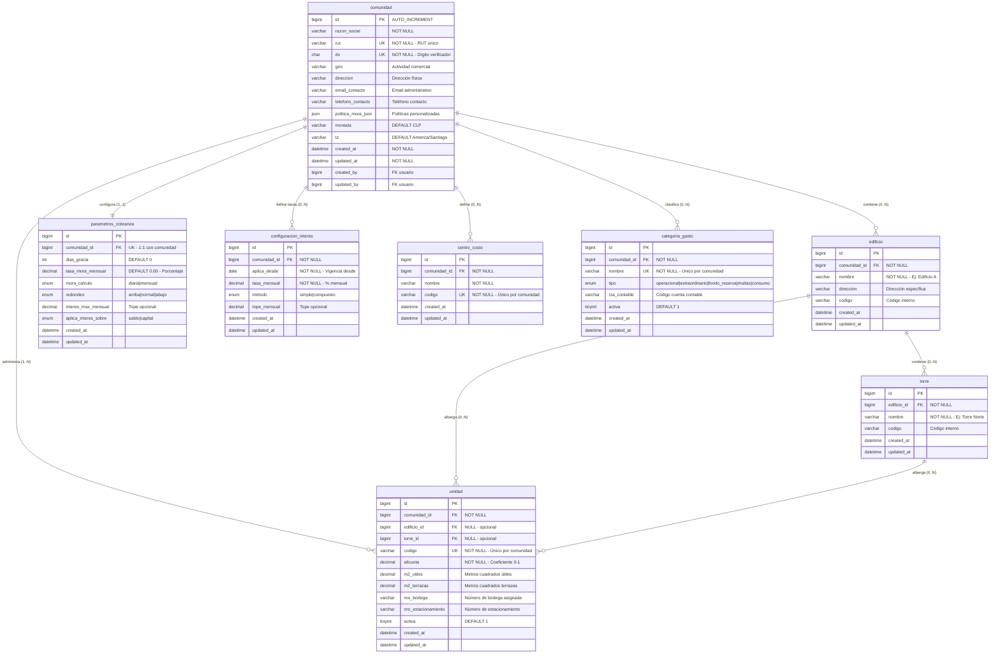

# 🏢 SECCIÓN: COMUNIDADES Y ESTRUCTURA ORGANIZACIONAL

> **Propósito:** Gestión jerárquica de comunidades, edificios, torres y unidades habitacionales

---

## 📊 DIAGRAMA: ESTRUCTURA ORGANIZACIONAL



---

## 🎯 REGLAS DE NEGOCIO

### **R1: Jerarquía Organizacional**

```
Comunidad (raíz)
├── Edificio (opcional, múltiples)
│   └── Torre (opcional, múltiples)
└── Unidad (obligatorio, al menos 1)
    ├── Puede pertenecer solo a Comunidad
    ├── Puede pertenecer a Comunidad + Edificio
    └── Puede pertenecer a Comunidad + Edificio + Torre
```

**Validaciones:**

- ✅ Una comunidad **DEBE** tener al menos 1 unidad
- ✅ Si unidad tiene `torre_id`, **DEBE** tener `edificio_id`
- ✅ El código de unidad es único dentro de la comunidad
- ⚠️ No se puede eliminar comunidad si tiene unidades activas

---

### **R2: Alícuotas y Prorrateo**

```sql
-- La suma de alícuotas de unidades activas debe ser = 1.0 (100%)
SELECT SUM(alicuota) as total_alicuotas
FROM unidad
WHERE comunidad_id = ? AND activa = 1;
-- Resultado esperado: 1.000000

-- Ejemplo:
-- Comunidad con 10 departamentos iguales: 0.1 cada uno
-- Edificio con 5 deptos grandes (0.15) + 10 pequeños (0.075) = 1.0
```

**Cálculo de gasto común por unidad:**

```
Monto_Unidad = Gasto_Total × Alícuota_Unidad

Ejemplo:
Gasto Total: $1,000,000
Depto 301: alícuota 0.12 → $120,000
Depto 102: alícuota 0.08 → $80,000
```

---

### **R3: Configuración de Morosidad**

**Parámetros por comunidad:**

| Parámetro              | Descripción                              | Ejemplo                     |
| ---------------------- | ---------------------------------------- | --------------------------- |
| `dias_gracia`          | Días después del vencimiento sin interés | 5 días                      |
| `tasa_mora_mensual`    | Porcentaje mensual de interés            | 1.5%                        |
| `mora_calculo`         | Tipo de cálculo                          | `mensual` o `diaria`        |
| `interes_max_mensual`  | Tope mensual de interés                  | 3.0%                        |
| `aplica_interes_sobre` | Base de cálculo                          | `saldo` o `capital`         |
| `redondeo`             | Método de redondeo                       | `normal`, `arriba`, `abajo` |

**Ejemplo de cálculo de interés:**

```
Fecha vencimiento: 2025-10-05
Días de gracia: 5
Tasa mensual: 1.5%
Mora_calculo: mensual

Saldo: $100,000
Fecha consulta: 2025-11-15

Días vencidos = 2025-11-15 - 2025-10-05 = 41 días
Días vencidos efectivos = 41 - 5 (gracia) = 36 días

Si mora_calculo = 'mensual':
  Meses completos = FLOOR(36/30) = 1 mes
  Interés = $100,000 × 1.5% = $1,500

Si mora_calculo = 'diaria':
  Tasa diaria = 1.5% / 30 = 0.05% diario
  Interés = $100,000 × 0.05% × 36 = $1,800
```

---

### **R4: Configuración de Tasas de Interés**

**Histórico de tasas por comunidad:**

```sql
-- Una comunidad puede tener múltiples configuraciones de interés
-- según fecha de vigencia

INSERT INTO configuracion_interes
(comunidad_id, aplica_desde, tasa_mensual, metodo, tope_mensual)
VALUES
(1, '2025-01-01', 1.5, 'simple', 3.0),   -- Vigente desde enero
(1, '2025-07-01', 2.0, 'simple', 3.5),   -- Nueva tasa desde julio
(1, '2026-01-01', 1.8, 'compuesto', 4.0); -- Cambio para 2026
```

**Query para obtener tasa vigente:**

```sql
SELECT tasa_mensual, metodo, tope_mensual
FROM configuracion_interes
WHERE comunidad_id = ?
  AND aplica_desde <= CURDATE()
ORDER BY aplica_desde DESC
LIMIT 1;
```

---

### **R5: Centros de Costo y Categorías**

**Centro de Costo (dónde se gasta):**

```
Ejemplos:
- Edificio A
- Torre Norte
- Áreas Comunes
- Administración General
- Mantención Ascensores
```

**Categoría de Gasto (qué se gasta):**

```
Tipos:
1. operacional: Gastos mensuales recurrentes
   - Luz áreas comunes
   - Agua
   - Remuneraciones conserje
   - Aseo

2. extraordinario: Gastos no recurrentes
   - Reparación de fachada
   - Cambio de ascensor
   - Pintura general

3. fondo_reserva: Ahorro para futuro
   - Fondo mantención
   - Fondo contingencias

4. multas: Infracciones
   - Multa por ruidos molestos
   - Multa por no asistir a junta

5. consumo: Servicios medidos
   - Agua caliente individual
   - Gas individual
```

---

## 📋 CASOS DE USO

### **CU1: Crear Nueva Comunidad**

```sql
-- Paso 1: Crear comunidad
INSERT INTO comunidad (razon_social, rut, dv, moneda)
VALUES ('Condominio Los Aromos', '76123456', '7', 'CLP');

SET @comunidad_id = LAST_INSERT_ID();

-- Paso 2: Crear parámetros de cobranza (obligatorio)
INSERT INTO parametros_cobranza (comunidad_id, dias_gracia, tasa_mora_mensual)
VALUES (@comunidad_id, 5, 1.5);

-- Paso 3: Crear configuración de interés (obligatorio)
INSERT INTO configuracion_interes (comunidad_id, aplica_desde, tasa_mensual, metodo)
VALUES (@comunidad_id, CURDATE(), 1.5, 'simple');

-- Paso 4: Crear categorías básicas
INSERT INTO categoria_gasto (comunidad_id, nombre, tipo, activa)
VALUES
(@comunidad_id, 'Gastos Comunes Operacionales', 'operacional', 1),
(@comunidad_id, 'Gastos Extraordinarios', 'extraordinario', 1),
(@comunidad_id, 'Fondo de Reserva', 'fondo_reserva', 1),
(@comunidad_id, 'Multas e Infracciones', 'multas', 1);

-- Paso 5: Crear centro de costo general
INSERT INTO centro_costo (comunidad_id, nombre, codigo)
VALUES (@comunidad_id, 'Administración General', 'ADM-001');
```

---

### **CU2: Agregar Estructura Física**

```sql
-- Comunidad con 2 edificios, cada uno con 2 torres

-- Edificio A
INSERT INTO edificio (comunidad_id, nombre, codigo)
VALUES (@comunidad_id, 'Edificio A', 'EDF-A');
SET @edificio_a = LAST_INSERT_ID();

INSERT INTO torre (edificio_id, nombre, codigo)
VALUES
(@edificio_a, 'Torre Norte', 'A-N'),
(@edificio_a, 'Torre Sur', 'A-S');

-- Edificio B
INSERT INTO edificio (comunidad_id, nombre, codigo)
VALUES (@comunidad_id, 'Edificio B', 'EDF-B');
SET @edificio_b = LAST_INSERT_ID();

INSERT INTO torre (edificio_id, nombre, codigo)
VALUES
(@edificio_b, 'Torre Oriente', 'B-O'),
(@edificio_b, 'Torre Poniente', 'B-P');
```

---

### **CU3: Crear Unidades con Alícuotas**

```sql
-- Ejemplo: 10 departamentos iguales (alícuota 0.1 cada uno)

INSERT INTO unidad (comunidad_id, edificio_id, torre_id, codigo, alicuota, m2_utiles)
SELECT
  @comunidad_id,
  @edificio_a,
  (SELECT id FROM torre WHERE edificio_id = @edificio_a LIMIT 1),
  CONCAT('DEPTO-', LPAD(n, 3, '0')),
  0.1,
  75.5
FROM (
  SELECT 1 as n UNION SELECT 2 UNION SELECT 3 UNION SELECT 4 UNION SELECT 5
  UNION SELECT 6 UNION SELECT 7 UNION SELECT 8 UNION SELECT 9 UNION SELECT 10
) numbers;

-- Verificar suma de alícuotas
SELECT
  comunidad_id,
  COUNT(*) as total_unidades,
  SUM(alicuota) as suma_alicuotas
FROM unidad
WHERE comunidad_id = @comunidad_id AND activa = 1
GROUP BY comunidad_id;

-- Resultado esperado: total_unidades=10, suma_alicuotas=1.000000
```

---

## 🔍 QUERIES ÚTILES

### **Q1: Estructura Completa de Comunidad**

```sql
SELECT
  c.razon_social as comunidad,
  e.nombre as edificio,
  t.nombre as torre,
  u.codigo as unidad,
  u.alicuota,
  u.m2_utiles
FROM comunidad c
LEFT JOIN edificio e ON e.comunidad_id = c.id
LEFT JOIN torre t ON t.edificio_id = e.id
LEFT JOIN unidad u ON u.comunidad_id = c.id
WHERE c.id = ?
ORDER BY e.nombre, t.nombre, u.codigo;
```

---

### **Q2: Validar Consistencia de Alícuotas**

```sql
-- Unidades con alícuota = 0 (error)
SELECT codigo, alicuota
FROM unidad
WHERE comunidad_id = ? AND activa = 1 AND alicuota = 0;

-- Suma de alícuotas diferente a 1.0
SELECT
  comunidad_id,
  SUM(alicuota) as suma,
  CASE
    WHEN ABS(SUM(alicuota) - 1.0) > 0.00001 THEN 'ERROR: No suma 1.0'
    ELSE 'OK'
  END as estado
FROM unidad
WHERE comunidad_id = ? AND activa = 1
GROUP BY comunidad_id;
```

---

### **Q3: Configuración Activa de Morosidad**

```sql
SELECT
  c.razon_social,
  pc.dias_gracia,
  pc.tasa_mora_mensual,
  pc.mora_calculo,
  pc.redondeo,
  ci.tasa_mensual as tasa_interes_actual,
  ci.metodo as metodo_interes,
  ci.tope_mensual as tope_interes
FROM comunidad c
INNER JOIN parametros_cobranza pc ON pc.comunidad_id = c.id
LEFT JOIN LATERAL (
  SELECT tasa_mensual, metodo, tope_mensual
  FROM configuracion_interes
  WHERE comunidad_id = c.id AND aplica_desde <= CURDATE()
  ORDER BY aplica_desde DESC
  LIMIT 1
) ci ON TRUE
WHERE c.id = ?;
```

---

### **Q4: Categorías y Centros de Costo**

```sql
-- Categorías activas por comunidad
SELECT
  tipo,
  COUNT(*) as cantidad,
  GROUP_CONCAT(nombre ORDER BY nombre SEPARATOR ', ') as categorias
FROM categoria_gasto
WHERE comunidad_id = ? AND activa = 1
GROUP BY tipo;

-- Centros de costo
SELECT codigo, nombre
FROM centro_costo
WHERE comunidad_id = ?
ORDER BY codigo;
```

---

## ⚠️ RESTRICCIONES Y VALIDACIONES

### **Validaciones de Integridad:**

```sql
-- V1: No permitir eliminar comunidad con unidades
DELIMITER $$
CREATE TRIGGER trg_comunidad_before_delete
BEFORE DELETE ON comunidad
FOR EACH ROW
BEGIN
  IF EXISTS (SELECT 1 FROM unidad WHERE comunidad_id = OLD.id) THEN
    SIGNAL SQLSTATE '45000'
    SET MESSAGE_TEXT = 'No se puede eliminar comunidad con unidades asociadas';
  END IF;
END$$
DELIMITER ;

-- V2: Validar alícuota entre 0 y 1
DELIMITER $$
CREATE TRIGGER trg_unidad_before_insert
BEFORE INSERT ON unidad
FOR EACH ROW
BEGIN
  IF NEW.alicuota < 0 OR NEW.alicuota > 1 THEN
    SIGNAL SQLSTATE '45000'
    SET MESSAGE_TEXT = 'Alícuota debe estar entre 0 y 1';
  END IF;
END$$
DELIMITER ;

-- V3: Validar torre solo si hay edificio
DELIMITER $$
CREATE TRIGGER trg_unidad_torre_edificio
BEFORE INSERT ON unidad
FOR EACH ROW
BEGIN
  IF NEW.torre_id IS NOT NULL AND NEW.edificio_id IS NULL THEN
    SIGNAL SQLSTATE '45000'
    SET MESSAGE_TEXT = 'Una unidad no puede tener torre sin edificio';
  END IF;
END$$
DELIMITER ;
```

---

## 📈 MÉTRICAS Y REPORTES

### **M1: Resumen de Comunidad**

```sql
SELECT
  c.razon_social,
  COUNT(DISTINCT e.id) as total_edificios,
  COUNT(DISTINCT t.id) as total_torres,
  COUNT(DISTINCT u.id) as total_unidades,
  COUNT(DISTINCT CASE WHEN u.activa = 1 THEN u.id END) as unidades_activas,
  SUM(CASE WHEN u.activa = 1 THEN u.alicuota ELSE 0 END) as suma_alicuotas,
  SUM(u.m2_utiles) as total_m2_utiles
FROM comunidad c
LEFT JOIN edificio e ON e.comunidad_id = c.id
LEFT JOIN torre t ON t.edificio_id = e.id
LEFT JOIN unidad u ON u.comunidad_id = c.id
WHERE c.id = ?
GROUP BY c.id, c.razon_social;
```

---

**Fecha:** Octubre 2025  
**Versión:** 2.0  
**Sección:** 1 de 8
