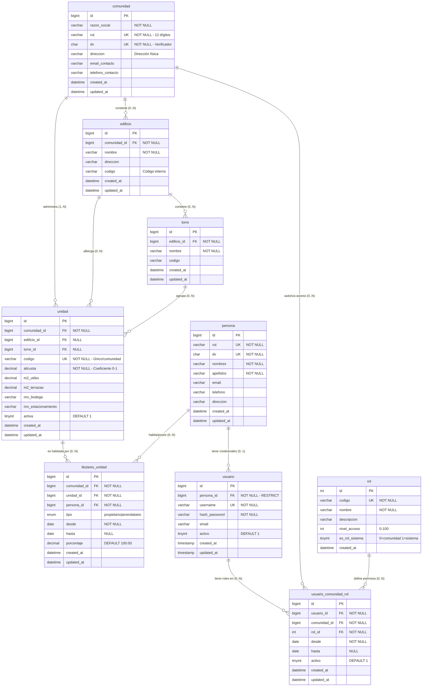

# ESTRUCTURA ORGANIZACIONAL Y MEMBRESÍAS

> **Propósito:** Gestión completa de la jerarquía organizacional, relaciones entre personas, unidades y roles dentro del sistema

---

## 📊 DIAGRAMA: RELACIONES COMPLETAS



---

## 🎯 REGLAS DE NEGOCIO

### **R1: Jerarquía Organizacional Flexible**

```
COMUNIDAD (Raíz obligatoria)
├── EDIFICIO_A (opcional)
│   ├── TORRE_NORTE (opcional)
│   │   ├── UNIDAD_101
│   │   ├── UNIDAD_102
│   │   └── UNIDAD_103
│   └── TORRE_SUR (opcional)
│       ├── UNIDAD_201
│       └── UNIDAD_202
├── EDIFICIO_B (opcional)
│   └── UNIDAD_301 (sin torre)
└── UNIDAD_400 (sin edificio ni torre - directo a comunidad)
```

**Validaciones:**

- ✅ `comunidad` → `unidad` (obligatorio, al menos 1)
- ✅ `edificio` → `unidad` (opcional, puede ser directo)
- ✅ `torre` → `unidad` (opcional, requiere edificio)
- ⚠️ Si `unidad.torre_id IS NOT NULL`, entonces `unidad.edificio_id` debe ser NOT NULL

**Ejemplos reales:**

```sql
-- Caso 1: Condominio horizontal (casas sin edificio)
INSERT INTO unidad (comunidad_id, codigo, alicuota)
VALUES (1, 'CASA-01', 0.05);  -- edificio_id y torre_id NULL

-- Caso 2: Edificio sin torres
INSERT INTO edificio (comunidad_id, nombre)
VALUES (1, 'Edificio Único');

INSERT INTO unidad (comunidad_id, edificio_id, codigo, alicuota)
VALUES (1, 1, 'DEPTO-301', 0.02);  -- torre_id NULL

-- Caso 3: Complejo con torres
INSERT INTO edificio (comunidad_id, nombre)
VALUES (1, 'Edificio Principal');

INSERT INTO torre (edificio_id, nombre)
VALUES (1, 'Torre A');

INSERT INTO unidad (comunidad_id, edificio_id, torre_id, codigo, alicuota)
VALUES (1, 1, 1, 'A-501', 0.015);
```

---

### **R2: Códigos Únicos y Jerarquía de Identificadores**

| Nivel         | Unicidad                         | Ejemplo                   |
| ------------- | -------------------------------- | ------------------------- |
| **Comunidad** | RUT único en todo el sistema     | `76123456-7`              |
| **Edificio**  | Código único dentro de comunidad | `EDF-A`, `EDF-B`          |
| **Torre**     | Código único dentro de edificio  | `TN`, `TS`, `TO`          |
| **Unidad**    | Código único dentro de comunidad | `101`, `A-501`, `CASA-12` |

**Query de validación:**

```sql
-- Verificar duplicados de código de unidad
SELECT
  comunidad_id,
  codigo,
  COUNT(*) as duplicados
FROM unidad
WHERE comunidad_id = ?
GROUP BY comunidad_id, codigo
HAVING COUNT(*) > 1;
```

---

### **R3: Alícuotas (Coeficiente de Participación)**

**Concepto chileno:**

> La alícuota es el porcentaje de participación de cada unidad en los gastos comunes, definido en el reglamento de copropiedad.

**Fórmula:**

```
Alícuota = Participación de la unidad / Participación total

Suma de todas las alícuotas activas = 1.0 (100%)
```

**Ejemplo práctico:**

```sql
-- Comunidad con 10 departamentos iguales
-- Alícuota = 1.0 / 10 = 0.1 cada uno

INSERT INTO unidad (comunidad_id, codigo, alicuota, m2_utiles)
VALUES
(1, '101', 0.1, 75.5),
(1, '102', 0.1, 75.5),
(1, '103', 0.1, 75.5),
-- ... total 10 unidades
(1, '110', 0.1, 75.5);

-- Verificar suma = 1.0
SELECT SUM(alicuota) as total FROM unidad WHERE comunidad_id = 1 AND activa = 1;
-- Resultado esperado: 1.000000
```

**Caso complejo (departamentos de distinto tamaño):**

```sql
-- 5 deptos grandes (100m²) + 10 deptos pequeños (50m²)
-- Total metros: (5×100) + (10×50) = 1000m²
-- Alícuota grande: 100/1000 = 0.1
-- Alícuota pequeña: 50/1000 = 0.05

INSERT INTO unidad (comunidad_id, codigo, alicuota, m2_utiles)
VALUES
-- Grandes
(1, '101', 0.10, 100.0),
(1, '102', 0.10, 100.0),
-- ...
-- Pequeños
(1, '201', 0.05, 50.0),
(1, '202', 0.05, 50.0);
-- ...

-- Verificar: (5 × 0.1) + (10 × 0.05) = 0.5 + 0.5 = 1.0 ✅
```

---

### **R4: Tenencia de Unidades (Propietarios y Arrendatarios)**

**Tipos de tenencia:**

| Tipo             | Descripción              | Vigencia                  | Porcentaje         |
| ---------------- | ------------------------ | ------------------------- | ------------------ |
| **propietario**  | Dueño legal de la unidad | Indefinida (hasta=NULL)   | Suma debe ser 100% |
| **arrendatario** | Inquilino temporal       | Temporal (hasta definido) | Siempre 100%       |

**Reglas de validación:**

```sql
-- V1: Suma de porcentajes de propietarios = 100%
SELECT
  unidad_id,
  SUM(porcentaje) as total
FROM titulares_unidad
WHERE tipo = 'propietario'
  AND hasta IS NULL
GROUP BY unidad_id
HAVING SUM(porcentaje) != 100;
-- Si retorna filas → ERROR

-- V2: Solo UN arrendatario activo por unidad
SELECT
  unidad_id,
  COUNT(*) as arrendatarios_activos
FROM titulares_unidad
WHERE tipo = 'arrendatario'
  AND (hasta IS NULL OR hasta >= CURDATE())
GROUP BY unidad_id
HAVING COUNT(*) > 1;
-- Si retorna filas → ERROR

-- V3: Fechas de arrendamiento NO pueden solaparse
SELECT
  t1.unidad_id,
  t1.persona_id as persona1,
  t2.persona_id as persona2,
  t1.desde as inicio1,
  t1.hasta as fin1,
  t2.desde as inicio2,
  t2.hasta as fin2
FROM titulares_unidad t1
INNER JOIN titulares_unidad t2
  ON t1.unidad_id = t2.unidad_id
  AND t1.id < t2.id
  AND t1.tipo = 'arrendatario'
  AND t2.tipo = 'arrendatario'
WHERE (t1.desde <= COALESCE(t2.hasta, '9999-12-31'))
  AND (COALESCE(t1.hasta, '9999-12-31') >= t2.desde);
-- Si retorna filas → ERROR (solapamiento)
```

**Ejemplos de tenencia:**

```sql
-- CASO 1: Propietario único
INSERT INTO titulares_unidad (comunidad_id, unidad_id, persona_id, tipo, desde, porcentaje)
VALUES (1, 101, 5, 'propietario', '2025-01-01', 100.00);

-- CASO 2: Copropiedad (2 dueños)
INSERT INTO titulares_unidad (comunidad_id, unidad_id, persona_id, tipo, desde, porcentaje)
VALUES
(1, 102, 6, 'propietario', '2025-01-01', 60.00),  -- Juan 60%
(1, 102, 7, 'propietario', '2025-01-01', 40.00);  -- María 40%

-- CASO 3: Propietario + Arrendatario (inquilino temporal)
-- Juan es dueño pero arrienda a Pedro
INSERT INTO titulares_unidad (comunidad_id, unidad_id, persona_id, tipo, desde, porcentaje)
VALUES (1, 103, 8, 'propietario', '2025-01-01', 100.00);

INSERT INTO titulares_unidad (comunidad_id, unidad_id, persona_id, tipo, desde, hasta, porcentaje)
VALUES (1, 103, 9, 'arrendatario', '2025-03-01', '2026-02-28', 100.00);

-- CASO 4: Cambio de propietario (venta)
-- Finalizar tenencia anterior
UPDATE titulares_unidad
SET hasta = '2025-06-30'
WHERE unidad_id = 104 AND persona_id = 10 AND hasta IS NULL;

-- Crear nueva tenencia
INSERT INTO titulares_unidad (comunidad_id, unidad_id, persona_id, tipo, desde, porcentaje)
VALUES (1, 104, 11, 'propietario', '2025-07-01', 100.00);
```

---

### **R5: Separación Persona vs Usuario**

```
PERSONA (Entidad física)
├── Datos inmutables: RUT, nombres, apellidos
├── Información de contacto
├── Puede existir SIN acceso al sistema
└── Una persona puede ser titular de MÚLTIPLES unidades

USUARIO (Credenciales de acceso)
├── Siempre vinculado a UNA persona (FK NOT NULL)
├── Username único en TODO el sistema
├── Puede tener acceso a MÚLTIPLES comunidades
├── Puede estar inactivo temporalmente (activo=0)
└── Puede tener DIFERENTES roles en DIFERENTES comunidades
```

**Ejemplo práctico:**

```sql
-- Paso 1: Crear persona (física, con RUT)
INSERT INTO persona (rut, dv, nombres, apellidos, email, telefono)
VALUES ('12345678', '9', 'Juan Carlos', 'Pérez González', 'juan@email.com', '+56991234567');

SET @persona_id = LAST_INSERT_ID();

-- Paso 2: Asignar como propietario de unidad 101
INSERT INTO titulares_unidad (comunidad_id, unidad_id, persona_id, tipo, desde, porcentaje)
VALUES (1, 101, @persona_id, 'propietario', '2025-01-01', 100.00);

-- Paso 3: Crear usuario (credenciales de acceso)
INSERT INTO usuario (persona_id, username, hash_password, email)
VALUES (@persona_id, 'juan.perez', '$2b$10$encrypted_hash', 'juan@email.com');

SET @usuario_id = LAST_INSERT_ID();

-- Paso 4: Asignar rol en comunidad
INSERT INTO usuario_comunidad_rol (usuario_id, comunidad_id, rol_id, desde, activo)
VALUES (@usuario_id, 1, (SELECT id FROM rol WHERE codigo='propietario'), '2025-01-01', 1);

-- RESULTADO:
-- Juan Pérez (persona) es:
-- - Propietario de unidad 101 en Comunidad 1
-- - Usuario 'juan.perez' con acceso al sistema
-- - Rol 'propietario' en Comunidad 1
```

---

### **R6: Sistema de Roles Jerárquico**

| Nivel | Código        | Nombre              | Tipo      | Permisos                                |
| ----- | ------------- | ------------------- | --------- | --------------------------------------- |
| 100   | `superadmin`  | Super Administrador | Sistema   | Acceso total, todas las comunidades     |
| 80    | `admin`       | Administrador       | Comunidad | Administración completa de su comunidad |
| 70    | `comite`      | Comité              | Comunidad | Aprobar gastos, ver finanzas            |
| 60    | `contador`    | Contador            | Comunidad | Ver finanzas, reportes, auditoría       |
| 40    | `conserje`    | Conserje            | Comunidad | Bitácora, multas, solicitudes           |
| 30    | `propietario` | Propietario         | Comunidad | Ver su cuenta, pagar, reservar          |
| 20    | `residente`   | Arrendatario        | Comunidad | Consultas limitadas                     |

**Roles de SISTEMA vs COMUNIDAD:**

```sql
-- Roles de SISTEMA (es_rol_sistema = 1)
-- Solo 'superadmin', se asigna a TODAS las comunidades
SELECT * FROM rol WHERE es_rol_sistema = 1;
-- Result: superadmin (nivel 100)

-- Roles de COMUNIDAD (es_rol_sistema = 0)
-- Se asignan comunidad por comunidad
SELECT * FROM rol WHERE es_rol_sistema = 0;
-- Result: admin, comite, contador, conserje, propietario, residente
```

**Un usuario puede tener múltiples roles:**

```sql
-- Juan tiene:
-- - Rol 'admin' en Comunidad Los Aromos (activo)
-- - Rol 'propietario' en Comunidad Los Robles (activo)
-- - Rol 'contador' en Comunidad Los Olivos (inactivo)

SELECT
  u.username,
  c.razon_social as comunidad,
  r.nombre as rol,
  r.nivel_acceso,
  ucr.desde,
  ucr.hasta,
  ucr.activo
FROM usuario_comunidad_rol ucr
INNER JOIN usuario u ON u.id = ucr.usuario_id
INNER JOIN comunidad c ON c.id = ucr.comunidad_id
INNER JOIN rol r ON r.id = ucr.rol_id
WHERE u.id = 5
ORDER BY ucr.activo DESC, r.nivel_acceso DESC;
```

---

## 📋 CASOS DE USO

### **CU1: Crear Comunidad Completa**

```sql
-- Paso 1: Crear comunidad
INSERT INTO comunidad (razon_social, rut, dv, direccion, email_contacto)
VALUES (
  'Condominio Los Aromos',
  '76123456',
  '7',
  'Av. Los Aromos 123, Las Condes',
  'admin@losaromos.cl'
);

SET @comunidad_id = LAST_INSERT_ID();

-- Paso 2: Crear edificios
INSERT INTO edificio (comunidad_id, nombre, codigo)
VALUES
(@comunidad_id, 'Edificio A', 'EDF-A'),
(@comunidad_id, 'Edificio B', 'EDF-B');

SET @edificio_a = (SELECT id FROM edificio WHERE codigo = 'EDF-A' AND comunidad_id = @comunidad_id);
SET @edificio_b = (SELECT id FROM edificio WHERE codigo = 'EDF-B' AND comunidad_id = @comunidad_id);

-- Paso 3: Crear torres
INSERT INTO torre (edificio_id, nombre, codigo)
VALUES
(@edificio_a, 'Torre Norte', 'TN'),
(@edificio_a, 'Torre Sur', 'TS'),
(@edificio_b, 'Torre Oriente', 'TO');

-- Paso 4: Crear unidades (40 deptos, alícuota 0.025 cada uno)
INSERT INTO unidad (comunidad_id, edificio_id, torre_id, codigo, alicuota, m2_utiles)
SELECT
  @comunidad_id,
  @edificio_a,
  (SELECT id FROM torre WHERE edificio_id = @edificio_a LIMIT 1),
  CONCAT('A', LPAD(n, 3, '0')),
  0.025,
  75.5
FROM (
  SELECT 101 as n UNION SELECT 102 UNION SELECT 103 UNION SELECT 104 UNION SELECT 105
  UNION SELECT 106 UNION SELECT 107 UNION SELECT 108 UNION SELECT 109 UNION SELECT 110
  -- ... hasta 40 unidades
) numbers;

-- Paso 5: Verificar suma de alícuotas
SELECT
  COUNT(*) as total_unidades,
  SUM(alicuota) as suma_alicuotas,
  CASE
    WHEN ABS(SUM(alicuota) - 1.0) < 0.00001 THEN 'OK'
    ELSE 'ERROR'
  END as estado
FROM unidad
WHERE comunidad_id = @comunidad_id AND activa = 1;
```

---

### **CU2: Registrar Propietario y Asignar Acceso**

```sql
-- Escenario: María Rodríguez compra el depto A-501

-- Paso 1: Crear o buscar persona
INSERT INTO persona (rut, dv, nombres, apellidos, email, telefono)
VALUES ('19876543', '2', 'María Elena', 'Rodríguez Silva', 'maria@email.com', '+56998765432')
ON DUPLICATE KEY UPDATE id=LAST_INSERT_ID(id);

SET @persona_id = LAST_INSERT_ID();

-- Paso 2: Asignar como propietaria
SET @unidad_id = (SELECT id FROM unidad WHERE codigo = 'A-501' AND comunidad_id = @comunidad_id);

INSERT INTO titulares_unidad (comunidad_id, unidad_id, persona_id, tipo, desde, porcentaje)
VALUES (@comunidad_id, @unidad_id, @persona_id, 'propietario', CURDATE(), 100.00);

-- Paso 3: Crear usuario
INSERT INTO usuario (persona_id, username, hash_password, email, activo)
VALUES (@persona_id, 'maria.rodriguez', '$2b$10$hashed_password', 'maria@email.com', 1);

SET @usuario_id = LAST_INSERT_ID();

-- Paso 4: Asignar rol 'propietario'
INSERT INTO usuario_comunidad_rol (usuario_id, comunidad_id, rol_id, desde, activo)
VALUES (
  @usuario_id,
  @comunidad_id,
  (SELECT id FROM rol WHERE codigo = 'propietario'),
  CURDATE(),
  1
);
```

---

### **CU3: Gestionar Copropiedad (Múltiples Propietarios)**

```sql
-- Escenario: Depto A-202 comprado por matrimonio
-- Carlos (60%) y Ana (40%)

SET @unidad_id = (SELECT id FROM unidad WHERE codigo = 'A-202' AND comunidad_id = @comunidad_id);

-- Persona 1: Carlos
INSERT INTO persona (rut, dv, nombres, apellidos, email)
VALUES ('15555555', '5', 'Carlos', 'López Pérez', 'carlos@email.com');
SET @carlos_id = LAST_INSERT_ID();

-- Persona 2: Ana
INSERT INTO persona (rut, dv, nombres, apellidos, email)
VALUES ('16666666', '6', 'Ana', 'Martínez Soto', 'ana@email.com');
SET @ana_id = LAST_INSERT_ID();

-- Asignar copropietarios
INSERT INTO titulares_unidad (comunidad_id, unidad_id, persona_id, tipo, desde, porcentaje)
VALUES
(@comunidad_id, @unidad_id, @carlos_id, 'propietario', '2025-01-15', 60.00),
(@comunidad_id, @unidad_id, @ana_id, 'propietario', '2025-01-15', 40.00);

-- Verificar suma = 100%
SELECT
  u.codigo,
  SUM(tu.porcentaje) as total_porcentaje,
  GROUP_CONCAT(CONCAT(p.nombres, ' ', p.apellidos, ' (', tu.porcentaje, '%)') SEPARATOR ', ') as propietarios
FROM unidad u
INNER JOIN titulares_unidad tu ON tu.unidad_id = u.id AND tu.hasta IS NULL
INNER JOIN persona p ON p.id = tu.persona_id
WHERE u.id = @unidad_id
GROUP BY u.id, u.codigo;
```

---

### **CU4: Arrendar Unidad (Inquilino Temporal)**

```sql
-- Escenario: Propietario arrienda su depto por 1 año

SET @unidad_id = (SELECT id FROM unidad WHERE codigo = 'A-305' AND comunidad_id = @comunidad_id);

-- Crear persona arrendatario
INSERT INTO persona (rut, dv, nombres, apellidos, email, telefono)
VALUES ('20111111', '1', 'Pedro', 'Gómez Díaz', 'pedro@email.com', '+56911111111');
SET @arrendatario_id = LAST_INSERT_ID();

-- Registrar arrendamiento temporal
INSERT INTO titulares_unidad (comunidad_id, unidad_id, persona_id, tipo, desde, hasta, porcentaje)
VALUES (
  @comunidad_id,
  @unidad_id,
  @arrendatario_id,
  'arrendatario',
  '2025-03-01',
  '2026-02-28',  -- 1 año
  100.00
);

-- Crear usuario con rol 'residente' (acceso limitado)
INSERT INTO usuario (persona_id, username, hash_password, email)
VALUES (@arrendatario_id, 'pedro.gomez', '$2b$10$hash', 'pedro@email.com');

INSERT INTO usuario_comunidad_rol (usuario_id, comunidad_id, rol_id, desde, hasta, activo)
VALUES (
  LAST_INSERT_ID(),
  @comunidad_id,
  (SELECT id FROM rol WHERE codigo = 'residente'),
  '2025-03-01',
  '2026-02-28',
  1
);
```

---

### **CU5: Cambio de Propietario (Venta)**

```sql
-- Escenario: Juan vende su depto a Carolina

SET @unidad_id = (SELECT id FROM unidad WHERE codigo = 'B-102' AND comunidad_id = @comunidad_id);
SET @juan_id = 15;  -- Vendedor
SET @carolina_id = 25;  -- Compradora

-- Paso 1: Finalizar tenencia de Juan
UPDATE titulares_unidad
SET hasta = '2025-10-31'
WHERE unidad_id = @unidad_id
  AND persona_id = @juan_id
  AND hasta IS NULL;

-- Paso 2: Crear tenencia de Carolina
INSERT INTO titulares_unidad (comunidad_id, unidad_id, persona_id, tipo, desde, porcentaje)
VALUES (@comunidad_id, @unidad_id, @carolina_id, 'propietario', '2025-11-01', 100.00);

-- Paso 3: Actualizar rol de usuario de Juan (si no es propietario en otra unidad)
-- Verificar si Juan tiene otras unidades
SET @otras_unidades = (
  SELECT COUNT(*)
  FROM titulares_unidad
  WHERE persona_id = @juan_id
    AND comunidad_id = @comunidad_id
    AND hasta IS NULL
);

IF @otras_unidades = 0 THEN
  -- Desactivar rol de Juan
  UPDATE usuario_comunidad_rol
  SET activo = 0, hasta = '2025-10-31'
  WHERE usuario_id = (SELECT id FROM usuario WHERE persona_id = @juan_id)
    AND comunidad_id = @comunidad_id;
END IF;

-- Paso 4: Crear usuario y rol para Carolina
INSERT INTO usuario (persona_id, username, hash_password, email)
VALUES (@carolina_id, 'carolina.smith', '$2b$10$hash', 'carolina@email.com')
ON DUPLICATE KEY UPDATE id=LAST_INSERT_ID(id);

INSERT INTO usuario_comunidad_rol (usuario_id, comunidad_id, rol_id, desde, activo)
VALUES (
  LAST_INSERT_ID(),
  @comunidad_id,
  (SELECT id FROM rol WHERE codigo = 'propietario'),
  '2025-11-01',
  1
);
```

---

## 🔍 QUERIES ÚTILES

### **Q1: Vista Completa de Comunidad**

```sql
SELECT
  c.razon_social as comunidad,
  c.rut,
  c.dv,
  c.direccion,
  e.nombre as edificio,
  e.codigo as cod_edificio,
  t.nombre as torre,
  t.codigo as cod_torre,
  u.codigo as unidad,
  u.alicuota,
  u.m2_utiles,
  u.activa
FROM comunidad c
LEFT JOIN edificio e ON e.comunidad_id = c.id
LEFT JOIN torre t ON t.edificio_id = e.id
LEFT JOIN unidad u ON u.comunidad_id = c.id
WHERE c.id = ?
ORDER BY e.nombre, t.nombre, u.codigo;
```

---

### **Q2: Propietarios Actuales por Comunidad**

```sql
SELECT
  u.codigo as unidad,
  CONCAT(p.nombres, ' ', p.apellidos) as propietario,
  p.rut,
  p.dv,
  p.email,
  p.telefono,
  tu.tipo,
  tu.porcentaje,
  tu.desde,
  tu.hasta,
  CASE
    WHEN tu.hasta IS NULL THEN 'VIGENTE'
    WHEN tu.hasta >= CURDATE() THEN 'VIGENTE'
    ELSE 'FINALIZADO'
  END as estado
FROM unidad u
INNER JOIN titulares_unidad tu ON tu.unidad_id = u.id
INNER JOIN persona p ON p.id = tu.persona_id
WHERE u.comunidad_id = ?
  AND (tu.hasta IS NULL OR tu.hasta >= CURDATE())
ORDER BY u.codigo, tu.tipo DESC, tu.porcentaje DESC;
```

---

### **Q3: Usuarios con Acceso a Comunidad**

```sql
SELECT
  CONCAT(p.nombres, ' ', p.apellidos) as nombre_completo,
  p.rut,
  p.dv,
  u.username,
  u.email,
  r.nombre as rol,
  r.nivel_acceso,
  ucr.desde,
  ucr.hasta,
  ucr.activo,
  CASE
    WHEN ucr.activo = 1 AND (ucr.hasta IS NULL OR ucr.hasta >= CURDATE()) THEN 'ACTIVO'
    WHEN ucr.hasta < CURDATE() THEN 'EXPIRADO'
    ELSE 'INACTIVO'
  END as estado
FROM usuario_comunidad_rol ucr
INNER JOIN usuario u ON u.id = ucr.usuario_id AND u.activo = 1
INNER JOIN persona p ON p.id = u.persona_id
INNER JOIN rol r ON r.id = ucr.rol_id
WHERE ucr.comunidad_id = ?
ORDER BY r.nivel_acceso DESC, p.apellidos, p.nombres;
```

---

### **Q4: Validar Suma de Alícuotas**

```sql
SELECT
  c.razon_social as comunidad,
  COUNT(u.id) as total_unidades_activas,
  SUM(u.alicuota) as suma_alicuotas,
  ROUND(ABS(SUM(u.alicuota) - 1.0), 6) as diferencia,
  CASE
    WHEN ABS(SUM(u.alicuota) - 1.0) < 0.00001 THEN '✅ OK'
    ELSE '❌ ERROR: No suma 1.0'
  END as validacion
FROM comunidad c
INNER JOIN unidad u ON u.comunidad_id = c.id AND u.activa = 1
WHERE c.id = ?
GROUP BY c.id, c.razon_social;
```

---

### **Q5: Historial de Tenencia de Unidad**

```sql
-- Ver todos los propietarios/arrendatarios que ha tenido una unidad
SELECT
  u.codigo as unidad,
  CONCAT(p.nombres, ' ', p.apellidos) as persona,
  tu.tipo,
  tu.porcentaje,
  tu.desde,
  COALESCE(tu.hasta, 'Actual') as hasta,
  TIMESTAMPDIFF(MONTH, tu.desde, COALESCE(tu.hasta, CURDATE())) as meses_duracion,
  CASE
    WHEN tu.hasta IS NULL THEN 'VIGENTE'
    ELSE 'FINALIZADO'
  END as estado
FROM unidad u
INNER JOIN titulares_unidad tu ON tu.unidad_id = u.id
INNER JOIN persona p ON p.id = tu.persona_id
WHERE u.codigo = ?
  AND u.comunidad_id = ?
ORDER BY tu.desde DESC, tu.tipo;
```

---

### **Q6: Unidades sin Propietario (Vacías)**

```sql
-- Unidades activas sin titular actual
SELECT
  u.codigo,
  u.alicuota,
  u.m2_utiles,
  e.nombre as edificio,
  t.nombre as torre,
  'SIN TITULAR' as estado
FROM unidad u
LEFT JOIN edificio e ON e.id = u.edificio_id
LEFT JOIN torre t ON t.id = u.torre_id
LEFT JOIN titulares_unidad tu
  ON tu.unidad_id = u.id
  AND (tu.hasta IS NULL OR tu.hasta >= CURDATE())
WHERE u.comunidad_id = ?
  AND u.activa = 1
  AND tu.id IS NULL
ORDER BY u.codigo;
```

---

### **Q7: Copropiedad (Múltiples Propietarios)**

```sql
-- Unidades con más de 1 propietario
SELECT
  u.codigo as unidad,
  COUNT(*) as cantidad_propietarios,
  SUM(tu.porcentaje) as suma_porcentajes,
  GROUP_CONCAT(
    CONCAT(p.nombres, ' ', p.apellidos, ' (', tu.porcentaje, '%)')
    ORDER BY tu.porcentaje DESC
    SEPARATOR ', '
  ) as propietarios
FROM unidad u
INNER JOIN titulares_unidad tu
  ON tu.unidad_id = u.id
  AND tu.tipo = 'propietario'
  AND (tu.hasta IS NULL OR tu.hasta >= CURDATE())
INNER JOIN persona p ON p.id = tu.persona_id
WHERE u.comunidad_id = ?
GROUP BY u.id, u.codigo
HAVING COUNT(*) > 1
ORDER BY u.codigo;
```

---

## ⚠️ VALIDACIONES Y TRIGGERS

### **V1: Validar Torre Requiere Edificio**

```sql
DELIMITER $$
CREATE TRIGGER trg_unidad_torre_edificio
BEFORE INSERT ON unidad
FOR EACH ROW
BEGIN
  IF NEW.torre_id IS NOT NULL AND NEW.edificio_id IS NULL THEN
    SIGNAL SQLSTATE '45000'
    SET MESSAGE_TEXT = 'Una unidad no puede tener torre sin edificio asociado';
  END IF;
END$$

CREATE TRIGGER trg_unidad_torre_edificio_update
BEFORE UPDATE ON unidad
FOR EACH ROW
BEGIN
  IF NEW.torre_id IS NOT NULL AND NEW.edificio_id IS NULL THEN
    SIGNAL SQLSTATE '45000'
    SET MESSAGE_TEXT = 'Una unidad no puede tener torre sin edificio asociado';
  END IF;
END$$
DELIMITER ;
```

---

### **V2: Validar Alícuota entre 0 y 1**

```sql
DELIMITER $$
CREATE TRIGGER trg_unidad_alicuota_valida
BEFORE INSERT ON unidad
FOR EACH ROW
BEGIN
  IF NEW.alicuota < 0 OR NEW.alicuota > 1 THEN
    SIGNAL SQLSTATE '45000'
    SET MESSAGE_TEXT = 'Alícuota debe estar entre 0 y 1 (0% y 100%)';
  END IF;
END$$

CREATE TRIGGER trg_unidad_alicuota_valida_update
BEFORE UPDATE ON unidad
FOR EACH ROW
BEGIN
  IF NEW.alicuota < 0 OR NEW.alicuota > 1 THEN
    SIGNAL SQLSTATE '45000'
    SET MESSAGE_TEXT = 'Alícuota debe estar entre 0 y 1 (0% y 100%)';
  END IF;
END$$
DELIMITER ;
```

---

### **V3: Validar Porcentaje de Propietarios**

```sql
DELIMITER $$
CREATE TRIGGER trg_titulares_validar_porcentaje
AFTER INSERT ON titulares_unidad
FOR EACH ROW
BEGIN
  DECLARE total_porcentaje DECIMAL(5,2);

  IF NEW.tipo = 'propietario' THEN
    SELECT SUM(porcentaje) INTO total_porcentaje
    FROM titulares_unidad
    WHERE unidad_id = NEW.unidad_id
      AND tipo = 'propietario'
      AND (hasta IS NULL OR hasta >= CURDATE());

    IF total_porcentaje > 100 THEN
      SIGNAL SQLSTATE '45000'
      SET MESSAGE_TEXT = 'La suma de porcentajes de propietarios no puede exceder 100%';
    END IF;
  END IF;
END$$

CREATE TRIGGER trg_titulares_validar_porcentaje_update
AFTER UPDATE ON titulares_unidad
FOR EACH ROW
BEGIN
  DECLARE total_porcentaje DECIMAL(5,2);

  IF NEW.tipo = 'propietario' THEN
    SELECT SUM(porcentaje) INTO total_porcentaje
    FROM titulares_unidad
    WHERE unidad_id = NEW.unidad_id
      AND tipo = 'propietario'
      AND (hasta IS NULL OR hasta >= CURDATE());

    IF total_porcentaje > 100 THEN
      SIGNAL SQLSTATE '45000'
      SET MESSAGE_TEXT = 'La suma de porcentajes de propietarios no puede exceder 100%';
    END IF;
  END IF;
END$$
DELIMITER ;
```

---

### **V4: Solo UN Arrendatario Activo por Unidad**

```sql
DELIMITER $$
CREATE TRIGGER trg_titulares_un_arrendatario
BEFORE INSERT ON titulares_unidad
FOR EACH ROW
BEGIN
  DECLARE arrendatarios_activos INT;

  IF NEW.tipo = 'arrendatario' THEN
    SELECT COUNT(*) INTO arrendatarios_activos
    FROM titulares_unidad
    WHERE unidad_id = NEW.unidad_id
      AND tipo = 'arrendatario'
      AND (hasta IS NULL OR hasta >= NEW.desde);

    IF arrendatarios_activos > 0 THEN
      SIGNAL SQLSTATE '45000'
      SET MESSAGE_TEXT = 'Ya existe un arrendatario activo en esta unidad';
    END IF;
  END IF;
END$$
DELIMITER ;
```

---

### **V5: Usuario Debe Estar Vinculado a Persona**

```sql
DELIMITER $$
CREATE TRIGGER trg_usuario_persona_obligatoria
BEFORE INSERT ON usuario
FOR EACH ROW
BEGIN
  IF NEW.persona_id IS NULL THEN
    SIGNAL SQLSTATE '45000'
    SET MESSAGE_TEXT = 'Un usuario debe estar asociado a una persona';
  END IF;
END$$
DELIMITER ;
```

---

## 📈 REPORTES Y MÉTRICAS

### **R1: Dashboard de Comunidad**

```sql
SELECT
  c.razon_social as comunidad,
  c.rut || '-' || c.dv as rut_completo,
  c.direccion,
  c.email_contacto,
  c.telefono_contacto,
  COUNT(DISTINCT e.id) as total_edificios,
  COUNT(DISTINCT t.id) as total_torres,
  COUNT(DISTINCT u.id) as total_unidades,
  COUNT(DISTINCT CASE WHEN u.activa = 1 THEN u.id END) as unidades_activas,
  SUM(CASE WHEN u.activa = 1 THEN u.m2_utiles ELSE 0 END) as total_m2_utiles,
  COUNT(DISTINCT tu.persona_id) as total_personas_relacionadas,
  COUNT(DISTINCT CASE WHEN tu.tipo = 'propietario' THEN tu.persona_id END) as propietarios,
  COUNT(DISTINCT CASE WHEN tu.tipo = 'arrendatario' THEN tu.persona_id END) as arrendatarios,
  COUNT(DISTINCT ucr.usuario_id) as usuarios_con_acceso
FROM comunidad c
LEFT JOIN edificio e ON e.comunidad_id = c.id
LEFT JOIN torre t ON t.edificio_id = e.id
LEFT JOIN unidad u ON u.comunidad_id = c.id
LEFT JOIN titulares_unidad tu ON tu.unidad_id = u.id AND (tu.hasta IS NULL OR tu.hasta >= CURDATE())
LEFT JOIN usuario_comunidad_rol ucr ON ucr.comunidad_id = c.id AND ucr.activo = 1
WHERE c.id = ?
GROUP BY c.id, c.razon_social, c.rut, c.dv, c.direccion, c.email_contacto, c.telefono_contacto;
```

---

### **R2: Resumen por Edificio/Torre**

```sql
SELECT
  e.nombre as edificio,
  t.nombre as torre,
  COUNT(u.id) as total_unidades,
  COUNT(CASE WHEN u.activa = 1 THEN 1 END) as unidades_activas,
  SUM(CASE WHEN u.activa = 1 THEN u.alicuota ELSE 0 END) as suma_alicuotas,
  SUM(u.m2_utiles) as total_m2,
  AVG(u.m2_utiles) as promedio_m2
FROM edificio e
LEFT JOIN torre t ON t.edificio_id = e.id
LEFT JOIN unidad u ON (u.edificio_id = e.id AND (u.torre_id = t.id OR t.id IS NULL))
WHERE e.comunidad_id = ?
GROUP BY e.id, e.nombre, t.id, t.nombre
ORDER BY e.nombre, t.nombre;
```

---

**Fecha:** Octubre 2025  
**Versión:** 1.0  
**Módulo:** 1 de 6
