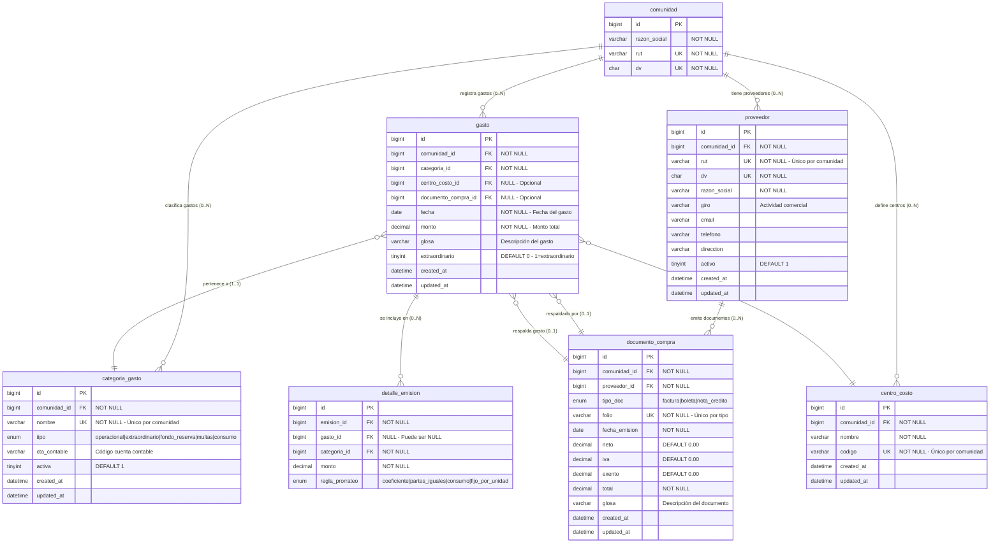

# GESTIÓN FINANCIERA Y CONTROL DE GASTOS

> **Propósito:** Gestión completa de gastos operacionales y extraordinarios, control de proveedores, documentos tributarios y clasificación contable

---

## 📊 DIAGRAMA: RELACIONES FINANCIERAS



---

## 🎯 REGLAS DE NEGOCIO

### **R1: Tipos de Gastos**

```
GASTOS OPERACIONALES (tipo='operacional')
├── Recurrentes mensuales
├── Presupuestados
├── Se distribuyen automáticamente vía alícuota
└── Ejemplos: Luz, agua, remuneraciones, aseo

GASTOS EXTRAORDINARIOS (tipo='extraordinario')
├── No recurrentes
├── Requieren aprobación en junta
├── Se distribuyen vía alícuota o específicamente
└── Ejemplos: Pintura general, cambio de ascensores, reparaciones mayores

FONDO DE RESERVA (tipo='fondo_reserva')
├── Ahorro obligatorio mensual
├── Se distribuye vía alícuota
├── No se gasta, se acumula
└── Ejemplos: Fondo de mantención, fondo de contingencias

MULTAS (tipo='multas')
├── Sanciones por infracciones
├── Se asignan a unidad específica
├── No se distribuyen
└── Ejemplos: Multa por ruidos molestos, multa por ausencia a junta

CONSUMOS INDIVIDUALES (tipo='consumo')
├── Servicios medidos por unidad
├── Se asignan según lectura de medidor
├── No se distribuyen vía alícuota
└── Ejemplos: Agua caliente individual, gas individual
```

---

### **R2: Relación Gasto ↔ Documento de Compra**

**Escenarios:**

| Situación | documento_compra_id | Validez |
|-----------|---------------------|---------|
| Gasto con factura | NOT NULL | ✅ Válido - Respaldo tributario completo |
| Gasto sin documento | NULL | ✅ Válido - Ej: Remuneraciones, multas internas |
| Gasto con boleta | NOT NULL | ✅ Válido - Respaldo parcial |
| Gasto con nota de crédito | NOT NULL | ✅ Válido - Ajuste negativo |

**Ejemplo práctico:**

```sql
-- CASO 1: Factura de luz (con documento)
-- Paso 1: Registrar documento
INSERT INTO documento_compra (comunidad_id, proveedor_id, tipo_doc, folio, fecha_emision, neto, iva, total)
VALUES (1, 5, 'factura', '123456', '2025-10-01', 420168, 79832, 500000);

SET @doc_id = LAST_INSERT_ID();

-- Paso 2: Registrar gasto vinculado
INSERT INTO gasto (comunidad_id, categoria_id, documento_compra_id, fecha, monto, glosa, extraordinario)
VALUES (1, 3, @doc_id, '2025-10-01', 500000, 'Luz áreas comunes Octubre 2025', 0);

-- CASO 2: Remuneración conserje (sin documento)
INSERT INTO gasto (comunidad_id, categoria_id, fecha, monto, glosa, extraordinario)
VALUES (1, 5, '2025-10-31', 800000, 'Sueldo conserje Octubre 2025', 0);

-- CASO 3: Nota de crédito (ajuste negativo)
INSERT INTO documento_compra (comunidad_id, proveedor_id, tipo_doc, folio, fecha_emision, total)
VALUES (1, 5, 'nota_credito', 'NC-001', '2025-10-15', -50000);

INSERT INTO gasto (comunidad_id, categoria_id, documento_compra_id, fecha, monto, glosa)
VALUES (1, 3, LAST_INSERT_ID(), '2025-10-15', -50000, 'Descuento por factura incorrecta');
```

---

### **R3: Validación de Documentos Tributarios Chilenos**

**Estructura de documentos:**

```sql
-- Constraint único: (comunidad_id, proveedor_id, tipo_doc, folio)
-- No pueden existir 2 facturas con el mismo folio del mismo proveedor

ALTER TABLE documento_compra
ADD CONSTRAINT uq_doc_compra UNIQUE (comunidad_id, proveedor_id, tipo_doc, folio);
```

**Cálculo IVA (19% en Chile):**

```sql
-- Factura con IVA
-- neto + iva = total
-- iva = neto * 0.19

INSERT INTO documento_compra (comunidad_id, proveedor_id, tipo_doc, folio, fecha_emision, neto, iva, exento, total)
VALUES (
  1, 
  5, 
  'factura', 
  '789456', 
  '2025-10-15',
  840336,           -- Neto
  159664,           -- IVA (840336 × 0.19)
  0,                -- Exento
  1000000           -- Total (neto + iva)
);

-- Verificar IVA correcto
SELECT 
  folio,
  neto,
  iva,
  total,
  ROUND(neto * 0.19, 0) as iva_calculado,
  CASE 
    WHEN ABS(iva - ROUND(neto * 0.19, 0)) <= 1 THEN 'OK'
    ELSE 'ERROR IVA'
  END as validacion
FROM documento_compra
WHERE tipo_doc = 'factura' AND iva > 0;
```

**Tipos de documento:**

| Tipo | Descripción | IVA | Uso |
|------|-------------|-----|-----|
| **factura** | Documento tributario afecto a IVA | SÍ | Servicios, compras con IVA |
| **boleta** | Comprobante de venta | Puede incluir IVA | Compras menores, retail |
| **nota_credito** | Ajuste negativo (devolución) | Según doc. original | Corrección de errores, devoluciones |

---

### **R4: Clasificación Contable**

**Estructura:**

```
COMUNIDAD
├── CATEGORÍA DE GASTO (QUÉ)
│   ├── Luz (operacional)
│   ├── Agua (operacional)
│   ├── Remuneraciones (operacional)
│   ├── Pintura edificio (extraordinario)
│   └── Fondo de reserva (fondo_reserva)
│
└── CENTRO DE COSTO (DÓNDE)
    ├── Edificio A
    ├── Torre Norte
    ├── Áreas Comunes
    ├── Administración
    └── Mantención Ascensores
```

**Ejemplo de clasificación:**

```sql
-- Luz del Edificio A
INSERT INTO gasto (comunidad_id, categoria_id, centro_costo_id, fecha, monto, glosa)
VALUES (
  1,
  (SELECT id FROM categoria_gasto WHERE nombre = 'Luz' AND comunidad_id = 1),
  (SELECT id FROM centro_costo WHERE nombre = 'Edificio A' AND comunidad_id = 1),
  '2025-10-01',
  250000,
  'Luz Edificio A - Octubre 2025'
);

-- Remuneración conserje (sin centro de costo específico)
INSERT INTO gasto (comunidad_id, categoria_id, fecha, monto, glosa)
VALUES (1, 5, '2025-10-31', 800000, 'Sueldo conserje Octubre 2025');
```

---

### **R5: Gastos Extraordinarios (Aprobación Especial)**

**Flujo de aprobación:**

```
1. Propuesta de gasto extraordinario
   ↓
2. Evaluación por Comité/Administrador
   ↓
3. Aprobación en Junta de Propietarios
   ↓
4. Registro en sistema con flag extraordinario=1
   ↓
5. Inclusión en emisión de gastos comunes
```

**Registro en base de datos:**

```sql
-- Gasto extraordinario aprobado
INSERT INTO gasto (comunidad_id, categoria_id, fecha, monto, glosa, extraordinario)
VALUES (
  1,
  (SELECT id FROM categoria_gasto WHERE tipo = 'extraordinario' AND comunidad_id = 1 LIMIT 1),
  '2025-09-15',
  5000000,
  'Pintura fachada edificio completo - Aprobado en Junta 15/09/2025',
  1  -- extraordinario = TRUE
);

-- Query para listar gastos extraordinarios pendientes de distribución
SELECT 
  g.fecha,
  g.monto,
  g.glosa,
  cg.nombre as categoria,
  CASE 
    WHEN EXISTS (SELECT 1 FROM detalle_emision WHERE gasto_id = g.id) 
    THEN 'Distribuido'
    ELSE 'Pendiente'
  END as estado_distribucion
FROM gasto g
INNER JOIN categoria_gasto cg ON cg.id = g.categoria_id
WHERE g.comunidad_id = ?
  AND g.extraordinario = 1
ORDER BY g.fecha DESC;
```

---

## 📋 CASOS DE USO

### **CU1: Registrar Proveedor**

```sql
-- Proveedor con RUT único por comunidad
INSERT INTO proveedor (comunidad_id, rut, dv, razon_social, giro, email, telefono, activo)
VALUES (
  1,
  '76543210',
  '9',
  'Enel Distribución Chile S.A.',
  'Distribución de energía eléctrica',
  'atencion@enel.cl',
  '+56 2 2353 4000',
  1
);

-- Verificar unicidad de RUT en comunidad
SELECT 
  p.razon_social,
  p.rut || '-' || p.dv as rut_completo,
  p.activo
FROM proveedor p
WHERE p.comunidad_id = 1
  AND p.rut = '76543210';
```

---

### **CU2: Registrar Factura y Gasto Asociado**

```sql
-- Paso 1: Buscar/crear proveedor
SET @proveedor_id = (SELECT id FROM proveedor WHERE rut = '76543210' AND comunidad_id = 1);

-- Paso 2: Registrar factura
INSERT INTO documento_compra (
  comunidad_id, 
  proveedor_id, 
  tipo_doc, 
  folio, 
  fecha_emision,
  neto,
  iva,
  total,
  glosa
) VALUES (
  1,
  @proveedor_id,
  'factura',
  '123456789',
  '2025-10-01',
  420168,      -- Neto
  79832,       -- IVA (19%)
  500000,      -- Total
  'Suministro eléctrico Octubre 2025'
);

SET @doc_id = LAST_INSERT_ID();

-- Paso 3: Registrar gasto vinculado
INSERT INTO gasto (
  comunidad_id,
  categoria_id,
  centro_costo_id,
  documento_compra_id,
  fecha,
  monto,
  glosa,
  extraordinario
) VALUES (
  1,
  (SELECT id FROM categoria_gasto WHERE nombre = 'Luz' AND comunidad_id = 1),
  (SELECT id FROM centro_costo WHERE codigo = 'ADM-001' AND comunidad_id = 1),
  @doc_id,
  '2025-10-01',
  500000,
  'Luz áreas comunes Octubre 2025',
  0
);
```

---

### **CU3: Registrar Gasto sin Documento (Remuneración)**

```sql
-- Remuneración no requiere factura
INSERT INTO gasto (
  comunidad_id,
  categoria_id,
  fecha,
  monto,
  glosa,
  extraordinario
) VALUES (
  1,
  (SELECT id FROM categoria_gasto WHERE nombre = 'Remuneraciones' AND comunidad_id = 1),
  '2025-10-31',
  1200000,
  'Sueldo base conserje + gratificación - Octubre 2025',
  0
);
```

---

### **CU4: Registrar Gasto Extraordinario**

```sql
-- Gasto extraordinario aprobado en junta
INSERT INTO gasto (
  comunidad_id,
  categoria_id,
  centro_costo_id,
  fecha,
  monto,
  glosa,
  extraordinario
) VALUES (
  1,
  (SELECT id FROM categoria_gasto WHERE tipo = 'extraordinario' AND comunidad_id = 1 LIMIT 1),
  (SELECT id FROM centro_costo WHERE nombre = 'Edificio A' AND comunidad_id = 1),
  '2025-09-20',
  8500000,
  'Reparación sistema contra incendios - Aprobado Junta 15/09/2025 - Acta N°12',
  1  -- Extraordinario
);

-- Auditar aprobación
INSERT INTO auditoria (
  usuario_id,
  accion,
  tabla,
  registro_id,
  valores_nuevos
) VALUES (
  123,  -- ID del administrador
  'INSERT',
  'gasto',
  LAST_INSERT_ID(),
  JSON_OBJECT(
    'tipo', 'extraordinario',
    'monto', 8500000,
    'acta_junta', 'N°12 del 15/09/2025'
  )
);
```

---

### **CU5: Aplicar Nota de Crédito (Devolución)**

```sql
-- Escenario: Factura incorrecta, proveedor emite nota de crédito

-- Factura original
SET @factura_original = 456789;
SET @proveedor_id = 5;

-- Registrar nota de crédito
INSERT INTO documento_compra (
  comunidad_id,
  proveedor_id,
  tipo_doc,
  folio,
  fecha_emision,
  neto,
  iva,
  total,
  glosa
) VALUES (
  1,
  @proveedor_id,
  'nota_credito',
  'NC-123456',
  '2025-10-15',
  -84034,      -- Neto negativo
  -15966,      -- IVA negativo
  -100000,     -- Total negativo
  'Nota de crédito por factura incorrecta N°' || @factura_original
);

-- Registrar ajuste en gastos
INSERT INTO gasto (
  comunidad_id,
  categoria_id,
  documento_compra_id,
  fecha,
  monto,
  glosa
) VALUES (
  1,
  (SELECT id FROM categoria_gasto WHERE nombre = 'Luz' AND comunidad_id = 1),
  LAST_INSERT_ID(),
  '2025-10-15',
  -100000,
  'Ajuste por nota de crédito - Factura incorrecta'
);
```

---

### **CU6: Crear Categorías Estándar para Nueva Comunidad**

```sql
SET @comunidad_id = 1;

-- Categorías operacionales
INSERT INTO categoria_gasto (comunidad_id, nombre, tipo, cta_contable, activa)
VALUES 
(@comunidad_id, 'Luz', 'operacional', '5101-001', 1),
(@comunidad_id, 'Agua', 'operacional', '5101-002', 1),
(@comunidad_id, 'Gas', 'operacional', '5101-003', 1),
(@comunidad_id, 'Remuneraciones', 'operacional', '5201-001', 1),
(@comunidad_id, 'Mantención Ascensores', 'operacional', '5301-001', 1),
(@comunidad_id, 'Aseo', 'operacional', '5301-002', 1),
(@comunidad_id, 'Seguridad', 'operacional', '5401-001', 1);

-- Categorías extraordinarias
INSERT INTO categoria_gasto (comunidad_id, nombre, tipo, cta_contable, activa)
VALUES 
(@comunidad_id, 'Reparaciones Mayores', 'extraordinario', '5501-001', 1),
(@comunidad_id, 'Obras de Mejora', 'extraordinario', '5501-002', 1);

-- Fondo de reserva
INSERT INTO categoria_gasto (comunidad_id, nombre, tipo, cta_contable, activa)
VALUES 
(@comunidad_id, 'Fondo de Mantención', 'fondo_reserva', '2101-001', 1);

-- Multas
INSERT INTO categoria_gasto (comunidad_id, nombre, tipo, cta_contable, activa)
VALUES 
(@comunidad_id, 'Multas Reglamento', 'multas', '4201-001', 1);

-- Consumos individuales
INSERT INTO categoria_gasto (comunidad_id, nombre, tipo, cta_contable, activa)
VALUES 
(@comunidad_id, 'Agua Caliente Individual', 'consumo', '5101-010', 1),
(@comunidad_id, 'Gas Individual', 'consumo', '5101-011', 1);
```

---

### **CU7: Crear Centros de Costo**

```sql
SET @comunidad_id = 1;

-- Centros de costo por edificio/área
INSERT INTO centro_costo (comunidad_id, nombre, codigo)
VALUES 
(@comunidad_id, 'Administración General', 'ADM-001'),
(@comunidad_id, 'Edificio A', 'EDF-A'),
(@comunidad_id, 'Edificio B', 'EDF-B'),
(@comunidad_id, 'Torre Norte', 'TRR-N'),
(@comunidad_id, 'Torre Sur', 'TRR-S'),
(@comunidad_id, 'Áreas Comunes', 'COM-001'),
(@comunidad_id, 'Estacionamientos', 'EST-001'),
(@comunidad_id, 'Ascensores', 'ASC-001'),
(@comunidad_id, 'Jardines', 'JAR-001');
```

---

## 🔍 QUERIES ÚTILES

### **Q1: Resumen de Gastos por Mes**

```sql
SELECT 
  DATE_FORMAT(g.fecha, '%Y-%m') as periodo,
  cg.tipo as tipo_gasto,
  COUNT(*) as cantidad_gastos,
  SUM(g.monto) as total_mes,
  AVG(g.monto) as promedio_gasto
FROM gasto g
INNER JOIN categoria_gasto cg ON cg.id = g.categoria_id
WHERE g.comunidad_id = ?
  AND g.fecha >= DATE_SUB(CURDATE(), INTERVAL 12 MONTH)
GROUP BY DATE_FORMAT(g.fecha, '%Y-%m'), cg.tipo
ORDER BY periodo DESC, cg.tipo;
```

---

### **Q2: Gastos por Categoría (Mes Actual)**

```sql
SELECT 
  cg.nombre as categoria,
  cg.tipo,
  COUNT(g.id) as cantidad,
  SUM(g.monto) as total,
  CONCAT(
    ROUND(SUM(g.monto) / (SELECT SUM(monto) FROM gasto WHERE comunidad_id = ? AND MONTH(fecha) = MONTH(CURDATE())) * 100, 2),
    '%'
  ) as porcentaje_del_total
FROM categoria_gasto cg
LEFT JOIN gasto g 
  ON g.categoria_id = cg.id 
  AND g.comunidad_id = ?
  AND MONTH(g.fecha) = MONTH(CURDATE())
  AND YEAR(g.fecha) = YEAR(CURDATE())
WHERE cg.comunidad_id = ?
  AND cg.activa = 1
GROUP BY cg.id, cg.nombre, cg.tipo
ORDER BY total DESC;
```

---

### **Q3: Gastos por Centro de Costo**

```sql
SELECT 
  cc.nombre as centro_costo,
  cc.codigo,
  COUNT(g.id) as cantidad_gastos,
  SUM(g.monto) as total_gastado,
  MIN(g.fecha) as primer_gasto,
  MAX(g.fecha) as ultimo_gasto
FROM centro_costo cc
LEFT JOIN gasto g ON g.centro_costo_id = cc.id
WHERE cc.comunidad_id = ?
  AND g.fecha >= DATE_SUB(CURDATE(), INTERVAL 6 MONTH)
GROUP BY cc.id, cc.nombre, cc.codigo
ORDER BY total_gastado DESC;
```

---

### **Q4: Proveedores con Mayor Facturación**

```sql
SELECT 
  p.razon_social,
  p.rut || '-' || p.dv as rut,
  p.giro,
  COUNT(DISTINCT dc.id) as total_documentos,
  SUM(dc.total) as total_facturado,
  MAX(dc.fecha_emision) as ultima_factura
FROM proveedor p
INNER JOIN documento_compra dc ON dc.proveedor_id = p.id
WHERE p.comunidad_id = ?
  AND dc.fecha_emision >= DATE_SUB(CURDATE(), INTERVAL 12 MONTH)
GROUP BY p.id, p.razon_social, p.rut, p.dv, p.giro
ORDER BY total_facturado DESC
LIMIT 10;
```

---

### **Q5: Detalle de Gasto con Documento**

```sql
SELECT 
  g.fecha,
  g.monto,
  g.glosa,
  g.extraordinario,
  cg.nombre as categoria,
  cg.tipo as tipo_categoria,
  cc.nombre as centro_costo,
  p.razon_social as proveedor,
  dc.tipo_doc,
  dc.folio,
  dc.fecha_emision as fecha_documento,
  dc.neto,
  dc.iva,
  dc.total as total_documento
FROM gasto g
INNER JOIN categoria_gasto cg ON cg.id = g.categoria_id
LEFT JOIN centro_costo cc ON cc.id = g.centro_costo_id
LEFT JOIN documento_compra dc ON dc.id = g.documento_compra_id
LEFT JOIN proveedor p ON p.id = dc.proveedor_id
WHERE g.comunidad_id = ?
  AND g.id = ?;
```

---

### **Q6: Gastos sin Documento de Respaldo**

```sql
SELECT 
  g.fecha,
  g.monto,
  g.glosa,
  cg.nombre as categoria,
  CASE 
    WHEN g.extraordinario = 1 THEN 'Extraordinario'
    ELSE 'Operacional'
  END as tipo,
  DATEDIFF(CURDATE(), g.fecha) as dias_antiguedad
FROM gasto g
INNER JOIN categoria_gasto cg ON cg.id = g.categoria_id
WHERE g.comunidad_id = ?
  AND g.documento_compra_id IS NULL
  AND g.fecha >= DATE_SUB(CURDATE(), INTERVAL 3 MONTH)
ORDER BY g.fecha DESC;
```

---

### **Q7: Validar Consistencia IVA en Facturas**

```sql
-- Facturas con IVA mal calculado (diferencia > $1)
SELECT 
  dc.folio,
  p.razon_social as proveedor,
  dc.fecha_emision,
  dc.neto,
  dc.iva as iva_declarado,
  ROUND(dc.neto * 0.19, 0) as iva_calculado,
  ABS(dc.iva - ROUND(dc.neto * 0.19, 0)) as diferencia,
  dc.total
FROM documento_compra dc
INNER JOIN proveedor p ON p.id = dc.proveedor_id
WHERE dc.comunidad_id = ?
  AND dc.tipo_doc = 'factura'
  AND dc.iva > 0
  AND ABS(dc.iva - ROUND(dc.neto * 0.19, 0)) > 1
ORDER BY diferencia DESC;
```

---

### **Q8: Gastos Extraordinarios Pendientes de Distribución**

```sql
SELECT 
  g.fecha,
  g.monto,
  g.glosa,
  cg.nombre as categoria,
  CASE 
    WHEN EXISTS (
      SELECT 1 FROM detalle_emision de WHERE de.gasto_id = g.id
    ) THEN 'Distribuido'
    ELSE 'Pendiente'
  END as estado_distribucion,
  DATEDIFF(CURDATE(), g.fecha) as dias_pendiente
FROM gasto g
INNER JOIN categoria_gasto cg ON cg.id = g.categoria_id
WHERE g.comunidad_id = ?
  AND g.extraordinario = 1
ORDER BY g.fecha DESC;
```

---

## ⚠️ VALIDACIONES Y TRIGGERS

### **V1: Validar IVA en Facturas**

```sql
DELIMITER $$
CREATE TRIGGER trg_documento_validar_iva
BEFORE INSERT ON documento_compra
FOR EACH ROW
BEGIN
  DECLARE iva_calculado DECIMAL(12,2);
  
  IF NEW.tipo_doc = 'factura' AND NEW.neto > 0 THEN
    SET iva_calculado = ROUND(NEW.neto * 0.19, 2);
    
    -- Validar que IVA esté en rango aceptable (±$2 por redondeo)
    IF ABS(NEW.iva - iva_calculado) > 2 THEN
      SIGNAL SQLSTATE '45000' 
      SET MESSAGE_TEXT = 'IVA no coincide con neto × 19% (permitido ±$2 por redondeo)';
    END IF;
  END IF;
END$$

CREATE TRIGGER trg_documento_validar_iva_update
BEFORE UPDATE ON documento_compra
FOR EACH ROW
BEGIN
  DECLARE iva_calculado DECIMAL(12,2);
  
  IF NEW.tipo_doc = 'factura' AND NEW.neto > 0 THEN
    SET iva_calculado = ROUND(NEW.neto * 0.19, 2);
    
    IF ABS(NEW.iva - iva_calculado) > 2 THEN
      SIGNAL SQLSTATE '45000' 
      SET MESSAGE_TEXT = 'IVA no coincide con neto × 19% (permitido ±$2 por redondeo)';
    END IF;
  END IF;
END$$
DELIMITER ;
```

---

### **V2: Validar Total del Documento**

```sql
DELIMITER $$
CREATE TRIGGER trg_documento_validar_total
BEFORE INSERT ON documento_compra
FOR EACH ROW
BEGIN
  DECLARE total_calculado DECIMAL(12,2);
  
  SET total_calculado = NEW.neto + NEW.iva + NEW.exento;
  
  IF ABS(NEW.total - total_calculado) > 1 THEN
    SIGNAL SQLSTATE '45000' 
    SET MESSAGE_TEXT = 'Total no coincide con neto + iva + exento';
  END IF;
END$$

CREATE TRIGGER trg_documento_validar_total_update
BEFORE UPDATE ON documento_compra
FOR EACH ROW
BEGIN
  DECLARE total_calculado DECIMAL(12,2);
  
  SET total_calculado = NEW.neto + NEW.iva + NEW.exento;
  
  IF ABS(NEW.total - total_calculado) > 1 THEN
    SIGNAL SQLSTATE '45000' 
    SET MESSAGE_TEXT = 'Total no coincide con neto + iva + exento';
  END IF;
END$$
DELIMITER ;
```

---

### **V3: Validar Monto del Gasto vs Documento**

```sql
DELIMITER $$
CREATE TRIGGER trg_gasto_validar_monto_documento
BEFORE INSERT ON gasto
FOR EACH ROW
BEGIN
  DECLARE total_doc DECIMAL(12,2);
  
  IF NEW.documento_compra_id IS NOT NULL THEN
    SELECT total INTO total_doc
    FROM documento_compra
    WHERE id = NEW.documento_compra_id;
    
    -- Permitir diferencia de ±$10 por redondeo
    IF ABS(NEW.monto - total_doc) > 10 THEN
      SIGNAL SQLSTATE '45000' 
      SET MESSAGE_TEXT = 'Monto del gasto difiere significativamente del documento asociado';
    END IF;
  END IF;
END$$
DELIMITER ;
```

---

### **V4: Auditar Gastos Extraordinarios**

```sql
DELIMITER $$
CREATE TRIGGER trg_gasto_auditar_extraordinario
AFTER INSERT ON gasto
FOR EACH ROW
BEGIN
  IF NEW.extraordinario = 1 AND NEW.monto > 1000000 THEN
    INSERT INTO auditoria (
      usuario_id,
      accion,
      tabla,
      registro_id,
      valores_nuevos,
      ip_address
    ) VALUES (
      @current_user_id,
      'INSERT',
      'gasto',
      NEW.id,
      JSON_OBJECT(
        'tipo', 'extraordinario',
        'monto', NEW.monto,
        'glosa', NEW.glosa
      ),
      @current_ip
    );
  END IF;
END$$
DELIMITER ;
```

---

## 📈 REPORTES FINANCIEROS

### **R1: Estado de Resultados (Mensual)**

```sql
SELECT 
  'INGRESOS' as seccion,
  'Gastos Comunes Cobrados' as concepto,
  COALESCE(SUM(ccu.monto_total), 0) as monto
FROM cuenta_cobro_unidad ccu
WHERE ccu.comunidad_id = ?
  AND MONTH(ccu.created_at) = MONTH(CURDATE())
  AND YEAR(ccu.created_at) = YEAR(CURDATE())

UNION ALL

SELECT 
  'EGRESOS',
  cg.nombre,
  COALESCE(SUM(g.monto), 0)
FROM categoria_gasto cg
LEFT JOIN gasto g 
  ON g.categoria_id = cg.id
  AND g.comunidad_id = ?
  AND MONTH(g.fecha) = MONTH(CURDATE())
  AND YEAR(g.fecha) = YEAR(CURDATE())
WHERE cg.comunidad_id = ?
GROUP BY cg.id, cg.nombre

UNION ALL

SELECT 
  'RESULTADO',
  'Superávit/Déficit del Mes',
  (
    SELECT COALESCE(SUM(ccu.monto_total), 0)
    FROM cuenta_cobro_unidad ccu
    WHERE ccu.comunidad_id = ?
      AND MONTH(ccu.created_at) = MONTH(CURDATE())
      AND YEAR(ccu.created_at) = YEAR(CURDATE())
  ) - (
    SELECT COALESCE(SUM(g.monto), 0)
    FROM gasto g
    WHERE g.comunidad_id = ?
      AND MONTH(g.fecha) = MONTH(CURDATE())
      AND YEAR(g.fecha) = YEAR(CURDATE())
  );
```

---

### **R2: Comparativo Anual por Categoría**

```sql
SELECT 
  cg.nombre as categoria,
  SUM(CASE WHEN YEAR(g.fecha) = YEAR(CURDATE()) THEN g.monto ELSE 0 END) as ano_actual,
  SUM(CASE WHEN YEAR(g.fecha) = YEAR(CURDATE()) - 1 THEN g.monto ELSE 0 END) as ano_anterior,
  CONCAT(
    ROUND(
      (SUM(CASE WHEN YEAR(g.fecha) = YEAR(CURDATE()) THEN g.monto ELSE 0 END) - 
       SUM(CASE WHEN YEAR(g.fecha) = YEAR(CURDATE()) - 1 THEN g.monto ELSE 0 END)) /
      NULLIF(SUM(CASE WHEN YEAR(g.fecha) = YEAR(CURDATE()) - 1 THEN g.monto ELSE 0 END), 0) * 100,
      2
    ),
    '%'
  ) as variacion
FROM categoria_gasto cg
LEFT JOIN gasto g ON g.categoria_id = cg.id
WHERE cg.comunidad_id = ?
GROUP BY cg.id, cg.nombre
ORDER BY ano_actual DESC;
```

---

**Fecha:** Octubre 2025  
**Versión:** 1.0  
**Módulo:** 2 de 6