# AMENIDADES Y SISTEMA DE RESERVAS

> **Propósito:** Gestión completa de espacios comunes, sistema de reservas, control de acceso y políticas de uso

---

## 📊 DIAGRAMA: RELACIONES DE AMENIDADES

```mermaid
erDiagram
    comunidad ||--o{ amenidad : "tiene espacios (0..N)"
    comunidad ||--o{ politica_reserva : "define políticas (0..N)"
    
    amenidad ||--o{ reserva : "puede ser reservada (0..N)"
    amenidad ||--o{ bloqueo_amenidad : "tiene bloqueos (0..N)"
    amenidad ||--o{ tarifa_amenidad : "tiene tarifas (0..N)"
    
    unidad ||--o{ reserva : "realiza reservas (0..N)"
    persona ||--o{ reserva : "solicita reservas (0..N)"
    
    reserva ||--o{ pago_reserva : "se paga con (0..N)"
    
    comunidad {
        bigint id PK
        varchar razon_social "NOT NULL"
    }
    
    amenidad {
        bigint id PK
        bigint comunidad_id FK "NOT NULL"
        varchar nombre UK "NOT NULL - Único por comunidad"
        enum tipo "quincho|piscina|sala_eventos|cancha|gimnasio|sala_reuniones|estacionamiento_visita|otro"
        text descripcion
        int capacidad_personas "NULL - Opcional"
        decimal m2 "NULL - Metros cuadrados"
        varchar ubicacion "Edificio A, Piso 1"
        tinyint requiere_pago "DEFAULT 0"
        tinyint requiere_aprobacion "DEFAULT 0"
        tinyint activa "DEFAULT 1"
        text restricciones "Condiciones de uso"
        datetime created_at
        datetime updated_at
    }
    
    tarifa_amenidad {
        bigint id PK
        bigint amenidad_id FK "NOT NULL"
        enum tipo_tarifa "propietario|arrendatario|externo"
        decimal monto "NOT NULL"
        enum unidad_tiempo "hora|dia|evento"
        date vigencia_desde "NOT NULL"
        date vigencia_hasta "NULL"
        tinyint activa "DEFAULT 1"
        datetime created_at
    }
    
    politica_reserva {
        bigint id PK
        bigint comunidad_id FK "NOT NULL"
        bigint amenidad_id FK "NULL - NULL=política general"
        varchar nombre "NOT NULL"
        int dias_anticipacion_min "Mínimo días para reservar"
        int dias_anticipacion_max "Máximo días futuro"
        int duracion_min_minutos "Duración mínima"
        int duracion_max_minutos "Duración máxima"
        int max_reservas_simultaneas "Por unidad"
        int max_reservas_mes "Límite mensual"
        time hora_inicio_disponible "08:00:00"
        time hora_fin_disponible "22:00:00"
        json dias_semana_disponibles "[1,2,3,4,5,6,0]"
        tinyint permite_cancelacion "DEFAULT 1"
        int horas_anticipacion_cancelacion "Mínimo para cancelar"
        tinyint activa "DEFAULT 1"
        datetime created_at
        datetime updated_at
    }
    
    reserva {
        bigint id PK
        bigint amenidad_id FK "NOT NULL"
        bigint unidad_id FK "NOT NULL"
        bigint persona_id FK "NOT NULL - Quien reserva"
        bigint comunidad_id FK "NOT NULL"
        datetime fecha_inicio "NOT NULL"
        datetime fecha_fin "NOT NULL"
        int cantidad_personas "NULL"
        enum estado "solicitada|confirmada|cancelada|completada|no_presentado"
        decimal monto_cobrado "DEFAULT 0.00"
        text motivo_evento "Descripción del evento"
        text observaciones
        datetime fecha_cancelacion "NULL"
        varchar motivo_cancelacion "NULL"
        datetime created_at
        datetime updated_at
    }
    
    bloqueo_amenidad {
        bigint id PK
        bigint amenidad_id FK "NOT NULL"
        bigint comunidad_id FK "NOT NULL"
        datetime fecha_inicio "NOT NULL"
        datetime fecha_fin "NOT NULL"
        enum motivo "mantencion|reparacion|evento_comunidad|clausura_temporal|otro"
        text descripcion "Razón del bloqueo"
        bigint usuario_bloqueo_id FK "Quien bloqueó"
        datetime created_at
    }
    
    pago_reserva {
        bigint id PK
        bigint reserva_id FK "NOT NULL"
        decimal monto "NOT NULL"
        date fecha_pago "NOT NULL"
        enum medio_pago "efectivo|transferencia|tarjeta"
        varchar comprobante "Número de comprobante"
        enum estado "pendiente|pagado|reembolsado"
        datetime created_at
    }
```



---

## 🎯 REGLAS DE NEGOCIO

### **R1: Tipos de Amenidades Comunes**

```
ESPACIOS RECREATIVOS
├── Quincho / Parrilla
│   ├── Capacidad: 20-50 personas
│   ├── Requiere pago: SÍ (limpieza)
│   └── Horario: 10:00 - 23:00
│
├── Piscina
│   ├── Capacidad: Variable
│   ├── Requiere pago: NO
│   └── Horario: 08:00 - 21:00 (verano)
│
├── Sala de Eventos / Salón de Fiestas
│   ├── Capacidad: 50-100 personas
│   ├── Requiere pago: SÍ (alto costo)
│   └── Requiere aprobación: SÍ
│
└── Cancha Deportiva (tenis, fútbol)
    ├── Capacidad: 4-22 personas
    ├── Requiere pago: SÍ (opcional)
    └── Horario: 07:00 - 22:00

ESPACIOS DE SERVICIO
├── Sala de Reuniones
│   ├── Capacidad: 10-20 personas
│   ├── Requiere pago: NO
│   └── Uso: Juntas, reuniones vecinales
│
├── Gimnasio
│   ├── Capacidad: 10-15 personas
│   ├── Requiere pago: NO (incluido en gastos comunes)
│   └── Horario: 06:00 - 23:00
│
└── Estacionamiento de Visitas
    ├── Capacidad: 1 vehículo por espacio
    ├── Requiere pago: NO
    └── Duración: Máximo 24 horas
```

---

### **R2: Estados de Reserva (Máquina de Estados)**

```mermaid
stateDiagram-v2
    [*] --> solicitada: Usuario crea reserva
    
    solicitada --> confirmada: Aprobación automática/manual
    solicitada --> cancelada: Usuario cancela
    
    confirmada --> completada: Fecha pasó, uso normal
    confirmada --> no_presentado: Fecha pasó, no se presentó
    confirmada --> cancelada: Cancelación dentro de plazo
    
    completada --> [*]
    no_presentado --> [*]
    cancelada --> [*]
```



**Transiciones:**

| Estado | Descripción | Siguiente |
|--------|-------------|-----------|
| **solicitada** | Reserva creada, esperando confirmación | confirmada / cancelada |
| **confirmada** | Aprobada, esperando uso | completada / no_presentado / cancelada |
| **cancelada** | Cancelada por usuario o administrador | [final] |
| **completada** | Usada exitosamente | [final] |
| **no_presentado** | No se presentó (puede generar multa) | [final] |

---

### **R3: Validaciones de Reserva**

**Restricciones temporales:**

```sql
-- V1: Días de anticipación mínima/máxima
-- Ejemplo: Quincho requiere mínimo 2 días de anticipación, máximo 30 días

SELECT 
  CASE 
    WHEN DATEDIFF(fecha_inicio, CURDATE()) < politica.dias_anticipacion_min 
    THEN 'ERROR: Debe reservar con al menos X días de anticipación'
    WHEN DATEDIFF(fecha_inicio, CURDATE()) > politica.dias_anticipacion_max 
    THEN 'ERROR: No puede reservar con más de Y días de anticipación'
    ELSE 'OK'
  END as validacion_anticipacion
FROM reserva r
INNER JOIN politica_reserva politica ON politica.amenidad_id = r.amenidad_id;

-- V2: Horario permitido
-- Ejemplo: Quincho disponible 10:00 - 23:00

SELECT 
  CASE 
    WHEN TIME(fecha_inicio) < politica.hora_inicio_disponible 
    THEN 'ERROR: Hora de inicio fuera del horario permitido'
    WHEN TIME(fecha_fin) > politica.hora_fin_disponible 
    THEN 'ERROR: Hora de fin fuera del horario permitido'
    ELSE 'OK'
  END as validacion_horario
FROM reserva r
INNER JOIN politica_reserva politica ON politica.amenidad_id = r.amenidad_id;

-- V3: Duración mínima/máxima
-- Ejemplo: Sala de eventos mínimo 3 horas, máximo 8 horas

SELECT 
  TIMESTAMPDIFF(MINUTE, fecha_inicio, fecha_fin) as duracion_minutos,
  CASE 
    WHEN TIMESTAMPDIFF(MINUTE, fecha_inicio, fecha_fin) < politica.duracion_min_minutos 
    THEN 'ERROR: Duración menor a la mínima permitida'
    WHEN TIMESTAMPDIFF(MINUTE, fecha_inicio, fecha_fin) > politica.duracion_max_minutos 
    THEN 'ERROR: Duración mayor a la máxima permitida'
    ELSE 'OK'
  END as validacion_duracion
FROM reserva r
INNER JOIN politica_reserva politica ON politica.amenidad_id = r.amenidad_id;

-- V4: Días de la semana permitidos
-- Ejemplo: Quincho solo viernes, sábado, domingo

SELECT 
  DAYOFWEEK(fecha_inicio) as dia_semana,
  CASE 
    WHEN JSON_CONTAINS(politica.dias_semana_disponibles, CAST(DAYOFWEEK(fecha_inicio) AS JSON))
    THEN 'OK'
    ELSE 'ERROR: Día de la semana no permitido'
  END as validacion_dia_semana
FROM reserva r
INNER JOIN politica_reserva politica ON politica.amenidad_id = r.amenidad_id;

-- V5: Máximo de reservas simultáneas por unidad
-- Ejemplo: Máximo 2 reservas activas al mismo tiempo

SELECT 
  COUNT(*) as reservas_activas,
  CASE 
    WHEN COUNT(*) >= politica.max_reservas_simultaneas 
    THEN 'ERROR: Ya tiene el máximo de reservas activas'
    ELSE 'OK'
  END as validacion_limite
FROM reserva r
INNER JOIN politica_reserva politica ON politica.amenidad_id = r.amenidad_id
WHERE r.unidad_id = ?
  AND r.estado IN ('solicitada', 'confirmada')
  AND r.fecha_inicio >= CURDATE();

-- V6: Máximo de reservas por mes
-- Ejemplo: Máximo 4 reservas del quincho por mes

SELECT 
  COUNT(*) as reservas_mes,
  CASE 
    WHEN COUNT(*) >= politica.max_reservas_mes 
    THEN 'ERROR: Ya alcanzó el límite de reservas mensuales'
    ELSE 'OK'
  END as validacion_mensual
FROM reserva r
INNER JOIN politica_reserva politica ON politica.amenidad_id = r.amenidad_id
WHERE r.unidad_id = ?
  AND r.amenidad_id = ?
  AND MONTH(r.fecha_inicio) = MONTH(CURDATE())
  AND YEAR(r.fecha_inicio) = YEAR(CURDATE())
  AND r.estado != 'cancelada';
```

---

### **R4: Detección de Conflictos de Reserva**

```sql
-- V7: Detectar solapamiento de reservas
-- La amenidad no puede estar reservada en el mismo horario

SELECT 
  r_existente.id as reserva_conflicto,
  r_existente.fecha_inicio,
  r_existente.fecha_fin,
  r_existente.estado
FROM reserva r_existente
WHERE r_existente.amenidad_id = ?
  AND r_existente.estado IN ('solicitada', 'confirmada')
  AND (
    -- Nueva reserva comienza durante reserva existente
    (? BETWEEN r_existente.fecha_inicio AND r_existente.fecha_fin)
    OR
    -- Nueva reserva termina durante reserva existente
    (? BETWEEN r_existente.fecha_inicio AND r_existente.fecha_fin)
    OR
    -- Nueva reserva engloba reserva existente
    (? <= r_existente.fecha_inicio AND ? >= r_existente.fecha_fin)
  );

-- Si retorna filas → CONFLICTO (no se puede reservar)

-- V8: Detectar bloqueos de amenidad
SELECT 
  b.id,
  b.fecha_inicio,
  b.fecha_fin,
  b.motivo,
  b.descripcion
FROM bloqueo_amenidad b
WHERE b.amenidad_id = ?
  AND b.fecha_fin >= ?  -- Nueva reserva inicio
  AND b.fecha_inicio <= ?  -- Nueva reserva fin
  AND (
    -- Bloqueo solapa con nueva reserva
    (? BETWEEN b.fecha_inicio AND b.fecha_fin)
    OR
    (? BETWEEN b.fecha_inicio AND b.fecha_fin)
    OR
    (? <= b.fecha_inicio AND ? >= b.fecha_fin)
  );

-- Si retorna filas → BLOQUEADA (no se puede reservar)
```

---

### **R5: Cálculo de Tarifas**

```sql
-- Determinar tarifa según tipo de usuario y duración

-- Ejemplo: Quincho
-- - Propietarios: $30.000 por evento
-- - Arrendatarios: $40.000 por evento
-- - Externos (invitados): $60.000 por evento

SELECT 
  ta.monto,
  ta.unidad_tiempo,
  CASE ta.unidad_tiempo
    WHEN 'evento' THEN ta.monto
    WHEN 'hora' THEN ta.monto * CEIL(TIMESTAMPDIFF(MINUTE, ?, ?) / 60)
    WHEN 'dia' THEN ta.monto * CEIL(TIMESTAMPDIFF(HOUR, ?, ?) / 24)
  END as monto_total
FROM tarifa_amenidad ta
INNER JOIN titulares_unidad tu ON tu.unidad_id = ?
WHERE ta.amenidad_id = ?
  AND ta.tipo_tarifa = CASE 
    WHEN tu.tipo = 'propietario' THEN 'propietario'
    WHEN tu.tipo = 'arrendatario' THEN 'arrendatario'
    ELSE 'externo'
  END
  AND ta.activa = 1
  AND (ta.vigencia_hasta IS NULL OR ta.vigencia_hasta >= CURDATE())
ORDER BY ta.vigencia_desde DESC
LIMIT 1;
```

---

### **R6: Políticas de Cancelación**

```sql
-- Verificar si puede cancelar según política

SELECT 
  CASE 
    WHEN politica.permite_cancelacion = 0 
    THEN 'ERROR: Esta amenidad no permite cancelaciones'
    WHEN TIMESTAMPDIFF(HOUR, NOW(), r.fecha_inicio) < politica.horas_anticipacion_cancelacion
    THEN CONCAT('ERROR: Debe cancelar con al menos ', politica.horas_anticipacion_cancelacion, ' horas de anticipación')
    WHEN r.estado NOT IN ('solicitada', 'confirmada')
    THEN 'ERROR: No se puede cancelar una reserva en este estado'
    ELSE 'OK'
  END as puede_cancelar,
  -- Determinar si hay reembolso
  CASE 
    WHEN TIMESTAMPDIFF(HOUR, NOW(), r.fecha_inicio) >= 48 
    THEN 'Reembolso 100%'
    WHEN TIMESTAMPDIFF(HOUR, NOW(), r.fecha_inicio) >= 24 
    THEN 'Reembolso 50%'
    ELSE 'Sin reembolso'
  END as politica_reembolso
FROM reserva r
INNER JOIN politica_reserva politica ON politica.amenidad_id = r.amenidad_id
WHERE r.id = ?;
```

---

## 📋 CASOS DE USO

### **CU1: Configurar Amenidad Básica (Quincho)**

```sql
-- Paso 1: Crear amenidad
INSERT INTO amenidad (
  comunidad_id,
  nombre,
  tipo,
  descripcion,
  capacidad_personas,
  m2,
  ubicacion,
  requiere_pago,
  requiere_aprobacion,
  activa,
  restricciones
) VALUES (
  1,
  'Quincho Principal',
  'quincho',
  'Quincho con parrilla, mesas, sillas y baño. Capacidad 40 personas.',
  40,
  60.00,
  'Terraza nivel -1',
  1,  -- Requiere pago
  0,  -- No requiere aprobación
  1,  -- Activa
  'Prohibido fumar en espacios cerrados. Música hasta las 23:00. Responsable de limpieza.'
);

SET @amenidad_id = LAST_INSERT_ID();

-- Paso 2: Definir tarifas
INSERT INTO tarifa_amenidad (amenidad_id, tipo_tarifa, monto, unidad_tiempo, vigencia_desde, activa)
VALUES 
(@amenidad_id, 'propietario', 30000, 'evento', '2025-01-01', 1),
(@amenidad_id, 'arrendatario', 40000, 'evento', '2025-01-01', 1),
(@amenidad_id, 'externo', 60000, 'evento', '2025-01-01', 1);

-- Paso 3: Definir políticas
INSERT INTO politica_reserva (
  comunidad_id,
  amenidad_id,
  nombre,
  dias_anticipacion_min,
  dias_anticipacion_max,
  duracion_min_minutos,
  duracion_max_minutos,
  max_reservas_simultaneas,
  max_reservas_mes,
  hora_inicio_disponible,
  hora_fin_disponible,
  dias_semana_disponibles,
  permite_cancelacion,
  horas_anticipacion_cancelacion,
  activa
) VALUES (
  1,
  @amenidad_id,
  'Política Quincho Principal',
  2,      -- Mínimo 2 días anticipación
  30,     -- Máximo 30 días anticipación
  180,    -- Mínimo 3 horas (180 min)
  480,    -- Máximo 8 horas (480 min)
  1,      -- Máximo 1 reserva simultánea por unidad
  4,      -- Máximo 4 reservas al mes
  '10:00:00',
  '23:00:00',
  '[5,6,0]',  -- Viernes, Sábado, Domingo (MySQL: 1=Lunes, 0=Domingo)
  1,      -- Permite cancelación
  24,     -- Mínimo 24h para cancelar
  1
);
```

---

### **CU2: Crear Reserva Completa**

```sql
-- Escenario: Juan Pérez (Unidad 101) reserva quincho para fiesta

SET @unidad_id = (SELECT id FROM unidad WHERE codigo = '101' AND comunidad_id = 1);
SET @persona_id = (SELECT persona_id FROM titulares_unidad WHERE unidad_id = @unidad_id AND hasta IS NULL LIMIT 1);
SET @amenidad_id = (SELECT id FROM amenidad WHERE nombre = 'Quincho Principal' AND comunidad_id = 1);

-- Paso 1: Validar disponibilidad
SELECT 
  a.nombre,
  a.activa,
  CASE 
    WHEN EXISTS (
      SELECT 1 FROM reserva r
      WHERE r.amenidad_id = @amenidad_id
        AND r.estado IN ('solicitada', 'confirmada')
        AND (
          ('2025-11-15 18:00:00' BETWEEN r.fecha_inicio AND r.fecha_fin)
          OR ('2025-11-15 23:00:00' BETWEEN r.fecha_inicio AND r.fecha_fin)
        )
    ) THEN 'OCUPADA'
    WHEN EXISTS (
      SELECT 1 FROM bloqueo_amenidad b
      WHERE b.amenidad_id = @amenidad_id
        AND '2025-11-15 18:00:00' BETWEEN b.fecha_inicio AND b.fecha_fin
    ) THEN 'BLOQUEADA'
    ELSE 'DISPONIBLE'
  END as disponibilidad
FROM amenidad a
WHERE a.id = @amenidad_id;

-- Paso 2: Calcular tarifa
SET @monto_tarifa = (
  SELECT ta.monto
  FROM tarifa_amenidad ta
  INNER JOIN titulares_unidad tu ON tu.unidad_id = @unidad_id AND tu.hasta IS NULL
  WHERE ta.amenidad_id = @amenidad_id
    AND ta.tipo_tarifa = tu.tipo
    AND ta.activa = 1
  ORDER BY ta.vigencia_desde DESC
  LIMIT 1
);

-- Paso 3: Crear reserva
INSERT INTO reserva (
  amenidad_id,
  unidad_id,
  persona_id,
  comunidad_id,
  fecha_inicio,
  fecha_fin,
  cantidad_personas,
  estado,
  monto_cobrado,
  motivo_evento,
  observaciones
) VALUES (
  @amenidad_id,
  @unidad_id,
  @persona_id,
  1,
  '2025-11-15 18:00:00',
  '2025-11-15 23:00:00',
  35,
  'confirmada',  -- Confirmada automáticamente (no requiere aprobación)
  @monto_tarifa,
  'Cumpleaños familiar',
  'Necesitamos acceso desde las 17:00 para decorar'
);

SET @reserva_id = LAST_INSERT_ID();

-- Paso 4: Registrar pago (si requiere)
INSERT INTO pago_reserva (
  reserva_id,
  monto,
  fecha_pago,
  medio_pago,
  comprobante,
  estado
) VALUES (
  @reserva_id,
  @monto_tarifa,
  CURDATE(),
  'transferencia',
  'TRF-20251110-001',
  'pagado'
);
```

---

### **CU3: Cancelar Reserva**

```sql
-- Escenario: Usuario cancela reserva con 3 días de anticipación

SET @reserva_id = 123;

-- Paso 1: Validar que puede cancelar
SELECT 
  r.id,
  r.estado,
  r.fecha_inicio,
  TIMESTAMPDIFF(HOUR, NOW(), r.fecha_inicio) as horas_faltantes,
  pr.permite_cancelacion,
  pr.horas_anticipacion_cancelacion,
  CASE 
    WHEN r.estado NOT IN ('solicitada', 'confirmada') 
    THEN 'ERROR: No se puede cancelar en este estado'
    WHEN pr.permite_cancelacion = 0 
    THEN 'ERROR: Esta amenidad no permite cancelaciones'
    WHEN TIMESTAMPDIFF(HOUR, NOW(), r.fecha_inicio) < pr.horas_anticipacion_cancelacion
    THEN 'ERROR: Debe cancelar con más anticipación'
    ELSE 'OK'
  END as puede_cancelar,
  CASE 
    WHEN TIMESTAMPDIFF(HOUR, NOW(), r.fecha_inicio) >= 72 THEN 100
    WHEN TIMESTAMPDIFF(HOUR, NOW(), r.fecha_inicio) >= 48 THEN 50
    ELSE 0
  END as porcentaje_reembolso
FROM reserva r
INNER JOIN politica_reserva pr ON pr.amenidad_id = r.amenidad_id
WHERE r.id = @reserva_id;

-- Paso 2: Cancelar reserva
UPDATE reserva
SET 
  estado = 'cancelada',
  fecha_cancelacion = NOW(),
  motivo_cancelacion = 'Cancelada por el usuario con 72 horas de anticipación'
WHERE id = @reserva_id;

-- Paso 3: Procesar reembolso (si corresponde)
UPDATE pago_reserva
SET estado = 'reembolsado'
WHERE reserva_id = @reserva_id
  AND estado = 'pagado';

-- Paso 4: Registrar en auditoría
INSERT INTO auditoria (usuario_id, accion, tabla, registro_id, valores_nuevos)
VALUES (
  @current_user_id,
  'CANCELACION',
  'reserva',
  @reserva_id,
  JSON_OBJECT('motivo', 'Cancelación por usuario', 'reembolso', '100%')
);
```

---

### **CU4: Bloquear Amenidad por Mantenimiento**

```sql
-- Escenario: Piscina cerrada por mantención de filtros

SET @amenidad_id = (SELECT id FROM amenidad WHERE nombre = 'Piscina' AND comunidad_id = 1);

-- Paso 1: Crear bloqueo
INSERT INTO bloqueo_amenidad (
  amenidad_id,
  comunidad_id,
  fecha_inicio,
  fecha_fin,
  motivo,
  descripcion,
  usuario_bloqueo_id
) VALUES (
  @amenidad_id,
  1,
  '2025-11-20 00:00:00',
  '2025-11-25 23:59:59',
  'mantencion',
  'Mantención programada de filtros y limpieza profunda. Reapertura 26/11.',
  @current_user_id
);

-- Paso 2: Notificar reservas existentes en ese período
SELECT 
  r.id,
  u.codigo as unidad,
  CONCAT(p.nombres, ' ', p.apellidos) as residente,
  p.email,
  r.fecha_inicio,
  r.fecha_fin,
  'AFECTADA POR BLOQUEO' as estado
FROM reserva r
INNER JOIN unidad u ON u.id = r.unidad_id
INNER JOIN persona p ON p.id = r.persona_id
WHERE r.amenidad_id = @amenidad_id
  AND r.estado IN ('solicitada', 'confirmada')
  AND r.fecha_inicio BETWEEN '2025-11-20' AND '2025-11-25'
ORDER BY r.fecha_inicio;

-- Paso 3: Cancelar reservas afectadas (opcional)
UPDATE reserva
SET 
  estado = 'cancelada',
  fecha_cancelacion = NOW(),
  motivo_cancelacion = 'Cancelada por mantenimiento programado de la amenidad'
WHERE amenidad_id = @amenidad_id
  AND estado IN ('solicitada', 'confirmada')
  AND fecha_inicio BETWEEN '2025-11-20' AND '2025-11-25';

-- Reembolsar automáticamente
UPDATE pago_reserva pr
INNER JOIN reserva r ON r.id = pr.reserva_id
SET pr.estado = 'reembolsado'
WHERE r.amenidad_id = @amenidad_id
  AND r.estado = 'cancelada'
  AND pr.estado = 'pagado';
```

---

### **CU5: Configurar Amenidad sin Pago (Gimnasio)**

```sql
-- Gimnasio: Uso libre, incluido en gastos comunes

INSERT INTO amenidad (
  comunidad_id,
  nombre,
  tipo,
  descripcion,
  capacidad_personas,
  ubicacion,
  requiere_pago,
  requiere_aprobacion,
  activa,
  restricciones
) VALUES (
  1,
  'Gimnasio',
  'gimnasio',
  'Gimnasio equipado con máquinas cardiovasculares y pesas. Acceso libre para residentes.',
  15,
  'Subterráneo, sector norte',
  0,  -- NO requiere pago
  0,  -- NO requiere aprobación
  1,
  'Uso exclusivo residentes. Menores de 16 años con adulto responsable. Limpiar equipos después de usar.'
);

SET @gimnasio_id = LAST_INSERT_ID();

-- Política de uso libre
INSERT INTO politica_reserva (
  comunidad_id,
  amenidad_id,
  nombre,
  dias_anticipacion_min,
  dias_anticipacion_max,
  duracion_min_minutos,
  duracion_max_minutos,
  max_reservas_simultaneas,
  max_reservas_mes,
  hora_inicio_disponible,
  hora_fin_disponible,
  dias_semana_disponibles,
  permite_cancelacion,
  horas_anticipacion_cancelacion,
  activa
) VALUES (
  1,
  @gimnasio_id,
  'Política Gimnasio',
  0,      -- Sin anticipación (uso inmediato)
  7,      -- Máximo 7 días anticipación
  60,     -- Mínimo 1 hora
  180,    -- Máximo 3 horas
  3,      -- Máximo 3 turnos simultáneos
  30,     -- Sin límite mensual real
  '06:00:00',
  '23:00:00',
  '[1,2,3,4,5,6,0]',  -- Todos los días
  1,
  2,      -- Cancelar con 2 horas
  1
);
```

---

### **CU6: Configurar Estacionamiento de Visitas**

```sql
-- Estacionamientos individuales con control de acceso

-- Crear amenidad por cada espacio
INSERT INTO amenidad (comunidad_id, nombre, tipo, capacidad_personas, requiere_pago, activa)
VALUES 
(1, 'Estacionamiento Visita E-01', 'estacionamiento_visita', 1, 0, 1),
(1, 'Estacionamiento Visita E-02', 'estacionamiento_visita', 1, 0, 1),
(1, 'Estacionamiento Visita E-03', 'estacionamiento_visita', 1, 0, 1),
(1, 'Estacionamiento Visita E-04', 'estacionamiento_visita', 1, 0, 1);

-- Política: Máximo 24 horas, sin anticipación
INSERT INTO politica_reserva (
  comunidad_id,
  amenidad_id,
  nombre,
  dias_anticipacion_min,
  dias_anticipacion_max,
  duracion_min_minutos,
  duracion_max_minutos,
  max_reservas_simultaneas,
  max_reservas_mes,
  hora_inicio_disponible,
  hora_fin_disponible,
  dias_semana_disponibles,
  permite_cancelacion,
  activa
) 
SELECT 
  1,
  id,
  'Política Estacionamiento Visitas',
  0,      -- Uso inmediato
  1,      -- Máximo 1 día anticipación
  60,     -- Mínimo 1 hora
  1440,   -- Máximo 24 horas
  1,      -- 1 reserva a la vez
  10,     -- Máximo 10 veces al mes
  '00:00:00',
  '23:59:59',
  '[1,2,3,4,5,6,0]',
  1,
  1
FROM amenidad
WHERE tipo = 'estacionamiento_visita' AND comunidad_id = 1;
```

---

## 🔍 QUERIES ÚTILES

### **Q1: Calendario de Disponibilidad (Vista Mensual)**

```sql
-- Ver disponibilidad del quincho en Noviembre 2025
SELECT 
  DATE(fecha) as dia,
  DAYNAME(fecha) as dia_semana,
  GROUP_CONCAT(
    CONCAT(
      TIME(r.fecha_inicio), '-', TIME(r.fecha_fin),
      ' (', u.codigo, ' - ', r.estado, ')'
    )
    ORDER BY r.fecha_inicio
    SEPARATOR ' | '
  ) as reservas,
  CASE 
    WHEN EXISTS (
      SELECT 1 FROM bloqueo_amenidad b
      WHERE b.amenidad_id = ?
        AND fecha BETWEEN b.fecha_inicio AND b.fecha_fin
    ) THEN 'BLOQUEADA'
    ELSE 'DISPONIBLE'
  END as estado_dia
FROM (
  SELECT DATE('2025-11-01') + INTERVAL n DAY as fecha
  FROM (
    SELECT 0 n UNION SELECT 1 UNION SELECT 2 UNION SELECT 3 UNION SELECT 4
    UNION SELECT 5 UNION SELECT 6 UNION SELECT 7 UNION SELECT 8 UNION SELECT 9
    UNION SELECT 10 UNION SELECT 11 UNION SELECT 12 UNION SELECT 13 UNION SELECT 14
    UNION SELECT 15 UNION SELECT 16 UNION SELECT 17 UNION SELECT 18 UNION SELECT 19
    UNION SELECT 20 UNION SELECT 21 UNION SELECT 22 UNION SELECT 23 UNION SELECT 24
    UNION SELECT 25 UNION SELECT 26 UNION SELECT 27 UNION SELECT 28 UNION SELECT 29
  ) dias
  WHERE DATE('2025-11-01') + INTERVAL n DAY < '2025-12-01'
) calendario
LEFT JOIN reserva r 
  ON DATE(r.fecha_inicio) = calendario.fecha
  AND r.amenidad_id = ?
  AND r.estado IN ('confirmada', 'solicitada')
LEFT JOIN unidad u ON u.id = r.unidad_id
GROUP BY dia, dia_semana
ORDER BY dia;
```

---

### **Q2: Reservas Activas por Amenidad**

```sql
SELECT 
  a.nombre as amenidad,
  u.codigo as unidad,
  CONCAT(p.nombres, ' ', p.apellidos) as residente,
  r.fecha_inicio,
  r.fecha_fin,
  r.cantidad_personas,
  r.estado,
  r.monto_cobrado,
  CASE 
    WHEN pr.estado = 'pagado' THEN '✅ Pagado'
    WHEN pr.estado = 'pendiente' THEN '⏳ Pendiente'
    ELSE '❌ Sin pago'
  END as estado_pago
FROM reserva r
INNER JOIN amenidad a ON a.id = r.amenidad_id
INNER JOIN unidad u ON u.id = r.unidad_id
INNER JOIN persona p ON p.id = r.persona_id
LEFT JOIN pago_reserva pr ON pr.reserva_id = r.id
WHERE r.comunidad_id = ?
  AND r.estado IN ('solicitada', 'confirmada')
  AND r.fecha_inicio >= CURDATE()
ORDER BY r.fecha_inicio;
```

---

### **Q3: Historial de Reservas por Unidad**

```sql
SELECT 
  a.nombre as amenidad,
  r.fecha_inicio,
  r.fecha_fin,
  r.estado,
  r.monto_cobrado,
  CASE 
    WHEN r.estado = 'completada' THEN '✅'
    WHEN r.estado = 'cancelada' THEN '❌'
    WHEN r.estado = 'no_presentado' THEN '⚠️'
    ELSE '⏳'
  END as icono,
  r.motivo_evento,
  r.fecha_cancelacion,
  r.motivo_cancelacion
FROM reserva r
INNER JOIN amenidad a ON a.id = r.amenidad_id
WHERE r.unidad_id = ?
ORDER BY r.fecha_inicio DESC
LIMIT 20;
```

---

### **Q4: Estadísticas de Uso por Amenidad**

```sql
SELECT 
  a.nombre as amenidad,
  a.tipo,
  COUNT(r.id) as total_reservas,
  COUNT(CASE WHEN r.estado = 'completada' THEN 1 END) as completadas,
  COUNT(CASE WHEN r.estado = 'cancelada' THEN 1 END) as canceladas,
  COUNT(CASE WHEN r.estado = 'no_presentado' THEN 1 END) as no_presentados,
  ROUND(COUNT(CASE WHEN r.estado = 'completada' THEN 1 END) / COUNT(r.id) * 100, 2) as tasa_uso,
  SUM(r.monto_cobrado) as ingresos_totales,
  AVG(r.cantidad_personas) as promedio_personas
FROM amenidad a
LEFT JOIN reserva r ON r.amenidad_id = a.id
WHERE a.comunidad_id = ?
  AND r.fecha_inicio >= DATE_SUB(CURDATE(), INTERVAL 12 MONTH)
GROUP BY a.id, a.nombre, a.tipo
ORDER BY total_reservas DESC;
```

---

### **Q5: Unidades con Más Reservas**

```sql
SELECT 
  u.codigo as unidad,
  COUNT(r.id) as total_reservas,
  COUNT(CASE WHEN r.estado = 'completada' THEN 1 END) as completadas,
  SUM(r.monto_cobrado) as total_pagado,
  MAX(r.fecha_inicio) as ultima_reserva
FROM unidad u
INNER JOIN reserva r ON r.unidad_id = u.id
WHERE u.comunidad_id = ?
  AND r.fecha_inicio >= DATE_SUB(CURDATE(), INTERVAL 6 MONTH)
GROUP BY u.id, u.codigo
ORDER BY total_reservas DESC
LIMIT 10;
```

---

### **Q6: Próximas Reservas (Dashboard)**

```sql
SELECT 
  a.nombre as amenidad,
  u.codigo as unidad,
  CONCAT(p.nombres, ' ', p.apellidos) as residente,
  p.telefono,
  r.fecha_inicio,
  r.fecha_fin,
  TIMESTAMPDIFF(HOUR, NOW(), r.fecha_inicio) as horas_faltantes,
  r.cantidad_personas,
  r.motivo_evento
FROM reserva r
INNER JOIN amenidad a ON a.id = r.amenidad_id
INNER JOIN unidad u ON u.id = r.unidad_id
INNER JOIN persona p ON p.id = r.persona_id
WHERE r.comunidad_id = ?
  AND r.estado = 'confirmada'
  AND r.fecha_inicio BETWEEN NOW() AND DATE_ADD(NOW(), INTERVAL 7 DAY)
ORDER BY r.fecha_inicio;
```

---

### **Q7: Bloqueos Activos y Futuros**

```sql
SELECT 
  a.nombre as amenidad,
  b.fecha_inicio,
  b.fecha_fin,
  b.motivo,
  b.descripcion,
  DATEDIFF(b.fecha_fin, b.fecha_inicio) + 1 as dias_bloqueados,
  CONCAT(per.nombres, ' ', per.apellidos) as bloqueado_por
FROM bloqueo_amenidad b
INNER JOIN amenidad a ON a.id = b.amenidad_id
LEFT JOIN usuario u ON u.id = b.usuario_bloqueo_id
LEFT JOIN persona per ON per.id = u.persona_id
WHERE b.comunidad_id = ?
  AND b.fecha_fin >= CURDATE()
ORDER BY b.fecha_inicio;
```

---

## ⚠️ VALIDACIONES Y TRIGGERS

### **V1: Prevenir Reservas Solapadas**

```sql
DELIMITER $$
CREATE TRIGGER trg_reserva_validar_solapamiento
BEFORE INSERT ON reserva
FOR EACH ROW
BEGIN
  DECLARE reservas_conflicto INT;
  
  SELECT COUNT(*) INTO reservas_conflicto
  FROM reserva r
  WHERE r.amenidad_id = NEW.amenidad_id
    AND r.estado IN ('solicitada', 'confirmada')
    AND (
      (NEW.fecha_inicio BETWEEN r.fecha_inicio AND r.fecha_fin)
      OR (NEW.fecha_fin BETWEEN r.fecha_inicio AND r.fecha_fin)
      OR (NEW.fecha_inicio <= r.fecha_inicio AND NEW.fecha_fin >= r.fecha_fin)
    );
  
  IF reservas_conflicto > 0 THEN
    SIGNAL SQLSTATE '45000' 
    SET MESSAGE_TEXT = 'Ya existe una reserva en ese horario';
  END IF;
END$$
DELIMITER ;
```

---

### **V2: Validar Bloqueos de Amenidad**

```sql
DELIMITER $$
CREATE TRIGGER trg_reserva_validar_bloqueo
BEFORE INSERT ON reserva
FOR EACH ROW
BEGIN
  DECLARE bloqueos_activos INT;
  
  SELECT COUNT(*) INTO bloqueos_activos
  FROM bloqueo_amenidad b
  WHERE b.amenidad_id = NEW.amenidad_id
    AND (
      (NEW.fecha_inicio BETWEEN b.fecha_inicio AND b.fecha_fin)
      OR (NEW.fecha_fin BETWEEN b.fecha_inicio AND b.fecha_fin)
    );
  
  IF bloqueos_activos > 0 THEN
    SIGNAL SQLSTATE '45000' 
    SET MESSAGE_TEXT = 'La amenidad está bloqueada en ese período';
  END IF;
END$$
DELIMITER ;
```

---

### **V3: Marcar Reservas como Completadas/No Presentado**

```sql
-- Evento programado que se ejecuta diariamente
CREATE EVENT evt_actualizar_estado_reservas
ON SCHEDULE EVERY 1 DAY
STARTS '2025-01-01 02:00:00'
DO
BEGIN
  -- Marcar como completadas (asumiendo uso normal)
  UPDATE reserva
  SET estado = 'completada'
  WHERE estado = 'confirmada'
    AND fecha_fin < NOW();
  
  -- Opcional: Marcar como no_presentado si no hay check-in
  -- (requiere tabla adicional de check-in)
END;
```

---

### **V4: Calcular Monto Automáticamente**

```sql
DELIMITER $$
CREATE TRIGGER trg_reserva_calcular_monto
BEFORE INSERT ON reserva
FOR EACH ROW
BEGIN
  DECLARE monto_tarifa DECIMAL(12,2);
  DECLARE unidad_tiempo_tarifa ENUM('hora','dia','evento');
  
  SELECT ta.monto, ta.unidad_tiempo
  INTO monto_tarifa, unidad_tiempo_tarifa
  FROM tarifa_amenidad ta
  INNER JOIN titulares_unidad tu ON tu.unidad_id = NEW.unidad_id AND tu.hasta IS NULL
  WHERE ta.amenidad_id = NEW.amenidad_id
    AND ta.tipo_tarifa = tu.tipo
    AND ta.activa = 1
  ORDER BY ta.vigencia_desde DESC
  LIMIT 1;
  
  IF monto_tarifa IS NOT NULL THEN
    SET NEW.monto_cobrado = CASE unidad_tiempo_tarifa
      WHEN 'evento' THEN monto_tarifa
      WHEN 'hora' THEN monto_tarifa * CEIL(TIMESTAMPDIFF(MINUTE, NEW.fecha_inicio, NEW.fecha_fin) / 60)
      WHEN 'dia' THEN monto_tarifa * CEIL(TIMESTAMPDIFF(HOUR, NEW.fecha_inicio, NEW.fecha_fin) / 24)
    END;
  END IF;
END$$
DELIMITER ;
```

---

**Fecha:** Octubre 2025  
**Versión:** 1.0  
**Módulo:** 4 de 6
