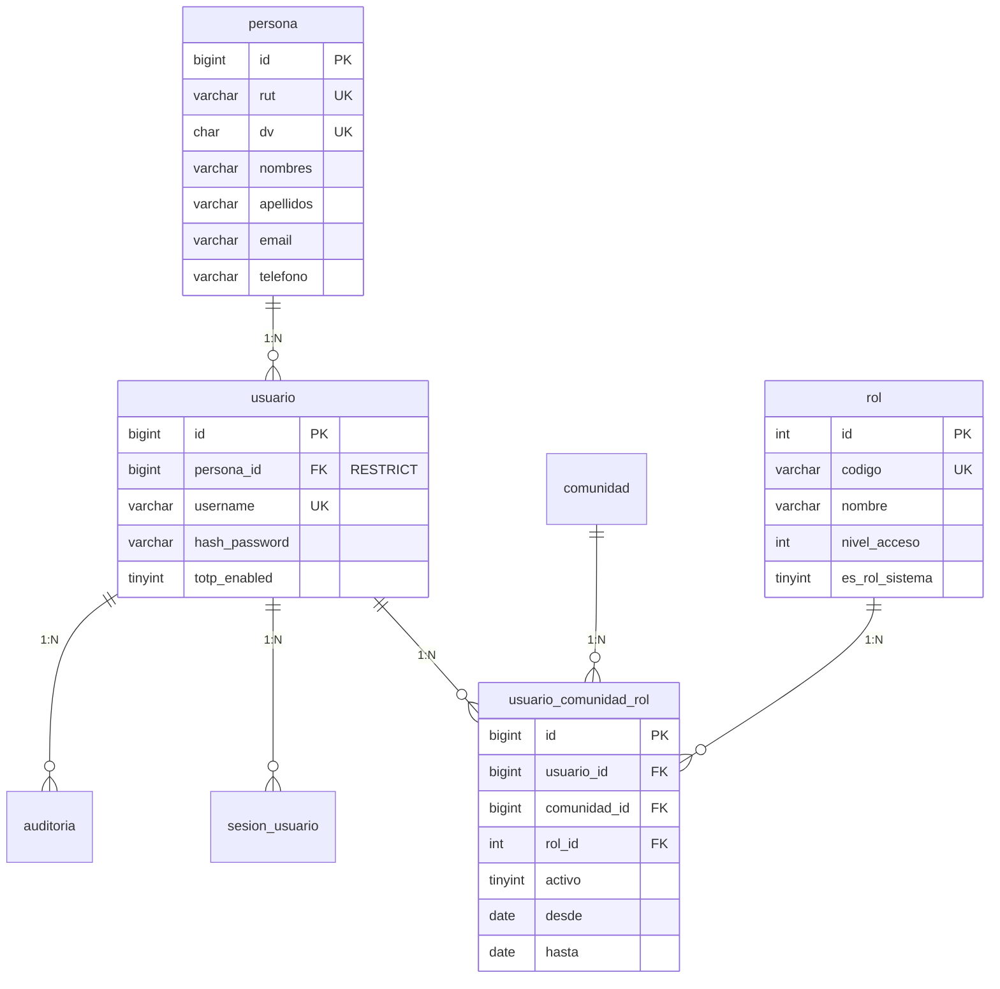
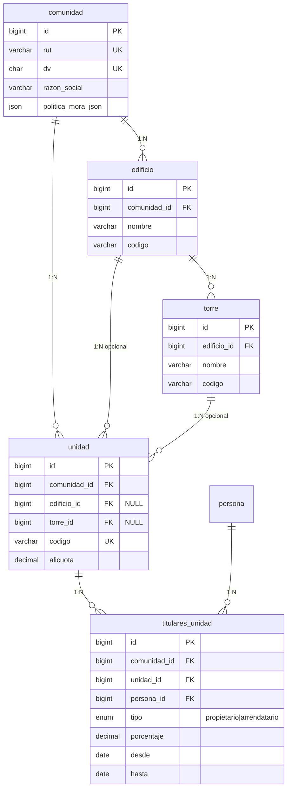
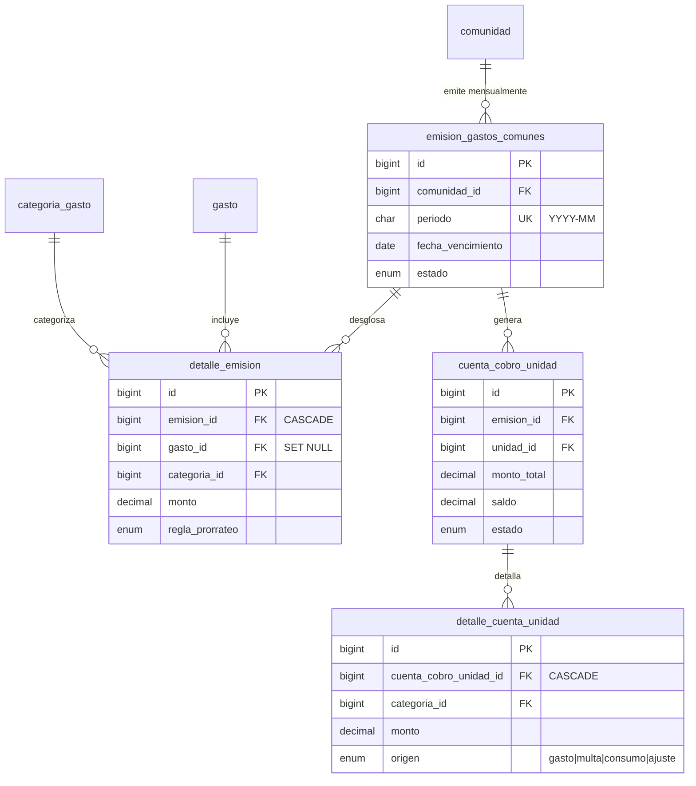
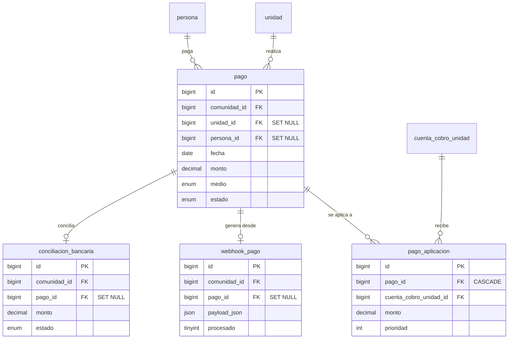
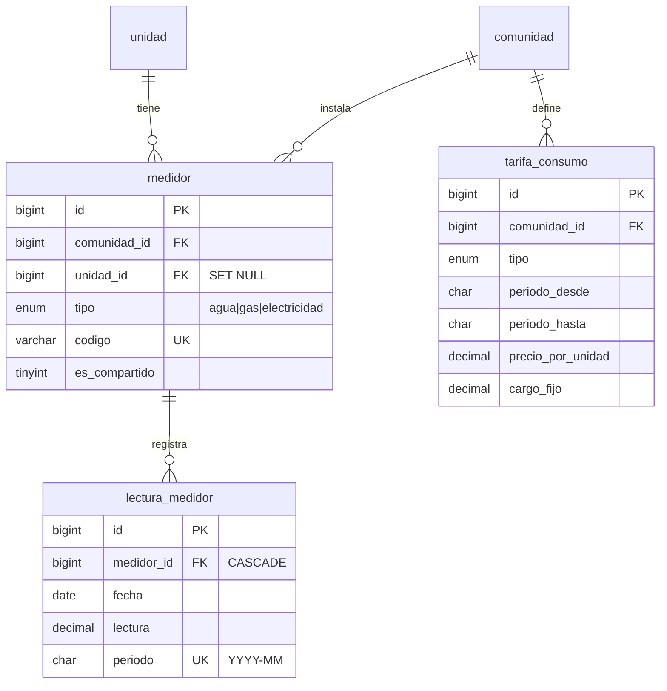

# 🏗️ DIAGRAMA ENTIDAD-RELACIÓN COMPLETO
## Sistema Cuentas Claras - Base de Datos

> **Nota:** Este diagrama usa sintaxis Mermaid. Se renderiza automáticamente en GitHub, VS Code (con extensión), y otras plataformas compatibles.

---

## 📊 DIAGRAMA PRINCIPAL - ENTIDADES Y RELACIONES

```mermaid
erDiagram
    %% ============================================
    %% MÓDULO: IDENTIDAD Y AUTENTICACIÓN
    %% ============================================
    
    persona {
        bigint id PK
        varchar rut UK
        char dv UK
        varchar nombres
        varchar apellidos
        varchar email
        varchar telefono
        varchar direccion
        datetime created_at
        datetime updated_at
    }
    
    usuario {
        bigint id PK
        bigint persona_id FK "NOT NULL"
        varchar username UK
        varchar hash_password
        varchar email
        tinyint activo
        tinyint is_superadmin "DEPRECADO"
        varchar totp_secret
        tinyint totp_enabled
        timestamp created_at
        timestamp updated_at
    }
    
    rol {
        int id PK
        varchar codigo UK
        varchar nombre
        varchar descripcion
        int nivel_acceso
        tinyint es_rol_sistema
        datetime created_at
    }
    
    usuario_comunidad_rol {
        bigint id PK
        bigint usuario_id FK
        bigint comunidad_id FK
        int rol_id FK
        date desde
        date hasta
        tinyint activo
        datetime created_at
        datetime updated_at
    }
    
    sesion_usuario {
        varchar id PK
        bigint usuario_id FK
        varchar ip_address
        text user_agent
        json data
        timestamp last_activity
        timestamp created_at
    }
    
    auditoria {
        bigint id PK
        bigint usuario_id FK
        varchar accion
        varchar tabla
        bigint registro_id
        json valores_anteriores
        json valores_nuevos
        varchar ip_address
        timestamp created_at
    }
    
    %% ============================================
    %% MÓDULO: ESTRUCTURA DE COMUNIDADES
    %% ============================================
    
    comunidad {
        bigint id PK
        varchar razon_social
        varchar rut UK
        char dv UK
        varchar giro
        varchar direccion
        varchar email_contacto
        varchar telefono_contacto
        json politica_mora_json
        varchar moneda "DEFAULT CLP"
        varchar tz "DEFAULT America/Santiago"
        datetime created_at
        datetime updated_at
        bigint created_by
        bigint updated_by
    }
    
    edificio {
        bigint id PK
        bigint comunidad_id FK
        varchar nombre
        varchar direccion
        varchar codigo
        datetime created_at
        datetime updated_at
    }
    
    torre {
        bigint id PK
        bigint edificio_id FK
        varchar nombre
        varchar codigo
        datetime created_at
        datetime updated_at
    }
    
    unidad {
        bigint id PK
        bigint comunidad_id FK
        bigint edificio_id FK
        bigint torre_id FK
        varchar codigo UK
        decimal alicuota
        decimal m2_utiles
        decimal m2_terrazas
        varchar nro_bodega
        varchar nro_estacionamiento
        tinyint activa
        datetime created_at
        datetime updated_at
    }
    
    titulares_unidad {
        bigint id PK
        bigint comunidad_id FK
        bigint unidad_id FK
        bigint persona_id FK
        enum tipo "propietario|arrendatario"
        date desde
        date hasta
        decimal porcentaje
        datetime created_at
        datetime updated_at
    }
    
    %% ============================================
    %% MÓDULO: GESTIÓN FINANCIERA
    %% ============================================
    
    categoria_gasto {
        bigint id PK
        bigint comunidad_id FK
        varchar nombre UK
        enum tipo "operacional|extraordinario|fondo_reserva|multas|consumo"
        varchar cta_contable
        tinyint activa
        datetime created_at
        datetime updated_at
    }
    
    centro_costo {
        bigint id PK
        bigint comunidad_id FK
        varchar nombre
        varchar codigo UK
        datetime created_at
        datetime updated_at
    }
    
    proveedor {
        bigint id PK
        bigint comunidad_id FK
        varchar rut UK
        char dv UK
        varchar razon_social
        varchar giro
        varchar email
        varchar telefono
        varchar direccion
        tinyint activo
        datetime created_at
        datetime updated_at
    }
    
    documento_compra {
        bigint id PK
        bigint comunidad_id FK
        bigint proveedor_id FK
        enum tipo_doc "factura|boleta|nota_credito"
        varchar folio
        date fecha_emision
        decimal neto
        decimal iva
        decimal exento
        decimal total
        varchar glosa
        datetime created_at
        datetime updated_at
    }
    
    gasto {
        bigint id PK
        bigint comunidad_id FK
        bigint categoria_id FK
        bigint centro_costo_id FK
        bigint documento_compra_id FK
        date fecha
        decimal monto
        varchar glosa
        tinyint extraordinario
        datetime created_at
        datetime updated_at
    }
    
    emision_gastos_comunes {
        bigint id PK
        bigint comunidad_id FK
        char periodo UK "YYYY-MM"
        date fecha_vencimiento
        enum estado "borrador|emitido|cerrado|anulado"
        varchar observaciones
        datetime created_at
        datetime updated_at
    }
    
    detalle_emision {
        bigint id PK
        bigint emision_id FK
        bigint gasto_id FK
        bigint categoria_id FK
        decimal monto
        enum regla_prorrateo "coeficiente|partes_iguales|consumo|fijo_por_unidad"
        json metadata_json
        datetime created_at
        datetime updated_at
    }
    
    cuenta_cobro_unidad {
        bigint id PK
        bigint emision_id FK
        bigint comunidad_id FK
        bigint unidad_id FK
        decimal monto_total
        decimal saldo
        enum estado "pendiente|pagado|vencido|parcial"
        decimal interes_acumulado
        datetime created_at
        datetime updated_at
    }
    
    detalle_cuenta_unidad {
        bigint id PK
        bigint cuenta_cobro_unidad_id FK
        bigint categoria_id FK
        varchar glosa
        decimal monto
        enum origen "gasto|multa|consumo|ajuste"
        bigint origen_id
        tinyint iva_incluido
        datetime created_at
        datetime updated_at
    }
    
    pago {
        bigint id PK
        bigint comunidad_id FK
        bigint unidad_id FK
        bigint persona_id FK
        date fecha
        decimal monto
        enum medio "transferencia|webpay|khipu|servipag|efectivo"
        varchar referencia
        enum estado "pendiente|aplicado|reversado"
        varchar comprobante_num
        datetime created_at
        datetime updated_at
    }
    
    pago_aplicacion {
        bigint id PK
        bigint pago_id FK
        bigint cuenta_cobro_unidad_id FK
        decimal monto
        int prioridad
        datetime created_at
        datetime updated_at
    }
    
    multa {
        bigint id PK
        bigint comunidad_id FK
        bigint unidad_id FK
        bigint persona_id FK
        varchar motivo
        varchar descripcion
        decimal monto
        enum estado "pendiente|pagada|anulada"
        date fecha
        datetime fecha_pago
        datetime created_at
        datetime updated_at
    }
    
    %% ============================================
    %% MÓDULO: CONFIGURACIÓN Y PARÁMETROS
    %% ============================================
    
    parametros_cobranza {
        bigint id PK
        bigint comunidad_id FK "UK"
        int dias_gracia
        decimal tasa_mora_mensual
        enum mora_calculo "diaria|mensual"
        enum redondeo "arriba|normal|abajo"
        decimal interes_max_mensual
        enum aplica_interes_sobre "saldo|capital"
        datetime created_at
        datetime updated_at
    }
    
    configuracion_interes {
        bigint id PK
        bigint comunidad_id FK
        date aplica_desde
        decimal tasa_mensual
        enum metodo "simple|compuesto"
        decimal tope_mensual
        datetime created_at
        datetime updated_at
    }
    
    %% ============================================
    %% MÓDULO: MEDIDORES Y CONSUMOS
    %% ============================================
    
    medidor {
        bigint id PK
        bigint comunidad_id FK
        bigint unidad_id FK
        enum tipo "agua|gas|electricidad"
        varchar codigo UK
        tinyint es_compartido
        datetime created_at
        datetime updated_at
    }
    
    lectura_medidor {
        bigint id PK
        bigint medidor_id FK
        date fecha
        decimal lectura
        char periodo UK "YYYY-MM"
        datetime created_at
        datetime updated_at
    }
    
    tarifa_consumo {
        bigint id PK
        bigint comunidad_id FK
        enum tipo "agua|gas|electricidad"
        char periodo_desde "YYYY-MM"
        char periodo_hasta "YYYY-MM"
        decimal precio_por_unidad
        decimal cargo_fijo
        datetime created_at
        datetime updated_at
    }
    
    %% ============================================
    %% MÓDULO: AMENIDADES Y RESERVAS
    %% ============================================
    
    amenidad {
        bigint id PK
        bigint comunidad_id FK
        varchar nombre
        varchar reglas
        int capacidad
        tinyint requiere_aprobacion
        decimal tarifa
        datetime created_at
        datetime updated_at
    }
    
    reserva_amenidad {
        bigint id PK
        bigint comunidad_id FK
        bigint amenidad_id FK
        bigint unidad_id FK
        bigint persona_id FK
        datetime inicio
        datetime fin
        enum estado "solicitada|aprobada|rechazada|cancelada|cumplida"
        datetime created_at
        datetime updated_at
    }
    
    %% ============================================
    %% MÓDULO: SOPORTE Y COMUNICACIÓN
    %% ============================================
    
    solicitud_soporte {
        bigint id PK
        bigint comunidad_id FK
        bigint unidad_id FK
        varchar categoria
        varchar titulo
        varchar descripcion
        enum estado "abierto|en_progreso|resuelto|cerrado"
        enum prioridad "baja|media|alta"
        bigint asignado_a
        json attachments_json
        datetime created_at
        datetime updated_at
    }
    
    notificacion {
        bigint id PK
        bigint comunidad_id FK
        bigint persona_id FK
        varchar tipo
        varchar titulo
        varchar mensaje
        tinyint leida
        varchar objeto_tipo
        bigint objeto_id
        datetime fecha_creacion
    }
    
    registro_conserjeria {
        bigint id PK
        bigint comunidad_id FK
        datetime fecha_hora
        bigint usuario_id FK
        varchar evento
        varchar detalle
        datetime created_at
    }
    
    documento {
        bigint id PK
        bigint comunidad_id FK
        enum tipo "circular|acta|reglamento|boletin|otro"
        varchar titulo
        varchar url
        char periodo "YYYY-MM"
        enum visibilidad "publico|privado"
        datetime created_at
        datetime updated_at
    }
    
    %% ============================================
    %% MÓDULO: CONCILIACIÓN Y WEBHOOKS
    %% ============================================
    
    conciliacion_bancaria {
        bigint id PK
        bigint comunidad_id FK
        date fecha_mov
        decimal monto
        varchar glosa
        varchar referencia
        enum estado "pendiente|conciliado|descartado"
        bigint pago_id FK
        bigint extracto_id
        datetime created_at
        datetime updated_at
    }
    
    webhook_pago {
        bigint id PK
        bigint comunidad_id FK
        enum proveedor "webpay|khipu|otro|transferencia"
        json payload_json
        datetime fecha_recepcion
        tinyint procesado
        bigint pago_id FK
    }
    
    %% ============================================
    %% MÓDULO: VALORES DE REFERENCIA
    %% ============================================
    
    uf_valor {
        date fecha PK
        decimal valor
    }
    
    utm_valor {
        date fecha PK
        decimal valor
    }
    
    user_preferences {
        int id PK
        int user_id UK
        json preferences
        timestamp created_at
        timestamp updated_at
    }
    
    %% ============================================
    %% RELACIONES - IDENTIDAD Y AUTENTICACIÓN
    %% ============================================
    
    persona ||--o{ usuario : "tiene credenciales"
    usuario ||--o{ usuario_comunidad_rol : "tiene roles en"
    comunidad ||--o{ usuario_comunidad_rol : "tiene usuarios"
    rol ||--o{ usuario_comunidad_rol : "define permisos"
    usuario ||--o{ sesion_usuario : "tiene sesiones"
    usuario ||--o{ auditoria : "realiza acciones"
    
    %% ============================================
    %% RELACIONES - ESTRUCTURA COMUNIDADES
    %% ============================================
    
    comunidad ||--o{ edificio : "contiene"
    edificio ||--o{ torre : "contiene"
    comunidad ||--o{ unidad : "administra"
    edificio ||--o{ unidad : "contiene"
    torre ||--o{ unidad : "contiene"
    unidad ||--o{ titulares_unidad : "tiene propietarios/arrendatarios"
    persona ||--o{ titulares_unidad : "es titular de"
    comunidad ||--o{ titulares_unidad : "registra tenencias"
    
    %% ============================================
    %% RELACIONES - GESTIÓN FINANCIERA
    %% ============================================
    
    comunidad ||--o{ categoria_gasto : "define categorías"
    comunidad ||--o{ centro_costo : "define centros de costo"
    comunidad ||--o{ proveedor : "tiene proveedores"
    proveedor ||--o{ documento_compra : "emite documentos"
    comunidad ||--o{ documento_compra : "recibe documentos"
    comunidad ||--o{ gasto : "registra gastos"
    categoria_gasto ||--o{ gasto : "categoriza"
    centro_costo ||--o{ gasto : "imputa a"
    documento_compra ||--o{ gasto : "respalda"
    
    comunidad ||--o{ emision_gastos_comunes : "emite mensualmente"
    emision_gastos_comunes ||--o{ detalle_emision : "desglosa en"
    gasto ||--o{ detalle_emision : "se incluye en"
    categoria_gasto ||--o{ detalle_emision : "categoriza"
    
    emision_gastos_comunes ||--o{ cuenta_cobro_unidad : "genera cuentas por"
    unidad ||--o{ cuenta_cobro_unidad : "recibe cuenta"
    comunidad ||--o{ cuenta_cobro_unidad : "administra"
    cuenta_cobro_unidad ||--o{ detalle_cuenta_unidad : "detalla items"
    categoria_gasto ||--o{ detalle_cuenta_unidad : "categoriza"
    
    comunidad ||--o{ pago : "recibe pagos"
    unidad ||--o{ pago : "paga"
    persona ||--o{ pago : "realiza"
    pago ||--o{ pago_aplicacion : "se aplica a"
    cuenta_cobro_unidad ||--o{ pago_aplicacion : "recibe aplicación"
    
    comunidad ||--o{ multa : "aplica multas"
    unidad ||--o{ multa : "es multada"
    persona ||--o{ multa : "recibe multa"
    
    %% ============================================
    %% RELACIONES - CONFIGURACIÓN
    %% ============================================
    
    comunidad ||--|| parametros_cobranza : "configura parámetros"
    comunidad ||--o{ configuracion_interes : "define tasas"
    
    %% ============================================
    %% RELACIONES - MEDIDORES Y CONSUMOS
    %% ============================================
    
    comunidad ||--o{ medidor : "instala medidores"
    unidad ||--o{ medidor : "tiene medidor"
    medidor ||--o{ lectura_medidor : "registra lecturas"
    comunidad ||--o{ tarifa_consumo : "define tarifas"
    
    %% ============================================
    %% RELACIONES - AMENIDADES
    %% ============================================
    
    comunidad ||--o{ amenidad : "ofrece amenidades"
    amenidad ||--o{ reserva_amenidad : "es reservada"
    unidad ||--o{ reserva_amenidad : "reserva"
    persona ||--o{ reserva_amenidad : "solicita"
    comunidad ||--o{ reserva_amenidad : "administra"
    
    %% ============================================
    %% RELACIONES - SOPORTE Y COMUNICACIÓN
    %% ============================================
    
    comunidad ||--o{ solicitud_soporte : "gestiona tickets"
    unidad ||--o{ solicitud_soporte : "reporta"
    comunidad ||--o{ notificacion : "envía notificaciones"
    persona ||--o{ notificacion : "recibe"
    comunidad ||--o{ registro_conserjeria : "mantiene bitácora"
    usuario ||--o{ registro_conserjeria : "registra eventos"
    comunidad ||--o{ documento : "publica documentos"
    
    %% ============================================
    %% RELACIONES - CONCILIACIÓN
    %% ============================================
    
    comunidad ||--o{ conciliacion_bancaria : "concilia movimientos"
    pago ||--o| conciliacion_bancaria : "se concilia con"
    comunidad ||--o{ webhook_pago : "recibe webhooks"
    pago ||--o| webhook_pago : "genera desde"
```

---

## 🔍 DIAGRAMAS DETALLADOS POR MÓDULO

### 1️⃣ MÓDULO: IDENTIDAD Y AUTENTICACIÓN



**Reglas de negocio:**
- ✅ Un usuario **DEBE** tener una persona asociada (RESTRICT)
- ✅ Un usuario puede tener múltiples roles en múltiples comunidades
- ✅ Un rol puede ser de sistema (superadmin) o de comunidad (admin, conserje, etc.)
- ✅ La combinación (usuario, comunidad, rol, activo) es única

---

### 2️⃣ MÓDULO: ESTRUCTURA DE COMUNIDADES



**Jerarquía:**
```
Comunidad
├── Edificio (opcional)
│   └── Torre (opcional)
└── Unidad (código único por comunidad)
    └── Titulares (propietario/arrendatario)
```

---

### 3️⃣ MÓDULO: CICLO DE GASTOS COMUNES



**Flujo:**
```
1. Comunidad → Emision Mensual (YYYY-MM)
2. Emision → Detalle Emision (gastos del mes)
3. Emision → Cuenta Cobro por Unidad (prorrateo)
4. Cuenta Cobro → Detalle (items individuales)
```

---

### 4️⃣ MÓDULO: PAGOS Y APLICACIONES



**Flujo de pago:**
```
1. Webhook/Manual → Pago (registro inicial)
2. Pago → Pago_Aplicacion (aplicar a cuentas)
3. Pago_Aplicacion → Actualizar saldo Cuenta_Cobro
4. Conciliacion_Bancaria (opcional)
```

---

### 5️⃣ MÓDULO: MEDIDORES Y CONSUMOS



**Cálculo de consumo:**
```
Consumo = Lectura_Actual - Lectura_Anterior
Monto = (Consumo × Precio_Por_Unidad) + Cargo_Fijo
```

---

## 📋 RESUMEN DE CARDINALIDADES

| Relación | Tipo | DELETE | Descripción |
|----------|------|--------|-------------|
| persona → usuario | 1:N | RESTRICT | Persona no se puede eliminar si tiene usuario |
| usuario → usuario_comunidad_rol | 1:N | CASCADE | Al eliminar usuario, se eliminan sus roles |
| comunidad → unidad | 1:N | CASCADE | Al eliminar comunidad, se eliminan unidades |
| emision → cuenta_cobro | 1:N | CASCADE | Al eliminar emisión, se eliminan cuentas |
| cuenta_cobro → detalle_cuenta | 1:N | CASCADE | Al eliminar cuenta, se eliminan detalles |
| pago → pago_aplicacion | 1:N | CASCADE | Al eliminar pago, se eliminan aplicaciones |
| medidor → lectura_medidor | 1:N | CASCADE | Al eliminar medidor, se eliminan lecturas |
| gasto → detalle_emision | 1:N | SET NULL | Al eliminar gasto, referencia queda NULL |

---

## 🎯 ÍNDICES ESTRATÉGICOS

### Índices para Queries Comunes

```sql
-- Búsquedas por comunidad (multi-tenant)
ix_tabla_comunidad (comunidad_id)

-- Reportes financieros
ix_cuenta_cobro_estado (estado, fecha_vencimiento)
ix_pago_fecha_estado (fecha, estado)

-- Consultas de usuarios
ix_usuario_comunidad_rol_activo (usuario_id, comunidad_id, activo)

-- Auditoría
ix_auditoria_tabla_registro (tabla, registro_id)
ix_auditoria_usuario_fecha (usuario_id, created_at)
```

---

## 🔐 POLÍTICAS DE INTEGRIDAD

### Eliminación en Cascada (CASCADE)
```
✅ detalle_cuenta_unidad → cuenta_cobro_unidad
✅ detalle_emision → emision_gastos_comunes
✅ pago_aplicacion → pago
✅ lectura_medidor → medidor
✅ sesion_usuario → usuario
```

### Set NULL (mantener histórico)
```
✅ auditoria → usuario
✅ gasto → documento_compra
✅ multa → persona
✅ pago → unidad
✅ webhook_pago → pago
```

### Restrict (integridad crítica)
```
✅ usuario → persona
✅ cuenta_cobro_unidad → unidad
```

---

## 📊 ESTADÍSTICAS DE LA BASE DE DATOS

- **Total de tablas:** 42 tablas principales
- **Total de vistas:** 8 vistas de compatibilidad
- **Total de relaciones:** 68 foreign keys
- **Índices únicos:** 15
- **Índices compuestos:** 12
- **Campos JSON:** 7 (flexibilidad)
- **Campos ENUM:** 18 (control de estados)

---

## 🚀 PRÓXIMOS PASOS

1. ✅ Implementar índices adicionales recomendados
2. ✅ Agregar soft delete (deleted_at)
3. ✅ Implementar created_by/updated_by
4. ✅ Considerar particionamiento por comunidad_id
5. ✅ Implementar archivado de datos históricos

---

**Fecha de generación:** Octubre 2025  
**Versión de esquema:** 2.0 (post-migración)  
**Motor:** MySQL 8.0.43 / MariaDB 10.2+

