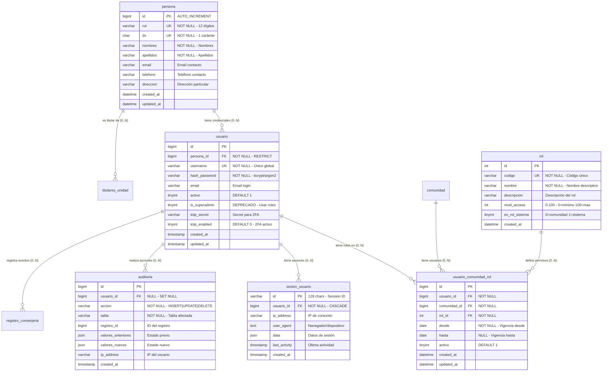

# 👥 SECCIÓN: USUARIOS, ROLES Y AUTENTICACIÓN

> **Propósito:** Gestión de identidad, credenciales, roles y permisos por comunidad

---

## 📊 DIAGRAMA: SISTEMA DE USUARIOS Y ROLES



---

## 🎯 REGLAS DE NEGOCIO

### **R1: Jerarquía de Identidad**

```
Persona (identidad física - RUT único)
  ↓
Usuario (credenciales de acceso - username único)
  ↓
Usuario_Comunidad_Rol (permisos por comunidad)
```

**Principios:**
- ✅ Una persona **puede** tener 0 o más usuarios (ej: admin + residente)
- ✅ Una persona **puede** ser titular de múltiples unidades
- ✅ Un usuario **debe** tener una persona asociada (ON DELETE RESTRICT)
- ✅ Un usuario **puede** tener diferentes roles en diferentes comunidades
- ✅ Un usuario **puede** tener el mismo rol en múltiples comunidades

---

### **R2: Sistema de Roles (7 roles disponibles)**

| Código | Nombre | Nivel | Tipo | Permisos |
|--------|--------|-------|------|----------|
| `superadmin` | Super Administrador | 100 | Sistema | Acceso total, gestiona todas las comunidades |
| `admin` | Administrador de Comunidad | 80 | Comunidad | Administración completa de su comunidad |
| `comite` | Miembro del Comité | 70 | Comunidad | Aprobar gastos, ver finanzas, gestionar documentos |
| `contador` | Contador | 60 | Comunidad | Ver finanzas, generar reportes, auditoría |
| `conserje` | Conserje | 40 | Comunidad | Bitácora, reservas, multas, solicitudes |
| `propietario` | Propietario | 30 | Comunidad | Ver su cuenta, pagar, reservar, tickets |
| `residente` | Residente/Arrendatario | 20 | Comunidad | Ver información, pagar, reservar (limitado) |

---

### **R3: Asignación de Roles**

```sql
-- Roles de SISTEMA (es_rol_sistema = 1):
-- - Solo superadmin
-- - Se asigna a TODAS las comunidades automáticamente

-- Roles de COMUNIDAD (es_rol_sistema = 0):
-- - admin, comite, contador, conserje, propietario, residente
-- - Se asignan comunidad por comunidad

-- Constraint único:
UNIQUE (usuario_id, comunidad_id, rol_id, activo)
-- Un usuario NO puede tener el mismo rol activo 2 veces en la misma comunidad
```

**Ejemplo:**
```sql
-- Juan Pérez tiene:
-- - Rol 'admin' en Comunidad A (activo=1)
-- - Rol 'propietario' en Comunidad B (activo=1)
-- - Rol 'contador' en Comunidad C (activo=0, hasta='2025-06-30')

SELECT 
  u.username,
  c.razon_social,
  r.nombre as rol,
  ucr.desde,
  ucr.hasta,
  ucr.activo
FROM usuario u
INNER JOIN usuario_comunidad_rol ucr ON ucr.usuario_id = u.id
INNER JOIN comunidad c ON c.id = ucr.comunidad_id
INNER JOIN rol r ON r.id = ucr.rol_id
WHERE u.id = 5
ORDER BY ucr.activo DESC, c.razon_social;
```

---

### **R4: Autenticación y 2FA**

**Flujo de Login:**

```
1. Usuario ingresa username + password
   ↓
2. Verificar credenciales (hash_password con bcrypt)
   ↓
3. Si totp_enabled = 1 → Solicitar código 2FA
   ↓
4. Validar código TOTP con totp_secret
   ↓
5. Crear sesión en sesion_usuario
   ↓
6. Registrar en auditoria: accion='LOGIN'
```

**Estructura de hash_password:**
```
$2y$10$abcdefghijklmnopqrstuvwxyzABCDEFGHIJKLMNOPQRSTUVWXYZ012
│  │  │                                                        │
│  │  │                                                        └─ Hash (31 chars)
│  │  └─ Salt (22 chars)
│  └─ Cost factor (10 = 2^10 = 1024 iteraciones)
└─ Algoritmo (2y = bcrypt)
```

---

### **R5: Gestión de Sesiones**

```sql
-- Crear sesión al login
INSERT INTO sesion_usuario (id, usuario_id, ip_address, user_agent, data)
VALUES (
  'sess_a1b2c3d4e5f6...', -- 128 chars aleatorios
  123,                     -- usuario_id
  '192.168.1.100',
  'Mozilla/5.0...',
  JSON_OBJECT('comunidad_activa', 1, 'idioma', 'es')
);

-- Actualizar actividad
UPDATE sesion_usuario
SET last_activity = NOW()
WHERE id = 'sess_a1b2c3d4e5f6...';

-- Limpiar sesiones expiradas (>24 horas inactivas)
DELETE FROM sesion_usuario
WHERE last_activity < NOW() - INTERVAL 24 HOUR;
```

---

### **R6: Auditoría de Acciones**

**Eventos auditables:**

| Acción | Tabla | Ejemplo |
|--------|-------|---------|
| `LOGIN` | `usuario` | Usuario inicia sesión |
| `LOGOUT` | `usuario` | Usuario cierra sesión |
| `INSERT` | `gasto` | Nuevo gasto creado |
| `UPDATE` | `cuenta_cobro_unidad` | Estado de cuenta modificado |
| `DELETE` | `pago` | Pago eliminado (reversado) |
| `APPROVE` | `emision_gastos_comunes` | Emisión aprobada |
| `REJECT` | `solicitud_soporte` | Ticket rechazado |

**Registro de auditoría:**
```sql
INSERT INTO auditoria (
  usuario_id, 
  accion, 
  tabla, 
  registro_id,
  valores_anteriores,
  valores_nuevos,
  ip_address
) VALUES (
  123,
  'UPDATE',
  'cuenta_cobro_unidad',
  456,
  JSON_OBJECT('estado', 'pendiente', 'saldo', 150000),
  JSON_OBJECT('estado', 'pagado', 'saldo', 0),
  '192.168.1.100'
);
```

---

## 📋 CASOS DE USO

### **CU1: Crear Nueva Persona y Usuario**

```sql
-- Paso 1: Crear persona
INSERT INTO persona (rut, dv, nombres, apellidos, email, telefono)
VALUES ('12345678', '9', 'Juan Carlos', 'Pérez Soto', 'jperez@email.com', '+56912345678');

SET @persona_id = LAST_INSERT_ID();

-- Paso 2: Crear usuario con contraseña hasheada
INSERT INTO usuario (persona_id, username, hash_password, email, activo)
VALUES (
  @persona_id,
  'jperez',
  '$2y$10$abcdefg...', -- Hash de bcrypt
  'jperez@email.com',
  1
);

SET @usuario_id = LAST_INSERT_ID();

-- Paso 3: Asignar rol en comunidad
INSERT INTO usuario_comunidad_rol (usuario_id, comunidad_id, rol_id, desde, activo)
VALUES (
  @usuario_id,
  1, -- Comunidad Los Aromos
  (SELECT id FROM rol WHERE codigo = 'propietario'),
  CURDATE(),
  1
);
```

---

### **CU2: Asignar Superadmin (acceso a todas las comunidades)**

```sql
-- Usuario con is_superadmin=1 debe tener rol en TODAS las comunidades

SET @usuario_id = 1;
SET @rol_superadmin = (SELECT id FROM rol WHERE codigo = 'superadmin');

-- Actualizar flag (deprecado pero mantenido)
UPDATE usuario SET is_superadmin = 1 WHERE id = @usuario_id;

-- Asignar rol superadmin en todas las comunidades existentes
INSERT INTO usuario_comunidad_rol (usuario_id, comunidad_id, rol_id, desde, activo)
SELECT 
  @usuario_id,
  c.id,
  @rol_superadmin,
  CURDATE(),
  1
FROM comunidad c
WHERE NOT EXISTS (
  SELECT 1 FROM usuario_comunidad_rol ucr
  WHERE ucr.usuario_id = @usuario_id 
    AND ucr.comunidad_id = c.id
    AND ucr.rol_id = @rol_superadmin
);
```

---

### **CU3: Cambiar Rol de Usuario en Comunidad**

```sql
-- Cambiar de 'propietario' a 'admin'

SET @usuario_id = 5;
SET @comunidad_id = 1;

-- Desactivar rol actual
UPDATE usuario_comunidad_rol
SET activo = 0, hasta = CURDATE()
WHERE usuario_id = @usuario_id
  AND comunidad_id = @comunidad_id
  AND activo = 1;

-- Asignar nuevo rol
INSERT INTO usuario_comunidad_rol (usuario_id, comunidad_id, rol_id, desde, activo)
VALUES (
  @usuario_id,
  @comunidad_id,
  (SELECT id FROM rol WHERE codigo = 'admin'),
  CURDATE(),
  1
);
```

---

### **CU4: Activar 2FA para Usuario**

```sql
-- Generar secret TOTP (base32, 32 chars)
-- En el código backend: speakeasy.generateSecret()

UPDATE usuario
SET totp_secret = 'JBSWY3DPEHPK3PXP',
    totp_enabled = 1
WHERE id = 123;

-- Verificar código TOTP (en login)
-- Backend: speakeasy.totp.verify({
--   secret: 'JBSWY3DPEHPK3PXP',
--   encoding: 'base32',
--   token: '123456', -- código ingresado por usuario
--   window: 1 -- permitir ±30 segundos
-- })
```

---

### **CU5: Auditar Acción de Usuario**

```sql
-- Ejemplo: Usuario modifica monto de un gasto

-- BEFORE UPDATE
SET @old_values = (
  SELECT JSON_OBJECT('monto', monto, 'glosa', glosa)
  FROM gasto WHERE id = 789
);

-- UPDATE gasto SET monto = 250000, glosa = 'Actualizado' WHERE id = 789;

-- AFTER UPDATE
SET @new_values = (
  SELECT JSON_OBJECT('monto', monto, 'glosa', glosa)
  FROM gasto WHERE id = 789
);

INSERT INTO auditoria (usuario_id, accion, tabla, registro_id, valores_anteriores, valores_nuevos, ip_address)
VALUES (123, 'UPDATE', 'gasto', 789, @old_values, @new_values, '192.168.1.100');
```

---

## 🔍 QUERIES ÚTILES

### **Q1: Verificar Permisos de Usuario en Comunidad**

```sql
SELECT 
  u.username,
  p.nombres,
  p.apellidos,
  c.razon_social as comunidad,
  r.codigo as rol,
  r.nombre as rol_nombre,
  r.nivel_acceso,
  ucr.desde,
  ucr.hasta,
  ucr.activo,
  CASE 
    WHEN ucr.activo = 1 THEN 'ACTIVO'
    WHEN ucr.hasta < CURDATE() THEN 'EXPIRADO'
    ELSE 'INACTIVO'
  END as estado
FROM usuario u
INNER JOIN persona p ON p.id = u.persona_id
INNER JOIN usuario_comunidad_rol ucr ON ucr.usuario_id = u.id
INNER JOIN comunidad c ON c.id = ucr.comunidad_id
INNER JOIN rol r ON r.id = ucr.rol_id
WHERE u.id = ?
  AND c.id = ?
ORDER BY r.nivel_acceso DESC;
```

---

### **Q2: Usuarios con Múltiples Roles**

```sql
-- Usuarios que tienen más de 1 rol activo en cualquier comunidad
SELECT 
  u.username,
  p.nombres || ' ' || p.apellidos as nombre_completo,
  COUNT(DISTINCT ucr.comunidad_id) as comunidades,
  COUNT(*) as roles_totales,
  GROUP_CONCAT(DISTINCT r.nombre ORDER BY r.nivel_acceso DESC) as roles
FROM usuario u
INNER JOIN persona p ON p.id = u.persona_id
INNER JOIN usuario_comunidad_rol ucr ON ucr.usuario_id = u.id AND ucr.activo = 1
INNER JOIN rol r ON r.id = ucr.rol_id
GROUP BY u.id, u.username, p.nombres, p.apellidos
HAVING COUNT(*) > 1
ORDER BY roles_totales DESC;
```

---

### **Q3: Sesiones Activas**

```sql
-- Sesiones activas en las últimas 24 horas
SELECT 
  s.id as session_id,
  u.username,
  p.nombres || ' ' || p.apellidos as usuario,
  s.ip_address,
  s.last_activity,
  TIMESTAMPDIFF(MINUTE, s.last_activity, NOW()) as minutos_inactivo,
  CASE 
    WHEN s.last_activity > NOW() - INTERVAL 15 MINUTE THEN 'ONLINE'
    WHEN s.last_activity > NOW() - INTERVAL 1 HOUR THEN 'AUSENTE'
    ELSE 'INACTIVO'
  END as estado
FROM sesion_usuario s
INNER JOIN usuario u ON u.id = s.usuario_id
INNER JOIN persona p ON p.id = u.persona_id
WHERE s.last_activity > NOW() - INTERVAL 24 HOUR
ORDER BY s.last_activity DESC;
```

---

### **Q4: Auditoría de Acciones por Usuario**

```sql
-- Últimas 50 acciones de un usuario
SELECT 
  a.created_at,
  a.accion,
  a.tabla,
  a.registro_id,
  a.ip_address,
  CASE 
    WHEN a.valores_anteriores IS NOT NULL THEN 
      CONCAT('Cambió: ', 
        JSON_UNQUOTE(JSON_EXTRACT(a.valores_anteriores, '$.estado')),
        ' → ',
        JSON_UNQUOTE(JSON_EXTRACT(a.valores_nuevos, '$.estado'))
      )
    ELSE 'Nuevo registro'
  END as detalle
FROM auditoria a
WHERE a.usuario_id = ?
ORDER BY a.created_at DESC
LIMIT 50;
```

---

### **Q5: Usuarios por Rol en Comunidad**

```sql
SELECT 
  r.nombre as rol,
  r.nivel_acceso,
  COUNT(*) as cantidad_usuarios,
  GROUP_CONCAT(
    CONCAT(p.nombres, ' ', p.apellidos)
    ORDER BY p.apellidos
    SEPARATOR ', '
  ) as usuarios
FROM rol r
INNER JOIN usuario_comunidad_rol ucr ON ucr.rol_id = r.id AND ucr.activo = 1
INNER JOIN usuario u ON u.id = ucr.usuario_id AND u.activo = 1
INNER JOIN persona p ON p.id = u.persona_id
WHERE ucr.comunidad_id = ?
GROUP BY r.id, r.nombre, r.nivel_acceso
ORDER BY r.nivel_acceso DESC;
```

---

## ⚠️ RESTRICCIONES Y VALIDACIONES

### **V1: Validar RUT Chileno**

```sql
DELIMITER $$
CREATE FUNCTION validar_rut_chileno(rut VARCHAR(12), dv CHAR(1))
RETURNS TINYINT
DETERMINISTIC
BEGIN
  DECLARE suma INT DEFAULT 0;
  DECLARE multiplicador INT DEFAULT 2;
  DECLARE i INT;
  DECLARE digito_calculado CHAR(1);
  DECLARE resto INT;
  
  -- Calcular dígito verificador
  SET i = LENGTH(rut);
  WHILE i > 0 DO
    SET suma = suma + (SUBSTRING(rut, i, 1) * multiplicador);
    SET multiplicador = IF(multiplicador = 7, 2, multiplicador + 1);
    SET i = i - 1;
  END WHILE;
  
  SET resto = 11 - (suma MOD 11);
  SET digito_calculado = CASE
    WHEN resto = 11 THEN '0'
    WHEN resto = 10 THEN 'K'
    ELSE CAST(resto AS CHAR)
  END;
  
  RETURN UPPER(dv) = digito_calculado;
END$$
DELIMITER ;

-- Trigger para validar RUT al insertar persona
DELIMITER $$
CREATE TRIGGER trg_persona_validar_rut
BEFORE INSERT ON persona
FOR EACH ROW
BEGIN
  IF validar_rut_chileno(NEW.rut, NEW.dv) = 0 THEN
    SIGNAL SQLSTATE '45000' 
    SET MESSAGE_TEXT = 'RUT inválido';
  END IF;
END$$
DELIMITER ;
```

---

### **V2: Validar Usuario Único por Persona**

```sql
-- Opcional: Si quieres limitar a 1 usuario por persona
DELIMITER $$
CREATE TRIGGER trg_usuario_limite_por_persona
BEFORE INSERT ON usuario
FOR EACH ROW
BEGIN
  DECLARE cuenta INT;
  
  SELECT COUNT(*) INTO cuenta
  FROM usuario
  WHERE persona_id = NEW.persona_id;
  
  IF cuenta >= 1 THEN
    SIGNAL SQLSTATE '45000' 
    SET MESSAGE_TEXT = 'Esta persona ya tiene un usuario creado';
  END IF;
END$$
DELIMITER ;
```

---

### **V3: No Eliminar Usuario con Roles Activos**

```sql
DELIMITER $$
CREATE TRIGGER trg_usuario_before_delete
BEFORE DELETE ON usuario
FOR EACH ROW
BEGIN
  IF EXISTS (
    SELECT 1 FROM usuario_comunidad_rol 
    WHERE usuario_id = OLD.id AND activo = 1
  ) THEN
    SIGNAL SQLSTATE '45000' 
    SET MESSAGE_TEXT = 'No se puede eliminar usuario con roles activos';
  END IF;
END$$
DELIMITER ;
```

---

## 🔐 MIDDLEWARE DE AUTORIZACIÓN (Pseudocódigo)

```javascript
// Verificar si usuario tiene permiso en comunidad

async function checkPermission(userId, comunidadId, requiredLevel) {
  const query = `
    SELECT MAX(r.nivel_acceso) as max_nivel
    FROM usuario_comunidad_rol ucr
    INNER JOIN rol r ON r.id = ucr.rol_id
    WHERE ucr.usuario_id = ? 
      AND ucr.comunidad_id = ?
      AND ucr.activo = 1
      AND (ucr.hasta IS NULL OR ucr.hasta >= CURDATE())
  `;
  
  const result = await db.query(query, [userId, comunidadId]);
  
  if (!result[0] || result[0].max_nivel < requiredLevel) {
    throw new Error('Acceso denegado: permisos insuficientes');
  }
  
  return true;
}

// Ejemplo de uso en ruta Express
app.delete('/api/comunidades/:id/gastos/:gastoId', async (req, res) => {
  const userId = req.session.userId;
  const comunidadId = req.params.id;
  
  // Solo admin (80) o superior puede eliminar gastos
  await checkPermission(userId, comunidadId, 80);
  
  // ... eliminar gasto
});
```

---

**Fecha:** Octubre 2025  
**Versión:** 2.0  
**Sección:** 2 de 8
