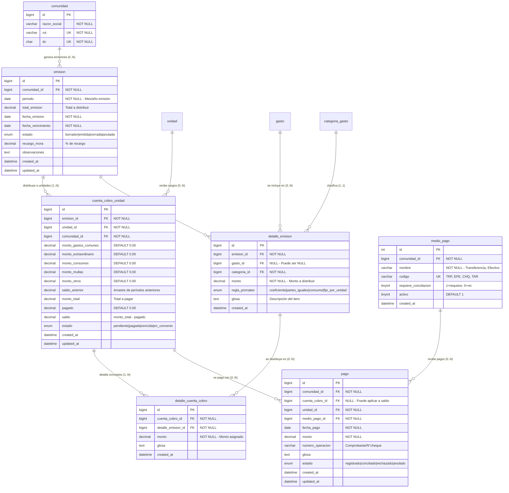

# CUENTAS DE COBRO, PAGOS Y MOROSIDAD

> **Propósito:** Gestión completa del ciclo de facturación, cobro, pagos y control de morosidad por unidad habitacional

---

## 📊 DIAGRAMA: RELACIONES DE COBRO Y PAGOS



---

## 🎯 REGLAS DE NEGOCIO

### **R1: Ciclo de Emisión de Gastos Comunes**

```
FLUJO COMPLETO DE FACTURACIÓN
================================

1. CREACIÓN DE EMISIÓN (estado='borrador')
   ├── Definir período (ej: Octubre 2025)
   ├── Establecer fecha de vencimiento
   └── Configurar recargo por mora

2. AGREGAR DETALLES (detalle_emision)
   ├── Gastos operacionales del mes
   ├── Gastos extraordinarios aprobados
   ├── Fondo de reserva
   └── Consumos individuales

3. DISTRIBUCIÓN POR UNIDAD (cuenta_cobro_unidad)
   ├── Aplicar regla de prorrateo según tipo
   │   ├── 'coeficiente' → según alícuota
   │   ├── 'partes_iguales' → dividido equitativamente
   │   ├── 'consumo' → según lectura de medidor
   │   └── 'fijo_por_unidad' → monto fijo
   ├── Sumar saldo anterior (si existe)
   └── Calcular monto_total

4. EMISIÓN (estado='emitida')
   ├── Generar cuenta_cobro_unidad para cada unidad
   ├── Notificar a propietarios/residentes
   └── Enviar documentos (email/físico)

5. REGISTRO DE PAGOS
   ├── Recibir pagos por diversos medios
   ├── Aplicar a cuenta_cobro_unidad
   ├── Actualizar saldo
   └── Cambiar estado según corresponda

6. CIERRE DE EMISIÓN (estado='cerrada')
   ├── Conciliar todos los pagos
   ├── Calcular saldos pendientes
   └── Generar morosidad si aplica
```

---

### **R2: Reglas de Prorrateo**

**Tipos de distribución:**

| Regla | Descripción | Cálculo | Uso típico |
|-------|-------------|---------|------------|
| **coeficiente** | Según alícuota | `monto × alícuota_unidad` | Gastos comunes generales |
| **partes_iguales** | Dividido equitativamente | `monto / cantidad_unidades` | Multas generales, eventos |
| **consumo** | Según lectura medidor | `monto × (lectura_unidad / total_lecturas)` | Agua, gas, electricidad individual |
| **fijo_por_unidad** | Monto fijo idéntico | `monto_fijo` | Cuota de administración fija |

**Ejemplo práctico:**

```sql
-- Caso 1: GASTO COMÚN GENERAL (Luz áreas comunes) - Prorrateo por coeficiente
-- Comunidad con 10 unidades, alícuota 0.1 cada una
-- Gasto luz: $500.000

INSERT INTO detalle_emision (emision_id, gasto_id, categoria_id, monto, regla_prorrateo, glosa)
VALUES (1, 123, 3, 500000, 'coeficiente', 'Luz áreas comunes Octubre 2025');

-- Distribución automática:
-- Unidad 101 (alícuota 0.1) → $50.000
-- Unidad 102 (alícuota 0.1) → $50.000
-- ... total 10 × $50.000 = $500.000

-- Caso 2: EVENTO ESPECIAL - Prorrateo partes iguales
-- Fiesta año nuevo comunidad: $300.000
-- 10 unidades

INSERT INTO detalle_emision (emision_id, categoria_id, monto, regla_prorrateo, glosa)
VALUES (1, 15, 300000, 'partes_iguales', 'Fiesta Año Nuevo 2025');

-- Distribución:
-- Cada unidad paga: $300.000 / 10 = $30.000

-- Caso 3: AGUA INDIVIDUAL - Prorrateo por consumo
-- Factura agua total: $150.000
-- Lecturas: Unidad 101=12m³, Unidad 102=8m³, Unidad 103=10m³
-- Total consumo: 30m³

INSERT INTO detalle_emision (emision_id, categoria_id, monto, regla_prorrateo, glosa)
VALUES (1, 2, 150000, 'consumo', 'Agua Octubre 2025 (medidores individuales)');

-- Distribución:
-- Unidad 101: $150.000 × (12/30) = $60.000
-- Unidad 102: $150.000 × (8/30) = $40.000
-- Unidad 103: $150.000 × (10/30) = $50.000

-- Caso 4: CUOTA ADMINISTRACIÓN FIJA
-- Cuota fija por unidad: $20.000

INSERT INTO detalle_emision (emision_id, categoria_id, monto, regla_prorrateo, glosa)
VALUES (1, 20, 20000, 'fijo_por_unidad', 'Cuota administración Octubre 2025');

-- Distribución:
-- Cada unidad paga exactamente: $20.000
```

---

### **R3: Estados de Cuenta de Cobro**

```sql
-- Máquina de estados de cuenta_cobro_unidad

'pendiente'     -- Recién emitida, esperando pago
    ↓
'pagada'        -- Completamente pagada (saldo = 0)
    
'vencida'       -- Pasó fecha_vencimiento sin pagar
    ↓
'en_convenio'   -- Acuerdo de pago pactado
    ↓
'pagada'        -- Convenio cumplido

'anulada'       -- Cancelada (error en emisión)
```

**Transiciones automáticas:**

```sql
-- Trigger: Cambiar a 'pagada' cuando saldo = 0
DELIMITER $$
CREATE TRIGGER trg_cuenta_cobro_marcar_pagada
AFTER UPDATE ON cuenta_cobro_unidad
FOR EACH ROW
BEGIN
  IF NEW.saldo <= 0 AND OLD.estado != 'pagada' THEN
    UPDATE cuenta_cobro_unidad
    SET estado = 'pagada'
    WHERE id = NEW.id;
  END IF;
END$$
DELIMITER ;

-- Evento: Cambiar a 'vencida' después de fecha límite
CREATE EVENT evt_marcar_cuentas_vencidas
ON SCHEDULE EVERY 1 DAY
DO
UPDATE cuenta_cobro_unidad
SET estado = 'vencida'
WHERE estado = 'pendiente'
  AND fecha_vencimiento < CURDATE()
  AND saldo > 0;
```

---

### **R4: Aplicación de Pagos (Orden de Imputación)**

**Orden estándar chileno (según Ley 19.537 de Copropiedad):**

```
1. SALDOS ANTERIORES (deuda más antigua)
2. INTERESES Y RECARGOS POR MORA
3. GASTOS COMUNES DEL PERÍODO ACTUAL
4. GASTOS EXTRAORDINARIOS
5. MULTAS
```

**Ejemplo de aplicación:**

```sql
-- Escenario:
-- Unidad 101 debe:
-- - Saldo anterior: $100.000
-- - Gastos comunes Oct: $80.000
-- - Multa: $20.000
-- Total: $200.000
-- 
-- Propietario paga: $150.000

-- Aplicación del pago:
-- 1. Saldo anterior: $100.000 (cubierto ✓)
-- 2. Gastos comunes: $50.000 de $80.000 (parcial)
-- 3. Multa: $0 (no alcanza)
-- 
-- Resultado:
-- - Saldo anterior: $0
-- - Gastos comunes: $30.000 pendiente
-- - Multa: $20.000 pendiente
-- - Total pendiente: $50.000

-- Query de aplicación:
INSERT INTO pago (comunidad_id, cuenta_cobro_id, unidad_id, medio_pago_id, fecha_pago, monto, glosa)
VALUES (1, 456, 101, 1, '2025-10-25', 150000, 'Pago parcial Octubre');

-- Actualizar saldo
UPDATE cuenta_cobro_unidad
SET 
  pagado = pagado + 150000,
  saldo = monto_total - (pagado + 150000),
  estado = CASE 
    WHEN (monto_total - (pagado + 150000)) <= 0 THEN 'pagada'
    ELSE estado 
  END
WHERE id = 456;
```

---

### **R5: Cálculo de Recargos por Mora**

**Regulación chilena:**
- Interés máximo permitido: Interés máximo convencional (IMC) del mes
- Típicamente: 1.5% mensual (configurable por comunidad)

```sql
-- Calcular recargo sobre saldo vencido
SELECT 
  ccu.id,
  u.codigo as unidad,
  ccu.monto_total,
  ccu.pagado,
  ccu.saldo,
  e.fecha_vencimiento,
  DATEDIFF(CURDATE(), e.fecha_vencimiento) as dias_mora,
  CASE 
    WHEN DATEDIFF(CURDATE(), e.fecha_vencimiento) > 0 
    THEN ROUND(ccu.saldo * (e.recargo_mora / 100), 0)
    ELSE 0
  END as recargo_calculado
FROM cuenta_cobro_unidad ccu
INNER JOIN emision e ON e.id = ccu.emision_id
INNER JOIN unidad u ON u.id = ccu.unidad_id
WHERE ccu.comunidad_id = ?
  AND ccu.estado IN ('vencida', 'pendiente')
  AND ccu.saldo > 0
  AND e.fecha_vencimiento < CURDATE();

-- Aplicar recargo a próxima emisión
INSERT INTO detalle_emision (emision_id, categoria_id, monto, regla_prorrateo, glosa)
SELECT 
  ?,  -- Nueva emisión
  (SELECT id FROM categoria_gasto WHERE nombre = 'Intereses Mora' AND comunidad_id = ?),
  ROUND(SUM(ccu.saldo * (e.recargo_mora / 100)), 0),
  'partes_iguales',
  CONCAT('Recargo mora período ', DATE_FORMAT(e.periodo, '%m/%Y'))
FROM cuenta_cobro_unidad ccu
INNER JOIN emision e ON e.id = ccu.emision_id
WHERE ccu.comunidad_id = ?
  AND ccu.estado = 'vencida'
  AND ccu.saldo > 0;
```

---

### **R6: Arrastre de Saldo Anterior**

```sql
-- Al crear nueva emisión, calcular saldo anterior de cada unidad

-- Paso 1: Sumar todas las cuentas anteriores no pagadas
INSERT INTO cuenta_cobro_unidad (
  emision_id,
  unidad_id,
  comunidad_id,
  saldo_anterior,
  monto_total,
  saldo,
  estado
)
SELECT 
  ?,  -- ID de nueva emisión
  u.id,
  u.comunidad_id,
  COALESCE(SUM(ccu_ant.saldo), 0) as saldo_anterior,
  COALESCE(SUM(ccu_ant.saldo), 0) as monto_total,  -- Se irá sumando nuevos conceptos
  COALESCE(SUM(ccu_ant.saldo), 0) as saldo,
  'pendiente'
FROM unidad u
LEFT JOIN cuenta_cobro_unidad ccu_ant 
  ON ccu_ant.unidad_id = u.id 
  AND ccu_ant.saldo > 0
  AND ccu_ant.emision_id != ?
WHERE u.comunidad_id = ?
  AND u.activa = 1
GROUP BY u.id, u.comunidad_id;
```

---

## 📋 CASOS DE USO

### **CU1: Crear Emisión Mensual Completa**

```sql
-- ========================================
-- OCTUBRE 2025 - CONDOMINIO LOS AROMOS
-- ========================================

-- Paso 1: Crear emisión
INSERT INTO emision (
  comunidad_id,
  periodo,
  fecha_emision,
  fecha_vencimiento,
  estado,
  recargo_mora,
  observaciones
) VALUES (
  1,
  '2025-10-01',
  '2025-10-05',
  '2025-10-15',
  'borrador',
  1.5,
  'Emisión Octubre 2025 - Incluye pintura fachada edificio A (extraordinario)'
);

SET @emision_id = LAST_INSERT_ID();

-- Paso 2: Agregar gastos comunes operacionales
INSERT INTO detalle_emision (emision_id, gasto_id, categoria_id, monto, regla_prorrateo, glosa)
VALUES 
-- Luz áreas comunes
(@emision_id, 1001, 3, 500000, 'coeficiente', 'Luz áreas comunes Octubre'),
-- Agua áreas comunes
(@emision_id, 1002, 2, 250000, 'coeficiente', 'Agua áreas comunes Octubre'),
-- Remuneración conserje
(@emision_id, 1003, 5, 1200000, 'coeficiente', 'Remuneración conserje Octubre'),
-- Aseo
(@emision_id, 1004, 8, 400000, 'coeficiente', 'Servicio de aseo Octubre'),
-- Mantención ascensores
(@emision_id, 1005, 6, 300000, 'coeficiente', 'Mantención ascensores Octubre');

-- Paso 3: Agregar gasto extraordinario
INSERT INTO detalle_emision (emision_id, gasto_id, categoria_id, monto, regla_prorrateo, glosa)
VALUES 
(@emision_id, 2001, 25, 8500000, 'coeficiente', 'Pintura fachada Edificio A - Cuota 1/3');

-- Paso 4: Agregar fondo de reserva (5% gastos comunes)
INSERT INTO detalle_emision (emision_id, categoria_id, monto, regla_prorrateo, glosa)
VALUES 
(@emision_id, 30, 132500, 'coeficiente', 'Fondo de reserva Octubre (5%)');

-- Paso 5: Consumos individuales (agua caliente)
INSERT INTO detalle_emision (emision_id, categoria_id, monto, regla_prorrateo, glosa)
VALUES 
(@emision_id, 35, 450000, 'consumo', 'Agua caliente individual - Lecturas Oct');

-- Paso 6: Calcular total de emisión
UPDATE emision
SET total_emision = (
  SELECT SUM(monto) FROM detalle_emision WHERE emision_id = @emision_id
)
WHERE id = @emision_id;

-- Total emisión: $11.732.500
```

---

### **CU2: Distribuir Emisión a Unidades**

```sql
-- ========================================
-- DISTRIBUCIÓN AUTOMÁTICA POR REGLA DE PRORRATEO
-- ========================================

SET @emision_id = 1;
SET @comunidad_id = 1;

-- Crear cuentas de cobro base con saldo anterior
INSERT INTO cuenta_cobro_unidad (
  emision_id,
  unidad_id,
  comunidad_id,
  saldo_anterior,
  monto_total,
  saldo,
  estado
)
SELECT 
  @emision_id,
  u.id,
  u.comunidad_id,
  COALESCE(SUM(ccu_ant.saldo), 0),
  COALESCE(SUM(ccu_ant.saldo), 0),
  COALESCE(SUM(ccu_ant.saldo), 0),
  'pendiente'
FROM unidad u
LEFT JOIN cuenta_cobro_unidad ccu_ant 
  ON ccu_ant.unidad_id = u.id 
  AND ccu_ant.saldo > 0
WHERE u.comunidad_id = @comunidad_id
  AND u.activa = 1
GROUP BY u.id, u.comunidad_id;

-- Distribuir cada detalle según su regla de prorrateo
-- REGLA 1: COEFICIENTE (alícuota)
INSERT INTO detalle_cuenta_cobro (cuenta_cobro_id, detalle_emision_id, monto, glosa)
SELECT 
  ccu.id,
  de.id,
  ROUND(de.monto * u.alicuota, 0),
  de.glosa
FROM cuenta_cobro_unidad ccu
INNER JOIN unidad u ON u.id = ccu.unidad_id
INNER JOIN detalle_emision de ON de.emision_id = ccu.emision_id
WHERE ccu.emision_id = @emision_id
  AND de.regla_prorrateo = 'coeficiente';

-- Actualizar monto_gastos_comunes
UPDATE cuenta_cobro_unidad ccu
SET monto_gastos_comunes = (
  SELECT SUM(dcc.monto)
  FROM detalle_cuenta_cobro dcc
  INNER JOIN detalle_emision de ON de.id = dcc.detalle_emision_id
  INNER JOIN categoria_gasto cg ON cg.id = de.categoria_id
  WHERE dcc.cuenta_cobro_id = ccu.id
    AND cg.tipo = 'operacional'
);

-- Actualizar monto_extraordinario
UPDATE cuenta_cobro_unidad ccu
SET monto_extraordinario = (
  SELECT SUM(dcc.monto)
  FROM detalle_cuenta_cobro dcc
  INNER JOIN detalle_emision de ON de.id = dcc.detalle_emision_id
  INNER JOIN categoria_gasto cg ON cg.id = de.categoria_id
  WHERE dcc.cuenta_cobro_id = ccu.id
    AND cg.tipo = 'extraordinario'
);

-- REGLA 2: CONSUMO (según medidor)
-- Requiere tabla auxiliar con lecturas de medidores
INSERT INTO detalle_cuenta_cobro (cuenta_cobro_id, detalle_emision_id, monto, glosa)
SELECT 
  ccu.id,
  de.id,
  ROUND(de.monto * (lm.consumo / total_consumo.total), 0),
  CONCAT(de.glosa, ' - ', lm.consumo, 'm³')
FROM cuenta_cobro_unidad ccu
INNER JOIN unidad u ON u.id = ccu.unidad_id
INNER JOIN detalle_emision de ON de.emision_id = ccu.emision_id
INNER JOIN lectura_medidor lm 
  ON lm.unidad_id = u.id 
  AND lm.periodo = (SELECT periodo FROM emision WHERE id = @emision_id)
CROSS JOIN (
  SELECT SUM(consumo) as total
  FROM lectura_medidor
  WHERE periodo = (SELECT periodo FROM emision WHERE id = @emision_id)
) total_consumo
WHERE ccu.emision_id = @emision_id
  AND de.regla_prorrateo = 'consumo';

-- Actualizar monto_consumos
UPDATE cuenta_cobro_unidad ccu
SET monto_consumos = (
  SELECT COALESCE(SUM(dcc.monto), 0)
  FROM detalle_cuenta_cobro dcc
  INNER JOIN detalle_emision de ON de.id = dcc.detalle_emision_id
  INNER JOIN categoria_gasto cg ON cg.id = de.categoria_id
  WHERE dcc.cuenta_cobro_id = ccu.id
    AND cg.tipo = 'consumo'
);

-- REGLA 3: PARTES IGUALES
INSERT INTO detalle_cuenta_cobro (cuenta_cobro_id, detalle_emision_id, monto, glosa)
SELECT 
  ccu.id,
  de.id,
  ROUND(de.monto / unidades_activas.total, 0),
  de.glosa
FROM cuenta_cobro_unidad ccu
INNER JOIN detalle_emision de ON de.emision_id = ccu.emision_id
CROSS JOIN (
  SELECT COUNT(*) as total
  FROM unidad
  WHERE comunidad_id = @comunidad_id AND activa = 1
) unidades_activas
WHERE ccu.emision_id = @emision_id
  AND de.regla_prorrateo = 'partes_iguales';

-- REGLA 4: FIJO POR UNIDAD
INSERT INTO detalle_cuenta_cobro (cuenta_cobro_id, detalle_emision_id, monto, glosa)
SELECT 
  ccu.id,
  de.id,
  de.monto,
  de.glosa
FROM cuenta_cobro_unidad ccu
INNER JOIN detalle_emision de ON de.emision_id = ccu.emision_id
WHERE ccu.emision_id = @emision_id
  AND de.regla_prorrateo = 'fijo_por_unidad';

-- Actualizar totales finales
UPDATE cuenta_cobro_unidad ccu
SET 
  monto_total = saldo_anterior + 
    COALESCE(monto_gastos_comunes, 0) + 
    COALESCE(monto_extraordinario, 0) + 
    COALESCE(monto_consumos, 0) + 
    COALESCE(monto_multas, 0) + 
    COALESCE(monto_otros, 0),
  saldo = saldo_anterior + 
    COALESCE(monto_gastos_comunes, 0) + 
    COALESCE(monto_extraordinario, 0) + 
    COALESCE(monto_consumos, 0) + 
    COALESCE(monto_multas, 0) + 
    COALESCE(monto_otros, 0)
WHERE emision_id = @emision_id;

-- Cambiar estado de emisión
UPDATE emision
SET estado = 'emitida'
WHERE id = @emision_id;
```

---

### **CU3: Registrar Pago de Unidad**

```sql
-- Escenario: Propietario de Unidad 101 paga por transferencia

SET @unidad_id = (SELECT id FROM unidad WHERE codigo = '101' AND comunidad_id = 1);
SET @cuenta_cobro_id = (
  SELECT id FROM cuenta_cobro_unidad 
  WHERE unidad_id = @unidad_id 
    AND emision_id = (SELECT id FROM emision WHERE periodo = '2025-10-01')
);
SET @monto_pago = 350000;

-- Registrar pago
INSERT INTO pago (
  comunidad_id,
  cuenta_cobro_id,
  unidad_id,
  medio_pago_id,
  fecha_pago,
  monto,
  numero_operacion,
  glosa,
  estado
) VALUES (
  1,
  @cuenta_cobro_id,
  @unidad_id,
  (SELECT id FROM medio_pago WHERE codigo = 'TRF' AND comunidad_id = 1),  -- Transferencia
  '2025-10-12',
  @monto_pago,
  'TRF-2025101200123456',
  'Pago gastos comunes Octubre 2025 - Unidad 101',
  'registrado'
);

-- Aplicar pago a cuenta
UPDATE cuenta_cobro_unidad
SET 
  pagado = pagado + @monto_pago,
  saldo = monto_total - (pagado + @monto_pago),
  estado = CASE 
    WHEN (monto_total - (pagado + @monto_pago)) <= 0 THEN 'pagada'
    WHEN (monto_total - (pagado + @monto_pago)) > 0 AND fecha_vencimiento < CURDATE() THEN 'vencida'
    ELSE 'pendiente'
  END
WHERE id = @cuenta_cobro_id;
```

---

### **CU4: Pago Parcial con Imputación Ordenada**

```sql
-- Escenario:
-- Unidad 102 debe:
-- - Saldo anterior: $150.000
-- - Gastos comunes Octubre: $120.000
-- - Extraordinario: $80.000
-- - Multa: $30.000
-- Total: $380.000
-- 
-- Propietario paga: $200.000

SET @unidad_id = 102;
SET @monto_pago = 200000;

-- 1. Obtener deuda detallada
SELECT 
  saldo_anterior,
  monto_gastos_comunes,
  monto_extraordinario,
  monto_multas,
  monto_total,
  pagado,
  saldo
FROM cuenta_cobro_unidad
WHERE unidad_id = @unidad_id
  AND emision_id = (SELECT id FROM emision WHERE periodo = '2025-10-01');

-- Resultado:
-- saldo_anterior: 150000
-- monto_gastos_comunes: 120000
-- monto_extraordinario: 80000
-- monto_multas: 30000
-- monto_total: 380000
-- pagado: 0
-- saldo: 380000

-- 2. Aplicar pago según orden de imputación
-- Orden: saldo_anterior → gastos_comunes → extraordinario → multas

-- Pago total: $200.000
-- 1. Saldo anterior: $150.000 (cubierto ✓) → Resta $50.000
-- 2. Gastos comunes: $50.000 de $120.000 (parcial) → Resta $0
-- 3. Extraordinario: $0 (no alcanza)
-- 4. Multas: $0 (no alcanza)

-- Registrar pago
INSERT INTO pago (
  comunidad_id,
  cuenta_cobro_id,
  unidad_id,
  medio_pago_id,
  fecha_pago,
  monto,
  glosa,
  estado
) VALUES (
  1,
  (SELECT id FROM cuenta_cobro_unidad WHERE unidad_id = @unidad_id AND emision_id = ?),
  @unidad_id,
  1,
  CURDATE(),
  @monto_pago,
  'Pago parcial - Imputado a saldo anterior y parte de gastos comunes',
  'registrado'
);

-- Actualizar saldo
UPDATE cuenta_cobro_unidad
SET 
  pagado = pagado + @monto_pago,
  saldo = monto_total - (pagado + @monto_pago),
  estado = CASE 
    WHEN (monto_total - (pagado + @monto_pago)) <= 0 THEN 'pagada'
    ELSE 'vencida'
  END
WHERE unidad_id = @unidad_id
  AND emision_id = ?;

-- Resultado final:
-- pagado: 200000
-- saldo: 180000
-- estado: 'vencida'
```

---

### **CU5: Configurar Medios de Pago**

```sql
-- Crear medios de pago para comunidad
INSERT INTO medio_pago (comunidad_id, nombre, codigo, requiere_conciliacion, activo)
VALUES 
(1, 'Transferencia Bancaria', 'TRF', 1, 1),
(1, 'Depósito Bancario', 'DEP', 1, 1),
(1, 'Efectivo en Administración', 'EFE', 0, 1),
(1, 'Cheque', 'CHQ', 1, 1),
(1, 'Tarjeta de Crédito', 'TAR', 1, 1),
(1, 'WebPay', 'WEB', 1, 1),
(1, 'Pago PAC (Cuotas)', 'PAC', 0, 1);
```

---

### **CU6: Conciliar Pagos Bancarios**

```sql
-- Escenario: Conciliar transferencias del día con cartola bancaria

-- Paso 1: Listar pagos pendientes de conciliación
SELECT 
  p.id,
  u.codigo as unidad,
  CONCAT(per.nombres, ' ', per.apellidos) as pagador,
  p.fecha_pago,
  p.monto,
  p.numero_operacion,
  mp.nombre as medio,
  p.estado
FROM pago p
INNER JOIN unidad u ON u.id = p.unidad_id
INNER JOIN titulares_unidad tu ON tu.unidad_id = u.id AND tu.hasta IS NULL
INNER JOIN persona per ON per.id = tu.persona_id
INNER JOIN medio_pago mp ON mp.id = p.medio_pago_id
WHERE p.comunidad_id = 1
  AND mp.requiere_conciliacion = 1
  AND p.estado = 'registrado'
  AND p.fecha_pago = '2025-10-15'
ORDER BY p.fecha_pago DESC;

-- Paso 2: Conciliar pago individual
UPDATE pago
SET estado = 'conciliado'
WHERE id = ? AND estado = 'registrado';

-- Paso 3: Rechazar pago (ej: cheque sin fondos)
UPDATE pago
SET estado = 'rechazado'
WHERE id = ?;

-- Reversar aplicación del pago
UPDATE cuenta_cobro_unidad
SET 
  pagado = pagado - (SELECT monto FROM pago WHERE id = ?),
  saldo = saldo + (SELECT monto FROM pago WHERE id = ?),
  estado = CASE 
    WHEN saldo > 0 THEN 'vencida'
    ELSE estado
  END
WHERE id = (SELECT cuenta_cobro_id FROM pago WHERE id = ?);
```

---

### **CU7: Generar Reporte de Morosidad**

```sql
SELECT 
  u.codigo as unidad,
  e.nombre as edificio,
  t.nombre as torre,
  CONCAT(p.nombres, ' ', p.apellidos) as propietario,
  p.rut || '-' || p.dv as rut,
  p.email,
  p.telefono,
  ccu.monto_total,
  ccu.pagado,
  ccu.saldo,
  em.periodo,
  em.fecha_vencimiento,
  DATEDIFF(CURDATE(), em.fecha_vencimiento) as dias_mora,
  CASE 
    WHEN DATEDIFF(CURDATE(), em.fecha_vencimiento) <= 30 THEN '1-30 días'
    WHEN DATEDIFF(CURDATE(), em.fecha_vencimiento) <= 60 THEN '31-60 días'
    WHEN DATEDIFF(CURDATE(), em.fecha_vencimiento) <= 90 THEN '61-90 días'
    ELSE 'Más de 90 días'
  END as rango_mora,
  ROUND(ccu.saldo * (em.recargo_mora / 100) * (DATEDIFF(CURDATE(), em.fecha_vencimiento) / 30), 0) as interes_calculado
FROM cuenta_cobro_unidad ccu
INNER JOIN emision em ON em.id = ccu.emision_id
INNER JOIN unidad u ON u.id = ccu.unidad_id
LEFT JOIN edificio e ON e.id = u.edificio_id
LEFT JOIN torre t ON t.id = u.torre_id
INNER JOIN titulares_unidad tu 
  ON tu.unidad_id = u.id 
  AND tu.tipo = 'propietario'
  AND (tu.hasta IS NULL OR tu.hasta >= CURDATE())
INNER JOIN persona p ON p.id = tu.persona_id
WHERE ccu.comunidad_id = ?
  AND ccu.estado IN ('vencida', 'pendiente')
  AND ccu.saldo > 0
  AND em.fecha_vencimiento < CURDATE()
ORDER BY dias_mora DESC, ccu.saldo DESC;
```

---

## 🔍 QUERIES ÚTILES

### **Q1: Estado de Cuenta Detallado por Unidad**

```sql
SELECT 
  u.codigo as unidad,
  em.periodo,
  em.fecha_emision,
  em.fecha_vencimiento,
  ccu.saldo_anterior,
  ccu.monto_gastos_comunes,
  ccu.monto_extraordinario,
  ccu.monto_consumos,
  ccu.monto_multas,
  ccu.monto_otros,
  ccu.monto_total,
  ccu.pagado,
  ccu.saldo,
  ccu.estado,
  CASE 
    WHEN ccu.estado = 'pagada' THEN '✅ Al día'
    WHEN ccu.estado = 'vencida' THEN '❌ Moroso'
    WHEN ccu.fecha_vencimiento >= CURDATE() THEN '⏳ Por vencer'
    ELSE '⚠️ Pendiente'
  END as situacion
FROM cuenta_cobro_unidad ccu
INNER JOIN emision em ON em.id = ccu.emision_id
INNER JOIN unidad u ON u.id = ccu.unidad_id
WHERE u.codigo = ?
  AND ccu.comunidad_id = ?
ORDER BY em.periodo DESC
LIMIT 12;  -- Últimos 12 meses
```

---

### **Q2: Detalle de Conceptos de una Cuenta**

```sql
SELECT 
  cg.nombre as concepto,
  cg.tipo,
  dcc.monto,
  dcc.glosa,
  de.regla_prorrateo
FROM detalle_cuenta_cobro dcc
INNER JOIN detalle_emision de ON de.id = dcc.detalle_emision_id
INNER JOIN categoria_gasto cg ON cg.id = de.categoria_id
WHERE dcc.cuenta_cobro_id = ?
ORDER BY cg.tipo, dcc.monto DESC;
```

---

### **Q3: Historial de Pagos de una Unidad**

```sql
SELECT 
  p.fecha_pago,
  p.monto,
  mp.nombre as medio_pago,
  p.numero_operacion,
  p.glosa,
  p.estado,
  em.periodo as periodo_aplicado,
  CASE 
    WHEN p.estado = 'conciliado' THEN '✅'
    WHEN p.estado = 'rechazado' THEN '❌'
    WHEN p.estado = 'anulado' THEN '🚫'
    ELSE '⏳'
  END as icono_estado
FROM pago p
INNER JOIN medio_pago mp ON mp.id = p.medio_pago_id
LEFT JOIN cuenta_cobro_unidad ccu ON ccu.id = p.cuenta_cobro_id
LEFT JOIN emision em ON em.id = ccu.emision_id
WHERE p.unidad_id = ?
ORDER BY p.fecha_pago DESC;
```

---

### **Q4: Resumen de Recaudación por Emisión**

```sql
SELECT 
  em.periodo,
  em.fecha_emision,
  em.fecha_vencimiento,
  em.total_emision as emitido,
  SUM(ccu.pagado) as recaudado,
  SUM(ccu.saldo) as pendiente,
  CONCAT(ROUND(SUM(ccu.pagado) / em.total_emision * 100, 2), '%') as porcentaje_recaudacion,
  COUNT(*) as total_unidades,
  COUNT(CASE WHEN ccu.estado = 'pagada' THEN 1 END) as unidades_pagadas,
  COUNT(CASE WHEN ccu.estado = 'vencida' THEN 1 END) as unidades_morosas
FROM emision em
INNER JOIN cuenta_cobro_unidad ccu ON ccu.emision_id = em.id
WHERE em.comunidad_id = ?
  AND em.estado IN ('emitida', 'cerrada')
GROUP BY em.id, em.periodo, em.fecha_emision, em.fecha_vencimiento, em.total_emision
ORDER BY em.periodo DESC;
```

---

### **Q5: Top 10 Unidades con Mayor Deuda**

```sql
SELECT 
  u.codigo as unidad,
  CONCAT(p.nombres, ' ', p.apellidos) as propietario,
  p.email,
  p.telefono,
  SUM(ccu.saldo) as deuda_total,
  COUNT(ccu.id) as periodos_adeudados,
  MIN(em.periodo) as deuda_desde,
  MAX(em.periodo) as deuda_hasta
FROM unidad u
INNER JOIN cuenta_cobro_unidad ccu 
  ON ccu.unidad_id = u.id 
  AND ccu.saldo > 0
INNER JOIN emision em ON em.id = ccu.emision_id
INNER JOIN titulares_unidad tu 
  ON tu.unidad_id = u.id 
  AND tu.tipo = 'propietario'
  AND (tu.hasta IS NULL OR tu.hasta >= CURDATE())
INNER JOIN persona p ON p.id = tu.persona_id
WHERE u.comunidad_id = ?
GROUP BY u.id, u.codigo, p.nombres, p.apellidos, p.email, p.telefono
ORDER BY deuda_total DESC
LIMIT 10;
```

---

### **Q6: Flujo de Caja Mensual**

```sql
SELECT 
  DATE_FORMAT(fecha, '%Y-%m') as mes,
  'INGRESO' as tipo,
  'Recaudación Gastos Comunes' as concepto,
  SUM(monto) as total
FROM pago
WHERE comunidad_id = ?
  AND estado IN ('conciliado', 'registrado')
  AND fecha_pago >= DATE_SUB(CURDATE(), INTERVAL 12 MONTH)
GROUP BY DATE_FORMAT(fecha_pago, '%Y-%m')

UNION ALL

SELECT 
  DATE_FORMAT(fecha, '%Y-%m'),
  'EGRESO',
  cg.nombre,
  SUM(g.monto)
FROM gasto g
INNER JOIN categoria_gasto cg ON cg.id = g.categoria_id
WHERE g.comunidad_id = ?
  AND g.fecha >= DATE_SUB(CURDATE(), INTERVAL 12 MONTH)
GROUP BY DATE_FORMAT(g.fecha, '%Y-%m'), cg.nombre

ORDER BY mes DESC, tipo;
```

---

## ⚠️ VALIDACIONES Y TRIGGERS

### **V1: Validar Monto Total = Suma de Componentes**

```sql
DELIMITER $$
CREATE TRIGGER trg_cuenta_cobro_validar_total
BEFORE UPDATE ON cuenta_cobro_unidad
FOR EACH ROW
BEGIN
  DECLARE total_calculado DECIMAL(12,2);
  
  SET total_calculado = NEW.saldo_anterior + 
    COALESCE(NEW.monto_gastos_comunes, 0) + 
    COALESCE(NEW.monto_extraordinario, 0) + 
    COALESCE(NEW.monto_consumos, 0) + 
    COALESCE(NEW.monto_multas, 0) + 
    COALESCE(NEW.monto_otros, 0);
  
  IF ABS(NEW.monto_total - total_calculado) > 1 THEN
    SIGNAL SQLSTATE '45000' 
    SET MESSAGE_TEXT = 'monto_total no coincide con suma de componentes';
  END IF;
END$$
DELIMITER ;
```

---

### **V2: Validar Saldo = Monto Total - Pagado**

```sql
DELIMITER $$
CREATE TRIGGER trg_cuenta_cobro_validar_saldo
BEFORE UPDATE ON cuenta_cobro_unidad
FOR EACH ROW
BEGIN
  IF ABS(NEW.saldo - (NEW.monto_total - NEW.pagado)) > 1 THEN
    SIGNAL SQLSTATE '45000' 
    SET MESSAGE_TEXT = 'saldo debe ser igual a (monto_total - pagado)';
  END IF;
END$$
DELIMITER ;
```

---

### **V3: Auditar Cambios de Estado de Pago**

```sql
DELIMITER $$
CREATE TRIGGER trg_pago_auditar_estado
AFTER UPDATE ON pago
FOR EACH ROW
BEGIN
  IF OLD.estado != NEW.estado THEN
    INSERT INTO auditoria (
      usuario_id,
      accion,
      tabla,
      registro_id,
      valores_anteriores,
      valores_nuevos
    ) VALUES (
      @current_user_id,
      'UPDATE',
      'pago',
      NEW.id,
      JSON_OBJECT('estado', OLD.estado),
      JSON_OBJECT('estado', NEW.estado)
    );
  END IF;
END$$
DELIMITER ;
```

---

### **V4: Prevenir Emisiones Duplicadas**

```sql
ALTER TABLE emision
ADD CONSTRAINT uq_emision_periodo UNIQUE (comunidad_id, periodo);
```

---

**Fecha:** Octubre 2025  
**Versión:** 1.0  
**Módulo:** 3 de 6
