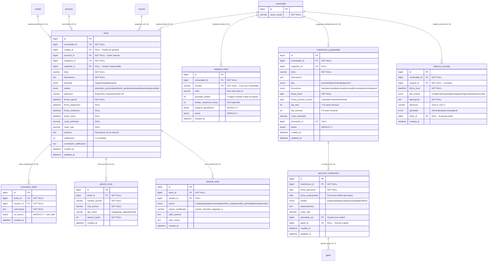
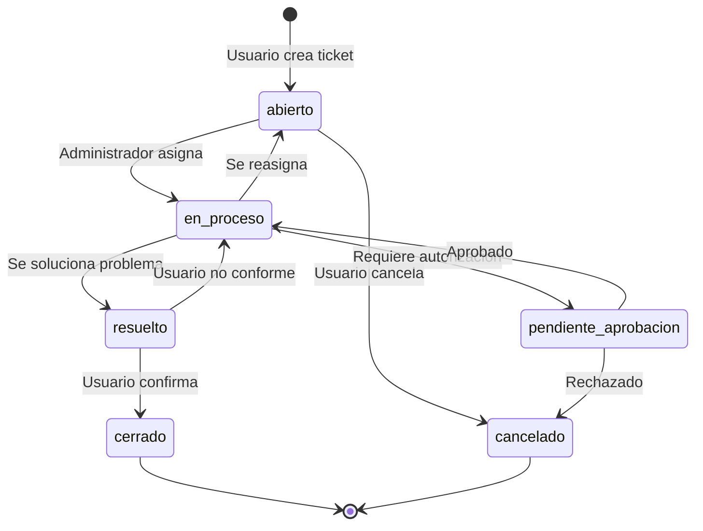

# 🔧 MÓDULO 05: SOPORTE, MANTENCIÓN Y TICKETS

> **Propósito:** Gestión completa de solicitudes de servicio, mantenciones programadas, bitácora de conserje y seguimiento de reparaciones

---

## 📊 DIAGRAMA: RELACIONES DE SOPORTE Y MANTENCIÓN



---

## 🎯 REGLAS DE NEGOCIO

### **R1: Ciclo de Vida de un Ticket**



**Descripción de estados:**

| Estado | Descripción | Responsable | Siguiente |
|--------|-------------|-------------|-----------|
| **abierto** | Ticket recién creado, sin asignar | Sistema | en_proceso / cancelado |
| **en_proceso** | Asignado a técnico, en resolución | Staff | resuelto / pendiente_aprobacion |
| **pendiente_aprobacion** | Requiere autorización para proceder | Administración | en_proceso / cancelado |
| **resuelto** | Problema solucionado, esperando confirmación | Usuario | cerrado / en_proceso |
| **cerrado** | Confirmado como resuelto | - | [final] |
| **cancelado** | No procede o duplicado | - | [final] |

---

### **R2: Niveles de Prioridad**

```
URGENTE (4)
├── Emergencias (fugas de gas, agua, incendios)
├── Ascensores detenidos con personas adentro
├── Cortes totales de servicios básicos
└── SLA: Respuesta inmediata (< 1 hora)

ALTA (3)
├── Problemas de seguridad (portón, cámaras)
├── Filtraciones mayores
├── Equipos críticos dañados
└── SLA: 4 horas

MEDIA (2)
├── Reparaciones generales
├── Problemas de áreas comunes
├── Mantenciones programadas vencidas
└── SLA: 24 horas

BAJA (1)
├── Solicitudes de información
├── Mejoras no urgentes
├── Mantenciones preventivas
└── SLA: 72 horas
```

**Cálculo automático de prioridad:**

```sql
-- Función para calcular prioridad según palabras clave
DELIMITER $$
CREATE FUNCTION calcular_prioridad_ticket(
  titulo VARCHAR(255),
  descripcion TEXT,
  categoria_prioridad INT
) RETURNS ENUM('baja','media','alta','urgente')
DETERMINISTIC
BEGIN
  DECLARE texto_completo TEXT;
  DECLARE prioridad_calculada ENUM('baja','media','alta','urgente');
  
  SET texto_completo = LOWER(CONCAT(titulo, ' ', descripcion));
  
  -- Urgente: Palabras críticas
  IF texto_completo REGEXP 'emergencia|urgente|incendio|gas|persona atrapada|peligro' THEN
    RETURN 'urgente';
  END IF;
  
  -- Alta: Problemas graves
  IF texto_completo REGEXP 'filtracion|inundacion|sin agua|sin luz|ascensor detenido|seguridad' THEN
    RETURN 'alta';
  END IF;
  
  -- Media: Por defecto
  IF categoria_prioridad >= 2 THEN
    RETURN 'media';
  END IF;
  
  -- Baja
  RETURN 'baja';
END$$
DELIMITER ;
```

---

### **R3: SLA (Service Level Agreement)**

**Tiempos de respuesta esperados:**

```sql
-- Query para verificar cumplimiento de SLA
SELECT 
  t.id,
  t.titulo,
  ct.nombre as categoria,
  t.prioridad,
  t.fecha_reporte,
  t.fecha_asignacion,
  t.fecha_resolucion,
  ct.tiempo_respuesta_horas as sla_horas,
  TIMESTAMPDIFF(HOUR, t.fecha_reporte, COALESCE(t.fecha_asignacion, NOW())) as horas_hasta_asignacion,
  TIMESTAMPDIFF(HOUR, t.fecha_reporte, COALESCE(t.fecha_resolucion, NOW())) as horas_hasta_resolucion,
  CASE 
    WHEN t.fecha_asignacion IS NULL AND TIMESTAMPDIFF(HOUR, t.fecha_reporte, NOW()) > ct.tiempo_respuesta_horas
    THEN '🔴 SLA VENCIDO'
    WHEN t.fecha_asignacion IS NULL
    THEN '⏳ En plazo'
    WHEN TIMESTAMPDIFF(HOUR, t.fecha_reporte, t.fecha_asignacion) <= ct.tiempo_respuesta_horas
    THEN '✅ Cumplido'
    ELSE '❌ Incumplido'
  END as cumplimiento_sla
FROM ticket t
INNER JOIN categoria_ticket ct ON ct.id = t.categoria_id
WHERE t.estado IN ('abierto', 'en_proceso')
ORDER BY 
  CASE t.prioridad
    WHEN 'urgente' THEN 1
    WHEN 'alta' THEN 2
    WHEN 'media' THEN 3
    WHEN 'baja' THEN 4
  END,
  t.fecha_reporte;
```

---

### **R4: Categorías Típicas de Tickets**

```sql
-- Configuración inicial de categorías
INSERT INTO categoria_ticket (comunidad_id, nombre, color, prioridad_default, tiempo_respuesta_horas, activa)
VALUES 
-- Infraestructura
(1, 'Plomería', '#2196F3', 3, 4, 1),
(1, 'Electricidad', '#FFC107', 3, 4, 1),
(1, 'Ascensores', '#F44336', 3, 2, 1),
(1, 'Climatización', '#4CAF50', 2, 24, 1),

-- Áreas comunes
(1, 'Aseo y limpieza', '#9C27B0', 2, 24, 1),
(1, 'Jardinería', '#4CAF50', 1, 72, 1),
(1, 'Piscina', '#00BCD4', 2, 24, 1),

-- Seguridad
(1, 'Seguridad', '#F44336', 3, 1, 1),
(1, 'Control de acceso', '#FF9800', 2, 12, 1),
(1, 'CCTV', '#607D8B', 2, 24, 1),

-- Administrativo
(1, 'Solicitud general', '#9E9E9E', 1, 72, 1),
(1, 'Reclamo', '#FF5722', 2, 24, 1),
(1, 'Mudanza', '#795548', 1, 48, 1);
```

---

### **R5: Mantenciones Programadas (Preventivas)**

**Tipos de frecuencia:**

```sql
-- Calcular próxima fecha de mantención según frecuencia
DELIMITER $$
CREATE FUNCTION calcular_proxima_mantencion(
  fecha_actual DATE,
  frecuencia ENUM('diaria','semanal','quincenal','mensual','trimestral','semestral','anual'),
  dia_mes INT,
  dia_semana INT
) RETURNS DATE
DETERMINISTIC
BEGIN
  DECLARE proxima_fecha DATE;
  
  CASE frecuencia
    WHEN 'diaria' THEN
      SET proxima_fecha = DATE_ADD(fecha_actual, INTERVAL 1 DAY);
    
    WHEN 'semanal' THEN
      -- Calcular próximo día de la semana especificado
      SET proxima_fecha = DATE_ADD(fecha_actual, 
        INTERVAL (7 - DAYOFWEEK(fecha_actual) + dia_semana) % 7 + 7 DAY);
    
    WHEN 'quincenal' THEN
      SET proxima_fecha = DATE_ADD(fecha_actual, INTERVAL 15 DAY);
    
    WHEN 'mensual' THEN
      -- Mismo día del próximo mes
      IF dia_mes IS NOT NULL THEN
        SET proxima_fecha = DATE_ADD(LAST_DAY(fecha_actual), INTERVAL 1 DAY);
        SET proxima_fecha = DATE_ADD(proxima_fecha, INTERVAL dia_mes - 1 DAY);
      ELSE
        SET proxima_fecha = DATE_ADD(fecha_actual, INTERVAL 1 MONTH);
      END IF;
    
    WHEN 'trimestral' THEN
      SET proxima_fecha = DATE_ADD(fecha_actual, INTERVAL 3 MONTH);
    
    WHEN 'semestral' THEN
      SET proxima_fecha = DATE_ADD(fecha_actual, INTERVAL 6 MONTH);
    
    WHEN 'anual' THEN
      SET proxima_fecha = DATE_ADD(fecha_actual, INTERVAL 1 YEAR);
    
    ELSE
      SET proxima_fecha = NULL;
  END CASE;
  
  RETURN proxima_fecha;
END$$
DELIMITER ;
```

**Ejemplos de mantenciones programadas:**

| Actividad | Frecuencia | Categoría | Costo estimado |
|-----------|------------|-----------|----------------|
| Limpieza de canaletas | Mensual | Mantención | $50.000 |
| Revisión de ascensores | Mensual | Preventiva | $150.000 |
| Limpieza de piscina | Semanal | Mantención | $30.000 |
| Revisión extintores | Semestral | Inspección | $80.000 |
| Fumigación | Trimestral | Preventiva | $120.000 |
| Poda de árboles | Trimestral | Mantención | $200.000 |
| Limpieza de tanques de agua | Anual | Preventiva | $500.000 |

---

### **R6: Bitácora de Conserje**

**Tipos de eventos registrados:**

```
RONDA
├── Recorrido de seguridad nocturno
├── Verificación de puertas y accesos
└── Control de iluminación

INCIDENTE
├── Ruidos molestos
├── Obstrucciones de paso
├── Conflictos entre vecinos
└── Mascotas sin control

VISITA
├── Registro de ingreso de visitas
├── Registro de proveedores
└── Control de acceso de mudanzas

ENTREGA
├── Encomiendas recibidas
├── Correspondencia
└── Entregas de supermercado

EMERGENCIA
├── Activación de alarmas
├── Accidentes en áreas comunes
├── Cortes de servicios
└── Llamado a servicios de emergencia

MANTENCION
├── Reparaciones menores realizadas
├── Cambio de ampolletas
└── Reposición de consumibles
```

---

## 📋 CASOS DE USO

### **CU1: Crear Ticket de Soporte (Usuario)**

```sql
-- Escenario: Propietario de Unidad 101 reporta filtración en baño

SET @unidad_id = (SELECT id FROM unidad WHERE codigo = '101' AND comunidad_id = 1);
SET @persona_id = (SELECT persona_id FROM titulares_unidad WHERE unidad_id = @unidad_id AND hasta IS NULL LIMIT 1);
SET @categoria_id = (SELECT id FROM categoria_ticket WHERE nombre = 'Plomería' AND comunidad_id = 1);

-- Paso 1: Crear ticket
INSERT INTO ticket (
  comunidad_id,
  unidad_id,
  persona_id,
  categoria_id,
  titulo,
  descripcion,
  prioridad,
  estado,
  ubicacion,
  fecha_reporte
) VALUES (
  1,
  @unidad_id,
  @persona_id,
  @categoria_id,
  'Filtración en baño principal',
  'Desde ayer hay una filtración de agua en el baño principal. El agua sale por debajo del inodoro y está mojando el piso. Ya cerré la llave de paso pero sigue filtrando un poco.',
  'alta',  -- Automático o calculado por función
  'abierto',
  'Baño principal, segundo piso',
  NOW()
);

SET @ticket_id = LAST_INSERT_ID();

-- Paso 2: Registrar en historial
INSERT INTO historial_ticket (ticket_id, usuario_id, accion, valor_nuevo)
VALUES (@ticket_id, NULL, 'creado', 'Ticket creado por usuario');

-- Paso 3: Adjuntar fotos (si tiene)
-- (Manejado por aplicación frontend, guarda archivos en servidor/S3)
INSERT INTO adjunto_ticket (ticket_id, nombre_archivo, ruta_archivo, tipo_mime, tamano_bytes)
VALUES 
(@ticket_id, 'filtracion_bano_1.jpg', '/uploads/tickets/2025/10/filtracion_bano_1.jpg', 'image/jpeg', 2458600),
(@ticket_id, 'filtracion_bano_2.jpg', '/uploads/tickets/2025/10/filtracion_bano_2.jpg', 'image/jpeg', 1893400);

-- Paso 4: Notificar a administración (email/push)
-- (Manejado por sistema de notificaciones)
```

---

### **CU2: Asignar Ticket a Técnico**

```sql
-- Administrador asigna ticket al técnico de plomería

SET @ticket_id = 123;
SET @tecnico_id = (
  SELECT u.id 
  FROM usuario u 
  INNER JOIN roles_usuario ru ON ru.usuario_id = u.id
  WHERE ru.rol = 'tecnico_mantencion' 
    AND u.activo = 1 
  LIMIT 1
);

-- Paso 1: Asignar ticket
UPDATE ticket
SET 
  asignado_a = @tecnico_id,
  estado = 'en_proceso',
  fecha_asignacion = NOW()
WHERE id = @ticket_id;

-- Paso 2: Registrar en historial
INSERT INTO historial_ticket (ticket_id, usuario_id, accion, campo_modificado, valor_anterior, valor_nuevo)
VALUES (
  @ticket_id, 
  @current_user_id, 
  'asignado', 
  'asignado_a', 
  'NULL', 
  @tecnico_id
);

-- Paso 3: Agregar comentario interno
INSERT INTO comentario_ticket (ticket_id, usuario_id, comentario, es_interno)
VALUES (
  @ticket_id,
  @current_user_id,
  'Asignado a Juan Pérez (técnico de plomería). Prioridad alta por riesgo de daño estructural.',
  1  -- Comentario interno (no visible para usuario)
);

-- Paso 4: Notificar al técnico
-- (Email/SMS/Push notification)
```

---

### **CU3: Técnico Actualiza Progreso del Ticket**

```sql
-- Técnico visita la unidad y actualiza el ticket

SET @ticket_id = 123;
SET @tecnico_id = 456;

-- Paso 1: Agregar comentario con diagnóstico
INSERT INTO comentario_ticket (ticket_id, usuario_id, comentario, es_interno)
VALUES (
  @ticket_id,
  @tecnico_id,
  'Revisé la unidad. La filtración viene de una fisura en el sello del inodoro. Necesito reemplazar el sello y revisar las cañerías. Costo estimado: $80.000. Materiales: $30.000, Mano de obra: $50.000.',
  0  -- Visible para usuario
);

-- Paso 2: Actualizar costo estimado
UPDATE ticket
SET costo_estimado = 80000
WHERE id = @ticket_id;

-- Paso 3: Cambiar a "pendiente_aprobacion" si requiere autorización
UPDATE ticket
SET estado = 'pendiente_aprobacion'
WHERE id = @ticket_id
  AND costo_estimado > 50000;  -- Requiere aprobación si supera límite

-- Paso 4: Registrar en historial
INSERT INTO historial_ticket (ticket_id, usuario_id, accion, campo_modificado, valor_anterior, valor_nuevo)
VALUES (
  @ticket_id,
  @tecnico_id,
  'cambio_estado',
  'estado',
  'en_proceso',
  'pendiente_aprobacion'
);
```

---

### **CU4: Aprobar y Ejecutar Reparación**

```sql
-- Administrador aprueba la reparación

SET @ticket_id = 123;

-- Paso 1: Aprobar
UPDATE ticket
SET estado = 'en_proceso'
WHERE id = @ticket_id
  AND estado = 'pendiente_aprobacion';

-- Paso 2: Comentar aprobación
INSERT INTO comentario_ticket (ticket_id, usuario_id, comentario, es_interno)
VALUES (
  @ticket_id,
  @current_user_id,
  'Reparación aprobada. Proceder con reemplazo de sello y revisión de cañerías.',
  0
);

-- [Técnico realiza la reparación...]

-- Paso 3: Marcar como resuelto
UPDATE ticket
SET 
  estado = 'resuelto',
  fecha_resolucion = NOW(),
  costo_real = 75000,
  solucion = 'Se reemplazó el sello del inodoro y se revisaron las cañerías. No se encontraron más problemas. Filtración solucionada.'
WHERE id = @ticket_id;

-- Paso 4: Registrar gasto asociado
INSERT INTO gasto (
  comunidad_id,
  categoria_id,
  fecha,
  monto,
  glosa,
  extraordinario
) VALUES (
  1,
  (SELECT id FROM categoria_gasto WHERE nombre = 'Reparaciones' AND comunidad_id = 1),
  CURDATE(),
  75000,
  CONCAT('Reparación filtración Unidad 101 - Ticket #', @ticket_id),
  0
);

-- Paso 5: Notificar a usuario solicitante
-- (Email: "Su ticket ha sido resuelto. Por favor, califique el servicio.")
```

---

### **CU5: Usuario Califica y Cierra Ticket**

```sql
-- Usuario confirma que el problema está resuelto y califica el servicio

SET @ticket_id = 123;

-- Paso 1: Usuario califica
UPDATE ticket
SET 
  estado = 'cerrado',
  fecha_cierre = NOW(),
  calificacion = 5,
  comentario_calificacion = 'Excelente servicio. El técnico fue muy profesional y solucionó el problema rápidamente. Muy conforme.'
WHERE id = @ticket_id
  AND estado = 'resuelto';

-- Paso 2: Registrar en historial
INSERT INTO historial_ticket (ticket_id, usuario_id, accion)
VALUES (@ticket_id, @current_user_id, 'cerrado');

-- Paso 3: Calcular estadísticas del técnico
SELECT 
  u.id,
  CONCAT(p.nombres, ' ', p.apellidos) as tecnico,
  COUNT(t.id) as tickets_resueltos,
  AVG(t.calificacion) as calificacion_promedio,
  AVG(TIMESTAMPDIFF(HOUR, t.fecha_reporte, t.fecha_resolucion)) as horas_promedio_resolucion
FROM ticket t
INNER JOIN usuario u ON u.id = t.asignado_a
INNER JOIN persona p ON p.id = u.persona_id
WHERE t.estado = 'cerrado'
  AND t.fecha_cierre >= DATE_SUB(CURDATE(), INTERVAL 3 MONTH)
GROUP BY u.id, p.nombres, p.apellidos;
```

---

### **CU6: Configurar Mantención Programada**

```sql
-- Configurar mantención mensual de ascensores

SET @proveedor_id = (SELECT id FROM proveedor WHERE razon_social LIKE '%Ascensores%' AND comunidad_id = 1 LIMIT 1);

INSERT INTO mantencion_programada (
  comunidad_id,
  categoria_id,
  titulo,
  descripcion,
  tipo,
  frecuencia,
  fecha_inicio,
  fecha_proximo_evento,
  dia_mes,
  costo_estimado,
  proveedor_id,
  activa
) VALUES (
  1,
  (SELECT id FROM categoria_ticket WHERE nombre = 'Ascensores'),
  'Mantención preventiva ascensores',
  'Revisión mensual de sistemas mecánicos, eléctricos y de seguridad de los 3 ascensores del edificio. Incluye lubricación, ajustes y pruebas de emergencia.',
  'preventiva',
  'mensual',
  '2025-11-01',
  '2025-11-01',
  1,  -- Día 1 de cada mes
  150000,
  @proveedor_id,
  1
);

-- Crear ejecuciones automáticas para los próximos 6 meses
SET @mantencion_id = LAST_INSERT_ID();

INSERT INTO ejecucion_mantencion (mantencion_id, fecha_programada, estado)
SELECT 
  @mantencion_id,
  DATE_ADD('2025-11-01', INTERVAL n MONTH),
  'programada'
FROM (
  SELECT 0 n UNION SELECT 1 UNION SELECT 2 UNION SELECT 3 UNION SELECT 4 UNION SELECT 5
) meses;
```

---

### **CU7: Ejecutar Mantención Programada**

```sql
-- Registrar ejecución de mantención mensual de ascensores

SET @ejecucion_id = (
  SELECT id 
  FROM ejecucion_mantencion 
  WHERE mantencion_id = ? 
    AND fecha_programada = '2025-11-01'
    AND estado = 'programada'
);

-- Paso 1: Marcar como ejecutada
UPDATE ejecucion_mantencion
SET 
  fecha_ejecucion = CURDATE(),
  estado = 'ejecutada',
  observaciones = 'Mantención completada sin novedades. Todos los sistemas operando correctamente. Se lubricaron cables y se ajustaron puertas del ascensor principal.',
  costo_real = 145000,
  ejecutado_por = @current_user_id
WHERE id = @ejecucion_id;

-- Paso 2: Registrar gasto
INSERT INTO gasto (
  comunidad_id,
  categoria_id,
  documento_compra_id,
  fecha,
  monto,
  glosa,
  extraordinario
) VALUES (
  1,
  (SELECT id FROM categoria_gasto WHERE nombre = 'Mantención Ascensores'),
  NULL,
  CURDATE(),
  145000,
  'Mantención preventiva mensual ascensores - Noviembre 2025',
  0
);

SET @gasto_id = LAST_INSERT_ID();

-- Paso 3: Vincular gasto a ejecución
UPDATE ejecucion_mantencion
SET gasto_id = @gasto_id
WHERE id = @ejecucion_id;

-- Paso 4: Calcular próxima fecha
UPDATE mantencion_programada mp
SET fecha_proximo_evento = calcular_proxima_mantencion(
  CURDATE(),
  mp.frecuencia,
  mp.dia_mes,
  mp.dia_semana
)
WHERE id = (SELECT mantencion_id FROM ejecucion_mantencion WHERE id = @ejecucion_id);

-- Paso 5: Crear próxima ejecución programada
INSERT INTO ejecucion_mantencion (mantencion_id, fecha_programada, estado)
SELECT 
  mantencion_id,
  fecha_proximo_evento,
  'programada'
FROM mantencion_programada
WHERE id = (SELECT mantencion_id FROM ejecucion_mantencion WHERE id = @ejecucion_id);
```

---

### **CU8: Registrar Evento en Bitácora de Conserje**

```sql
-- Conserje registra incidente de ruidos molestos

SET @conserje_id = (
  SELECT id FROM usuario 
  WHERE rol = 'conserje' 
    AND comunidad_id = 1 
  LIMIT 1
);

-- Escenario 1: Incidente que NO genera ticket
INSERT INTO bitacora_conserje (
  comunidad_id,
  usuario_id,
  fecha_hora,
  tipo_evento,
  descripcion,
  ubicacion,
  gravedad
) VALUES (
  1,
  @conserje_id,
  NOW(),
  'incidente',
  'Residente de Unidad 305 reportó ruidos molestos provenientes de Unidad 307 (música alta). Se llamó al timbre de 307, se habló con residente quien bajó el volumen inmediatamente. Sin mayores inconvenientes.',
  'Torre A, Piso 3',
  'informativo'
);

-- Escenario 2: Incidente que SÍ genera ticket
INSERT INTO bitacora_conserje (
  comunidad_id,
  usuario_id,
  fecha_hora,
  tipo_evento,
  descripcion,
  ubicacion,
  gravedad
) VALUES (
  1,
  @conserje_id,
  NOW(),
  'emergencia',
  'Filtración de agua en estacionamiento nivel -2. El agua está saliendo de un ducto en el techo. Se intentó cerrar llave de paso sin éxito. Requiere atención urgente de plomero.',
  'Estacionamiento, Nivel -2, Sector C',
  'urgente'
);

SET @bitacora_id = LAST_INSERT_ID();

-- Crear ticket asociado
INSERT INTO ticket (
  comunidad_id,
  unidad_id,
  persona_id,
  categoria_id,
  titulo,
  descripcion,
  prioridad,
  estado,
  ubicacion,
  fecha_reporte
) VALUES (
  1,
  NULL,  -- Área común
  (SELECT persona_id FROM usuario WHERE id = @conserje_id),
  (SELECT id FROM categoria_ticket WHERE nombre = 'Plomería'),
  'Filtración en estacionamiento nivel -2',
  'Filtración activa en ducto del techo. No se pudo cerrar llave de paso. Requiere atención inmediata.',
  'urgente',
  'abierto',
  'Estacionamiento, Nivel -2, Sector C',
  NOW()
);

-- Vincular ticket a bitácora
UPDATE bitacora_conserje
SET ticket_id = LAST_INSERT_ID()
WHERE id = @bitacora_id;
```

---

## 🔍 QUERIES ÚTILES

### **Q1: Dashboard de Tickets Abiertos**

```sql
SELECT 
  t.id,
  t.titulo,
  ct.nombre as categoria,
  u.codigo as unidad,
  CONCAT(p.nombres, ' ', p.apellidos) as reportado_por,
  t.prioridad,
  t.estado,
  t.fecha_reporte,
  TIMESTAMPDIFF(HOUR, t.fecha_reporte, NOW()) as horas_abierto,
  ct.tiempo_respuesta_horas as sla_horas,
  CASE 
    WHEN t.estado = 'abierto' AND TIMESTAMPDIFF(HOUR, t.fecha_reporte, NOW()) > ct.tiempo_respuesta_horas
    THEN '🔴 SLA VENCIDO'
    WHEN t.estado = 'abierto'
    THEN '⏳ En plazo'
    WHEN t.estado = 'en_proceso'
    THEN '🔧 En proceso'
    WHEN t.estado = 'pendiente_aprobacion'
    THEN '⏸️ Esperando aprobación'
    ELSE t.estado
  END as estado_visual,
  COALESCE(CONCAT(asig.nombres, ' ', asig.apellidos), 'Sin asignar') as asignado_a
FROM ticket t
INNER JOIN categoria_ticket ct ON ct.id = t.categoria_id
LEFT JOIN unidad u ON u.id = t.unidad_id
INNER JOIN persona p ON p.id = t.persona_id
LEFT JOIN usuario uasig ON uasig.id = t.asignado_a
LEFT JOIN persona asig ON asig.id = uasig.persona_id
WHERE t.comunidad_id = ?
  AND t.estado IN ('abierto', 'en_proceso', 'pendiente_aprobacion')
ORDER BY 
  CASE t.prioridad
    WHEN 'urgente' THEN 1
    WHEN 'alta' THEN 2
    WHEN 'media' THEN 3
    WHEN 'baja' THEN 4
  END,
  t.fecha_reporte;
```

---

### **Q2: Historial Completo de un Ticket**

```sql
-- Vista completa del ticket con todos sus detalles
SELECT 
  'INFO' as seccion,
  t.id,
  t.titulo,
  t.descripcion,
  ct.nombre as categoria,
  t.prioridad,
  t.estado,
  t.ubicacion,
  t.fecha_reporte,
  t.fecha_resolucion,
  t.costo_estimado,
  t.costo_real,
  t.calificacion
FROM ticket t
INNER JOIN categoria_ticket ct ON ct.id = t.categoria_id
WHERE t.id = ?

UNION ALL

-- Comentarios
SELECT 
  'COMENTARIO',
  ct.id,
  CONCAT(p.nombres, ' ', p.apellidos) as autor,
  ct.comentario,
  NULL, NULL, NULL, NULL,
  ct.created_at,
  NULL, NULL, NULL, NULL
FROM comentario_ticket ct
INNER JOIN usuario u ON u.id = ct.usuario_id
INNER JOIN persona p ON p.id = u.persona_id
WHERE ct.ticket_id = ?
  AND (ct.es_interno = 0 OR @current_user_role IN ('administrador', 'tecnico'))

UNION ALL

-- Adjuntos
SELECT 
  'ADJUNTO',
  a.id,
  a.nombre_archivo,
  a.ruta_archivo,
  a.tipo_mime,
  NULL, NULL, NULL,
  a.created_at,
  NULL, NULL, NULL, NULL
FROM adjunto_ticket a
WHERE a.ticket_id = ?

UNION ALL

-- Historial de cambios
SELECT 
  'HISTORIAL',
  h.id,
  h.accion,
  CONCAT(h.campo_modificado, ': ', h.valor_anterior, ' → ', h.valor_nuevo),
  NULL, NULL, NULL, NULL,
  h.created_at,
  NULL, NULL, NULL, NULL
FROM historial_ticket h
WHERE h.ticket_id = ?

ORDER BY created_at DESC;
```

---

### **Q3: Tickets por Categoría (Estadísticas)**

```sql
SELECT 
  ct.nombre as categoria,
  COUNT(t.id) as total_tickets,
  COUNT(CASE WHEN t.estado IN ('abierto', 'en_proceso') THEN 1 END) as activos,
  COUNT(CASE WHEN t.estado = 'cerrado' THEN 1 END) as cerrados,
  COUNT(CASE WHEN t.prioridad = 'urgente' THEN 1 END) as urgentes,
  AVG(TIMESTAMPDIFF(HOUR, t.fecha_reporte, t.fecha_resolucion)) as horas_promedio_resolucion,
  SUM(t.costo_real) as costo_total,
  AVG(t.calificacion) as calificacion_promedio
FROM categoria_ticket ct
LEFT JOIN ticket t 
  ON t.categoria_id = ct.id 
  AND t.fecha_reporte >= DATE_SUB(CURDATE(), INTERVAL 3 MONTH)
WHERE ct.comunidad_id = ?
GROUP BY ct.id, ct.nombre
ORDER BY total_tickets DESC;
```

---

### **Q4: Rendimiento de Técnicos**

```sql
SELECT 
  CONCAT(p.nombres, ' ', p.apellidos) as tecnico,
  COUNT(t.id) as tickets_asignados,
  COUNT(CASE WHEN t.estado = 'cerrado' THEN 1 END) as tickets_cerrados,
  COUNT(CASE WHEN t.estado IN ('abierto', 'en_proceso') THEN 1 END) as tickets_activos,
  AVG(TIMESTAMPDIFF(HOUR, t.fecha_asignacion, t.fecha_resolucion)) as horas_promedio_resolucion,
  AVG(t.calificacion) as calificacion_promedio,
  COUNT(CASE WHEN t.calificacion >= 4 THEN 1 END) / COUNT(CASE WHEN t.calificacion IS NOT NULL THEN 1 END) * 100 as porcentaje_satisfaccion
FROM usuario u
INNER JOIN persona p ON p.id = u.persona_id
LEFT JOIN ticket t 
  ON t.asignado_a = u.id 
  AND t.fecha_reporte >= DATE_SUB(CURDATE(), INTERVAL 3 MONTH)
WHERE u.comunidad_id = ?
  AND u.rol IN ('tecnico_mantencion', 'administrador')
  AND u.activo = 1
GROUP BY u.id, p.nombres, p.apellidos
ORDER BY calificacion_promedio DESC;
```

---

### **Q5: Mantenciones Vencidas o Próximas**

```sql
SELECT 
  mp.titulo,
  mp.tipo,
  mp.frecuencia,
  mp.fecha_proximo_evento,
  DATEDIFF(mp.fecha_proximo_evento, CURDATE()) as dias_faltantes,
  mp.costo_estimado,
  prov.razon_social as proveedor,
  CASE 
    WHEN mp.fecha_proximo_evento < CURDATE() THEN '🔴 VENCIDA'
    WHEN mp.fecha_proximo_evento = CURDATE() THEN '⚠️ HOY'
    WHEN mp.fecha_proximo_evento <= DATE_ADD(CURDATE(), INTERVAL 7 DAY) THEN '⏰ Esta semana'
    ELSE '📅 Próximamente'
  END as estado
FROM mantencion_programada mp
LEFT JOIN proveedor prov ON prov.id = mp.proveedor_id
WHERE mp.comunidad_id = ?
  AND mp.activa = 1
  AND mp.fecha_proximo_evento <= DATE_ADD(CURDATE(), INTERVAL 30 DAY)
ORDER BY mp.fecha_proximo_evento;
```

---

### **Q6: Bitácora de Conserje (Últimos 7 días)**

```sql
SELECT 
  bc.fecha_hora,
  bc.tipo_evento,
  bc.gravedad,
  bc.descripcion,
  bc.ubicacion,
  CONCAT(p.nombres, ' ', p.apellidos) as conserje,
  CASE 
    WHEN bc.ticket_id IS NOT NULL 
    THEN CONCAT('Ticket #', bc.ticket_id)
    ELSE '-'
  END as ticket_generado
FROM bitacora_conserje bc
INNER JOIN usuario u ON u.id = bc.usuario_id
INNER JOIN persona p ON p.id = u.persona_id
WHERE bc.comunidad_id = ?
  AND bc.fecha_hora >= DATE_SUB(NOW(), INTERVAL 7 DAY)
ORDER BY bc.fecha_hora DESC;
```

---

### **Q7: Reporte de Costos por Mantención**

```sql
SELECT 
  DATE_FORMAT(e.fecha_ejecucion, '%Y-%m') as periodo,
  mp.titulo,
  mp.tipo,
  COUNT(e.id) as ejecuciones,
  SUM(e.costo_real) as costo_total,
  AVG(e.costo_real) as costo_promedio,
  mp.costo_estimado,
  SUM(e.costo_real) - (COUNT(e.id) * mp.costo_estimado) as diferencia_presupuesto
FROM mantencion_programada mp
INNER JOIN ejecucion_mantencion e 
  ON e.mantencion_id = mp.id
  AND e.estado = 'ejecutada'
  AND e.fecha_ejecucion >= DATE_SUB(CURDATE(), INTERVAL 12 MONTH)
WHERE mp.comunidad_id = ?
GROUP BY DATE_FORMAT(e.fecha_ejecucion, '%Y-%m'), mp.id, mp.titulo, mp.tipo, mp.costo_estimado
ORDER BY periodo DESC, costo_total DESC;
```

---

## ⚠️ VALIDACIONES Y TRIGGERS

### **V1: Auditar Cambios de Estado de Ticket**

```sql
DELIMITER $$
CREATE TRIGGER trg_ticket_auditar_cambios
AFTER UPDATE ON ticket
FOR EACH ROW
BEGIN
  -- Auditar cambio de estado
  IF OLD.estado != NEW.estado THEN
    INSERT INTO historial_ticket (ticket_id, usuario_id, accion, campo_modificado, valor_anterior, valor_nuevo)
    VALUES (NEW.id, @current_user_id, 'cambio_estado', 'estado', OLD.estado, NEW.estado);
  END IF;
  
  -- Auditar cambio de prioridad
  IF OLD.prioridad != NEW.prioridad THEN
    INSERT INTO historial_ticket (ticket_id, usuario_id, accion, campo_modificado, valor_anterior, valor_nuevo)
    VALUES (NEW.id, @current_user_id, 'cambio_prioridad', 'prioridad', OLD.prioridad, NEW.prioridad);
  END IF;
  
  -- Auditar reasignación
  IF OLD.asignado_a != NEW.asignado_a OR (OLD.asignado_a IS NULL AND NEW.asignado_a IS NOT NULL) THEN
    INSERT INTO historial_ticket (ticket_id, usuario_id, accion, campo_modificado, valor_anterior, valor_nuevo)
    VALUES (NEW.id, @current_user_id, 'asignado', 'asignado_a', OLD.asignado_a, NEW.asignado_a);
  END IF;
END$$
DELIMITER ;
```

---

### **V2: Validar SLA al Cambiar Estado**

```sql
DELIMITER $$
CREATE TRIGGER trg_ticket_validar_sla
BEFORE UPDATE ON ticket
FOR EACH ROW
BEGIN
  DECLARE sla_horas INT;
  DECLARE horas_transcurridas INT;
  
  IF OLD.estado = 'abierto' AND NEW.estado = 'en_proceso' THEN
    SELECT tiempo_respuesta_horas INTO sla_horas
    FROM categoria_ticket
    WHERE id = NEW.categoria_id;
    
    SET horas_transcurridas = TIMESTAMPDIFF(HOUR, NEW.fecha_reporte, NOW());
    
    IF horas_transcurridas > sla_horas THEN
      -- Registrar incumplimiento de SLA (solo log, no bloquear)
      INSERT INTO auditoria (usuario_id, accion, tabla, registro_id, valores_nuevos)
      VALUES (
        @current_user_id,
        'SLA_INCUMPLIDO',
        'ticket',
        NEW.id,
        JSON_OBJECT('sla_horas', sla_horas, 'horas_reales', horas_transcurridas)
      );
    END IF;
  END IF;
END$$
DELIMITER ;
```

---

### **V3: Notificar Mantenciones Vencidas**

```sql
-- Evento que se ejecuta diariamente
CREATE EVENT evt_notificar_mantenciones_vencidas
ON SCHEDULE EVERY 1 DAY
STARTS '2025-01-01 08:00:00'
DO
BEGIN
  -- Crear tickets para mantenciones vencidas
  INSERT INTO ticket (
    comunidad_id,
    categoria_id,
    titulo,
    descripcion,
    prioridad,
    estado,
    fecha_reporte
  )
  SELECT 
    mp.comunidad_id,
    mp.categoria_id,
    CONCAT('MANTENCIÓN VENCIDA: ', mp.titulo),
    CONCAT('La mantención programada "', mp.titulo, '" está vencida desde el ', mp.fecha_proximo_evento, '. Por favor, programar ejecución.'),
    'alta',
    'abierto',
    NOW()
  FROM mantencion_programada mp
  WHERE mp.activa = 1
    AND mp.fecha_proximo_evento < CURDATE()
    AND NOT EXISTS (
      SELECT 1 FROM ticket t
      WHERE t.titulo LIKE CONCAT('%', mp.titulo, '%')
        AND t.estado IN ('abierto', 'en_proceso')
    );
END;
```

---

### **V4: Actualizar Próxima Fecha de Mantención**

```sql
DELIMITER $$
CREATE TRIGGER trg_mantencion_actualizar_proxima
AFTER UPDATE ON ejecucion_mantencion
FOR EACH ROW
BEGIN
  DECLARE nueva_fecha DATE;
  
  IF NEW.estado = 'ejecutada' AND OLD.estado != 'ejecutada' THEN
    SELECT calcular_proxima_mantencion(
      NEW.fecha_ejecucion,
      mp.frecuencia,
      mp.dia_mes,
      mp.dia_semana
    ) INTO nueva_fecha
    FROM mantencion_programada mp
    WHERE mp.id = NEW.mantencion_id;
    
    UPDATE mantencion_programada
    SET fecha_proximo_evento = nueva_fecha
    WHERE id = NEW.mantencion_id;
  END IF;
END$$
DELIMITER ;
```

---

**Fecha:** Octubre 2025  
**Versión:** 1.0  
**Módulo:** 5 de 6

